# Significance Scoring — Evening Analysis 2026-04-21

**SIG-ID**: SIG-2026-04-21-EVE001
**Scoring Date**: 2026-04-21
**Riksmöte**: 2025/26

---

## 5-Dimension Scoring Matrix

```mermaid
graph LR
    subgraph "Significance Scoring — Evening Analysis 2026-04-21"
        A["🗳️ Electoral Impact<br/>Score: 10/10<br/>FiU48 = direct voter relief<br/>Opposition 21-motion architecture"] 
        B["⚖️ Constitutional/Legal<br/>Score: 8/10<br/>KU hearings Svantesson+Wallström<br/>EU Pay Directive 47-day deadline"]
        C["💰 Fiscal Impact<br/>Score: 9/10<br/>4.1B SEK extra budget<br/>EU minimum fuel tax floor"]
        D["🌍 International/EU<br/>Score: 8/10<br/>EU Commission monitoring risk<br/>Gaza flotilla (HD11731)"]
        E["📊 Policy Precedent<br/>Score: 8/10<br/>First emergency fiscal<br/>pre-election household relief 2025/26"]
    end
    A -.->|"Weight 30%"| COMP["Composite Score: 8.7/10"]
    B -.->|"Weight 20%"| COMP
    C -.->|"Weight 25%"| COMP
    D -.->|"Weight 15%"| COMP
    E -.->|"Weight 10%"| COMP
```

---

## Per-Document Significance Scores

| dok_id | Electoral | Constitutional | Fiscal | International | Precedent | **Composite** | DIW Weight |
|--------|----------|----------------|--------|--------------|-----------|---------------|-----------|
| HD01FiU48 | 10 | 7 | 10 | 7 | 9 | **8.9** | 0.30 |
| Gov/vindkraft | 9 | 5 | 7 | 6 | 8 | **7.2** | 0.18 |
| KU G16 (Svantesson) | 8 | 10 | 8 | 4 | 7 | **7.9** | 0.15 |
| HD10442 (ätstörning) | 7 | 5 | 6 | 3 | 5 | **5.8** | 0.08 |
| Motions 21-cluster | 9 | 6 | 5 | 4 | 9 | **7.3** | 0.14 |
| HD11731 (Gaza) | 5 | 4 | 3 | 8 | 5 | **5.1** | 0.07 |
| HD10441 (rättssäkerhet) | 6 | 8 | 2 | 2 | 6 | **5.5** | 0.05 |
| HD01TU16 | 3 | 2 | 2 | 1 | 3 | **2.4** | 0.03 |

**Day Composite Score: 8.7/10 (DIW-weighted)**

---

## Publication Decision

| Decision | Justification |
|---------|--------------|
| **PUBLISH IMMEDIATELY** | 8.7/10 composite score exceeds 6.0 publication threshold by wide margin |
| **Priority Level** | P1 — LEAD STORY: FiU48 extra budget |
| **Languages** | EN + SV (primary); translations via news-translate workflow |
| **Coverage Depth** | Deep — 1,500-2,500 words with economic context and election implications |
| **Confidence** | 🟩HIGH |

*Produced by Riksdagsmonitor Evening Analysis v5.0*
