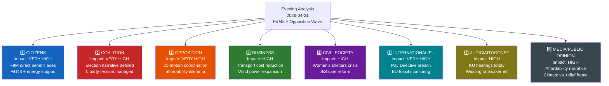

# Stakeholder Perspectives — Evening Analysis 2026-04-21

**STA-ID**: STA-2026-04-21-EVE001
**Analysis Date**: 2026-04-21
**Riksmöte**: 2025/26
**Confidence**: 🟩HIGH

---

## Impact Radar

---

## All 8 Stakeholder Groups

### 1. Citizens (Allmänheten)
**Impact Level**: 🔴 VERY HIGH | **Timeline**: Immediate

| Sub-group | Impact | Evidence |
|-----------|--------|---------|
| Vehicle owners (~6M) | POSITIVE — fuel cost relief | HD01FiU48: 82 öre/l petrol, 319 SEK/m³ diesel |
| Households (~3M) | POSITIVE — energy price support | HD01FiU48: el- och gasprisstöd |
| Stockholm residents | NEGATIVE — police density declining | BRÅ March 2026, HD10439 (from RT-1353) |
| Women needing shelter | NEGATIVE — closures accelerating | HD10437-38 (interpellations analysis) |
| Eating disorder patients | NEGATIVE — Region Stockholm service failures | HD10442 Kallifatides → Svantesson |
| Rural residents (Vetlanda) | NEGATIVE — Skatteverket office closure | HD11732 |

**Confidence**: 🟩HIGH | **Key actor**: Ordinary Swedish households facing high energy and fuel costs

### 2. Government Coalition (Tidöalliansen: M+SD+KD+L)
**Impact Level**: 🔴 VERY HIGH | **Timeline**: 0–3 days

| Party | Position | Tension | Evidence |
|-------|---------|---------|---------|
| **Moderaterna (M)** | SUPPORTS FiU48 — fiscal pragmatism | Svantesson under KU scrutiny simultaneously | HD01FiU48, KU G16 |
| **Sverigedemokraterna (SD)** | SUPPORTS FiU48 — affordability populism | No climate tension (SD opposes green taxation) | FiU48 support |
| **Kristdemokraterna (KD)** | SUPPORTS FiU48 + SiS reform | Infrastructure minister Carlson under pressure | HD01FiU48, SiS press release |
| **Liberalerna (L)** | Supports FiU48 via Britz vindkraft counterweight | Ideological climate tension, EU infringement risk | gov/vindkraft, HD10440 |

**Assessment**: Coalition message discipline holds for FiU48 vote. L internal tension real but manageable given vindkraft counterweight. Confidence: 🟩HIGH

### 3. Opposition Bloc (S/V/MP/C)
**Impact Level**: 🔴 VERY HIGH | **Timeline**: Immediate–Campaign 2026

| Party | Position on FiU48 | Strategy | Evidence |
|-------|------------------|---------|---------|
| **S (Socialdemokraterna)** | SILENT/AMBIVALENT — cannot oppose household relief | File interpellations on social welfare instead | HD10442, motions analysis |
| **V (Vänsterpartiet)** | OPPOSES — climate grounds | Immigration motion (HD024076) + climate | Motions synthesis |
| **MP (Miljöpartiet)** | STRONGLY OPPOSES FiU48 | Alm Ericson HD024098; Lakso HD11730 | HD11730, motions synthesis |
| **C (Centerpartiet)** | AMBIVALENT — rural voters need relief | Immigration pragmatist position | Motions synthesis |

**Assessment**: Opposition in strategic bind on FiU48 — welfare concerns require affordability support, climate concerns require opposition. S's silence is strategically rational. Confidence: 🟩HIGH

### 4. Business/Industry (Näringsliv)
**Impact Level**: 🟠 HIGH | **Timeline**: Immediate–12 months

| Sector | Impact | Evidence |
|--------|--------|---------|
| Transport/logistics | POSITIVE — 319 SEK/m³ diesel cut | HD01FiU48 |
| Wind power developers | POSITIVE — new revenue sharing framework | gov/vindkraft |
| Road haulage industry | POSITIVE — diesel cost structure improved | HD01FiU48 |
| Energy sector | MIXED — support for renewables + fossil stabilization | FiU48 + vindkraft |
| Rural businesses | NEGATIVE — Skatteverket Vetlanda service loss | HD11732 |

**Confidence**: 🟩HIGH

### 5. Civil Society (Civilsamhälle)
**Impact Level**: 🟠 HIGH | **Timeline**: Immediate–Medium

| Group | Impact | Evidence |
|-------|--------|---------|
| Women's shelters | NEGATIVE — closures accelerating, pressure continues | HD10437-38 (interpellations) |
| Children's rights organizations | POSITIVE — SiS care reform improvements | 2026-04-20 press release |
| Environmental groups | NEGATIVE — FiU48 climate regression | +0.3-0.5 MtCO₂e/year |
| Ukraine solidarity organizations | POSITIVE — 154M SEK democracy support | 2026-04-20 press release |
| Eating disorder patient groups | NEGATIVE — Region Stockholm failing on care | HD10442 |

**Confidence**: 🟩HIGH

### 6. International/EU
**Impact Level**: 🔴 VERY HIGH | **Timeline**: 47 days–4 weeks

| Institution | Issue | Timeline | Confidence |
|------------|-------|---------|-----------|
| **EU Commission** | Pay Transparency Directive non-transposition | June 7, 2026 | 🟩HIGH |
| **EU Commission** | Fossil subsidy monitoring re: FiU48 fuel cut | 2-4 weeks | 🟩HIGH |
| **UN/International community** | Gaza flotilla — Swedish citizen protection | Immediate | 🟧MEDIUM |
| **Nordic partners (DK/NO/FI)** | Sweden joining EU fossil floor — competitive concern | Medium-term | 🟧MEDIUM |

**Confidence**: 🟩HIGH — EU infringement risk is structurally certain; FiU48 EU monitoring is probable

### 7. Judiciary/Constitutional
**Impact Level**: 🟠 HIGH | **Timeline**: 2026-05-05 est.

| Issue | Body | Impact | Evidence |
|-------|------|--------|---------|
| KU G16 Svantesson hearing | Konstitutionsutskottet | Formal observation possible | HDC220260421ou1 |
| KU G34 Wallström hearing | Konstitutionsutskottet | Opposition historical exposure | HDC220260421ou2 |
| Rättssäkerhetsproblem (Widding) | Justitiedepartementet | Systemic reform needed | HD10441 |
| SfU22 ECHR compliance | Migrationsverket | Deportation legal risk | HD01SfU22 |

**Confidence**: 🟧MEDIUM (depends on KU conclusions not yet published)

### 8. Media/Public Opinion
**Impact Level**: 🟠 HIGH | **Timeline**: Immediate

| Narrative | Expected Frame | Direction | Evidence |
|-----------|---------------|---------|---------|
| "Government helps households" | Dominant if FiU48 passes | COALITION POSITIVE | FiU48 |
| "Climate backslide" | Environmental media counter-frame | COALITION NEGATIVE | MP motions, Naturvårdsverket |
| "Opposition coordinated" | May trigger "chaos coalition" counter-attack | MIXED | 21-motion cluster |
| "Constitutional accountability" | Elite media scrutiny of KU hearings | NEUTRAL | KU G16/G34 |

**Confidence**: 🟧MEDIUM — public opinion polls not yet available for 2026-04-21

---

*Produced by Riksdagsmonitor Evening Analysis v5.0 — Confidence: 🟩HIGH*
