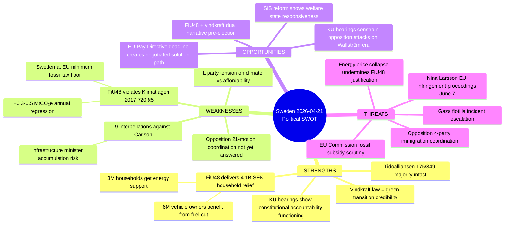
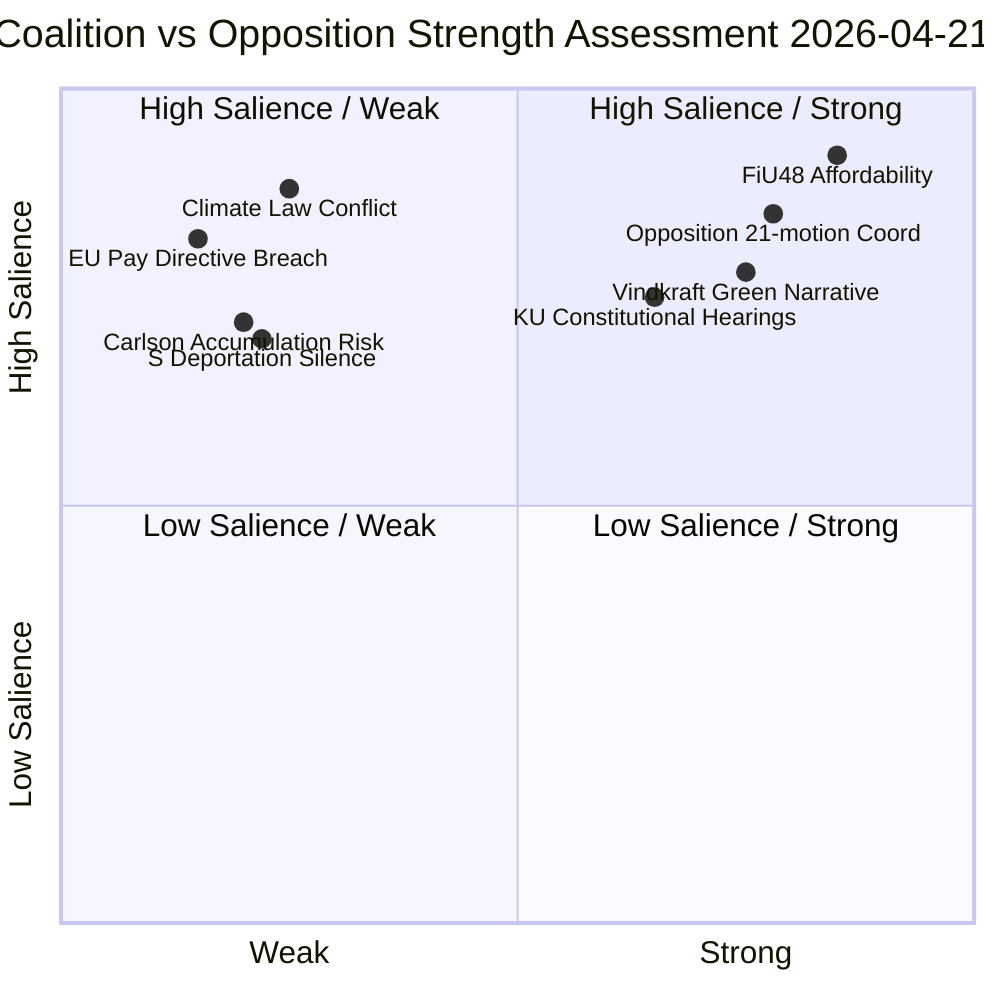

# SWOT Analysis — Evening Analysis 2026-04-21

**SWOT-ID**: SWT-2026-04-21-EVE001
**Analysis Date**: 2026-04-21
**Riksmöte**: 2025/26
**Confidence**: 🟩HIGH

---

## Quadrant Mapping

---

## Full SWOT Matrix

### Strengths (Coalition: Tidöalliansen M+SD+KD+L)

| Strength | Evidence | dok_id | Confidence |
|----------|---------|--------|-----------|
| **FiU48 delivers immediate household relief** | 4.1B SEK extra budget: fuel tax cut (82 öre/l petrol, 319 SEK/m³ diesel) + el-/gasprisstöd. ~6M vehicle owners and ~3M households benefit | HD01FiU48 | 🟩HIGH |
| **Majority intact** | 175/349 Riksdag seats (M+SD+KD+L). No defections reported for FiU48 | RT-1353 synthesis | 🟩HIGH |
| **Vindkraft law = green credibility** | Step 2 of three-step vindkraftspaket: resident revenue sharing up to 9 turbine-heights. Strategy to convert NIMBY to YIMBY | gov/vindkraft | 🟩HIGH |
| **Constitutional accountability operational** | KU G16 (Svantesson) + G34 (Wallström) hearings proceed — demonstrates functioning parliamentary oversight | HDC220260421ou1/ou2 | 🟩HIGH |
| **TU16 simplification** | Removal of mandatory introduction course for B-license practice driving — regulatory simplification message | HD01TU16 | 🟩HIGH |

### Weaknesses (Coalition: Tidöalliansen)

| Weakness | Evidence | dok_id | Confidence |
|----------|---------|--------|-----------|
| **Climate law conflict** | FiU48 fuel tax cut adds +0.3-0.5 MtCO₂e/year. Under Klimatlagen 2017:720 §5, government must explain incompatibility. Sweden already ~20% behind 2030 target | HD01FiU48; MP motion HD024098 | 🟩HIGH |
| **EU fossil minimum floor** | Sweden's fuel tax cut reduces to EU Energy Tax Directive minimum — weakens negotiating position on future EU climate measures | HD01FiU48 | 🟧MEDIUM |
| **Andreas Carlson infrastructure accumulation** | 9 interpellations against KD Infrastructure Minister covering rail closures, road safety, housing, airports, defense. Creates "minister in crisis" meta-narrative | HD10434 and prior IPs | 🟩HIGH |
| **L party climate tension** | Liberals historically support green taxation; supporting fossil subsidy is ideological compromise. Risk of "only for the election" framing | RT-1353 scenario B | 🟧MEDIUM |

### Strengths (Opposition: S/V/MP/C)

| Strength | Evidence | dok_id | Confidence |
|----------|---------|--------|-----------|
| **21-motion coordinated offensive** | All four major opposition parties filed counter-motions to prop. 2025/26:229 within 72 hours — historically rare multi-party coordination | HD024076-HD024089 | 🟩HIGH |
| **EU legal deadline weaponization** | June 7, 2026 = deadline for EU Pay Transparency Directive transposition. Sofia Amloh (S) filed HD10437 directly citing deadline — external legal pressure reinforces parliamentary attack | HD10437 (from interpellations analysis) | 🟩HIGH |
| **Women's welfare dual attack** | Two interpellations against Nina Larsson (L) filed same day: EU Pay Directive + women's shelter closures. "Minister failing women on two fronts" narrative | HD10437, HD10438 | 🟩HIGH |
| **Systematic accountability documentation** | S filed 11 of 14 most recent interpellations — building a timestamped record of government failures to mobilize in campaign | Interpellations synthesis | 🟩HIGH |

### Weaknesses (Opposition: S/V/MP/C)

| Weakness | Evidence | dok_id | Confidence |
|----------|---------|--------|-----------|
| **S silent on FiU48 opposition** | Social Democrats cannot credibly oppose fuel tax relief when households face real energy costs. Economic reality creates affordability vs. climate dilemma | RT-1353; motions synthesis | 🟩HIGH |
| **S silent on deportation** | Despite filing motions on reception and housing immigration laws, S avoided HD024090/95/97 deportation cluster — revealed strategic weakness on enforcement narrative | Motions synthesis | 🟩HIGH |
| **"Chaos coalition" risk** | When four opposition parties coordinate too visibly, M+SD frame it as "opposition chaos" — hurts opposition messaging | Motions synthesis | 🟧MEDIUM |

### Opportunities

| Opportunity | Mechanism | Timeline | Confidence |
|-------------|-----------|----------|-----------|
| **FiU48 + vindkraft dual narrative** | Government can claim both affordability AND green transition before election. Rare political win-win | 2026-04-22 to election | 🟩HIGH |
| **KU constrains opposition on Wallström** | G34 hearing of Wallström forces S to defend prior government decisions on foreign policy | 2026-05 est. | 🟧MEDIUM |
| **SiS reform institutional care** | Government commitment to improving conditions for children in institutional care shows social welfare responsiveness | 2026-04-20 (press release) | 🟧MEDIUM |

### Threats

| Threat | Mechanism | Probability | Severity | Confidence |
|--------|-----------|------------|---------|-----------|
| **EU Commission fossil subsidy challenge** | EU Commission may formally query Sweden's fuel tax reduction under fossil subsidy monitoring framework | MEDIUM | HIGH | 🟩HIGH |
| **Nina Larsson EU infringement (June 7)** | Non-transposition of EU Pay Transparency Directive = formal infringement proceedings. Electoral damage for equality-focused L party | HIGH | HIGH | 🟩HIGH |
| **4-party immigration coordination signal** | Opposition has demonstrated coordination capacity. Government must respond to 21 motions — response strategy risks | CONFIRMED | MEDIUM | 🟩HIGH |
| **Gaza flotilla escalation** | Denis Begic question HD11731 — if Swedish citizens in Gaza convoy are harmed, government faces foreign policy emergency | LOW | HIGH | 🟧MEDIUM |

---

## Coalition vs Opposition SWOT

*Produced by Riksdagsmonitor AI Evening Analysis — Confidence: 🟩HIGH*
