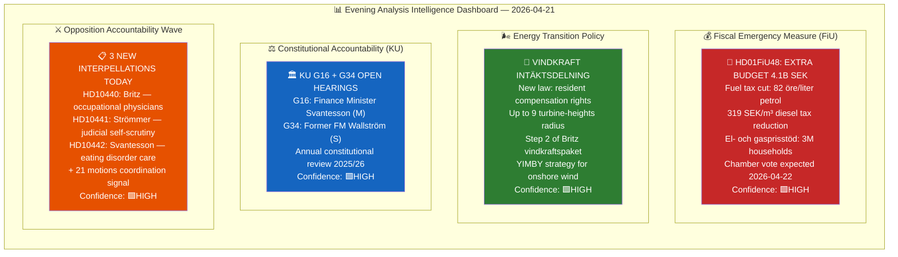

# Political Intelligence Synthesis Summary — Evening Analysis

  

<h2 align="center">📊 Intelligence Synthesis Dashboard — Evening Analysis</h2>

  <strong>Fuel Tax Election Gamble · Constitutional Hearings · Opposition Accountability Offensive</strong> 
  <em>Tuesday 2026-04-21 | Riksmöte 2025/26 | Deep Analysis</em>

---

## 📋 Synthesis Metadata

| Field | Value |
|-------|-------|
| **Synthesis ID** | `SYN-2026-04-21-EVE001` |
| **Analysis Date** | 2026-04-21 18:30 UTC |
| **Documents Analyzed** | 8 (direct) + 55 (via sibling analysis cross-reference) |
| **Analysis Period** | 2026-04-21 (plus integrated sibling analysis: CR, MOT, IP, RT-1353) |
| **Produced By** | news-evening-analysis agentic workflow v5.0 |
| **Overall Confidence** | HIGH 🟩 |
| **Riksmöte** | 2025/26 |
| **Days to Election** | ~145 days (September 13, 2026) |

---

## 📊 Intelligence Dashboard

---

## 🏆 Top 5 Intelligence Findings

| Rank | Finding | Source | Significance | Confidence | Electoral Impact |
|------|---------|--------|-------------|-----------|-----------------|
| 1 | **FiU48: 4.1B SEK extra budget** — fuel tax cut (82 öre/l) + energy price support benefits ~9M citizens. Coalition election-year "affordability" move at EU fossil minimum | HD01FiU48 | **10/10** | 🟩HIGH | **VERY HIGH** — direct household relief before election |
| 2 | **KU constitutional hearings** — Svantesson (G16) + Wallström (G34) in annual granskning. Any critical observations could damage coalition's fiscal governance narrative | HDC220260421ou1/ou2 | 8/10 | 🟩HIGH | **HIGH** — constitutional accountability |
| 3 | **21-motion opposition coordination** — S/V/MP/C filed counter-motions to government immigration bills within 72 hours. Unprecedented multi-party coordination signals opposition's 2026 campaign architecture | HD024076-HD024089 | 9/10 | 🟩HIGH | **VERY HIGH** — electoral campaign launched |
| 4 | **Eating disorder care crisis** (HD10442) — Kallifatides (S) presses Svantesson about Region Stockholm's failure to provide care. Cross-party concern about private welfare operator failures | HD10442 | 7/10 | 🟩HIGH | **MEDIUM-HIGH** — welfare state credibility |
| 5 | **Gaza flotilla accountability** (HD11731) — Denis Begic (S) presses Maria Malmer Stenergard on protecting Swedish citizens participating in Gaza civilian convoy. Foreign policy human rights dimension | HD11731 | 6/10 | 🟧MEDIUM | **MEDIUM** — foreign policy accountability |

---

## 🗂️ SWOT Summary

| Dimension | Coalition (Tidöalliansen) | Opposition (S/V/MP/C) |
|-----------|-------------------------|----------------------|
| **S (Strengths)** | FiU48 delivers tangible relief; 175-seat majority intact; vindkraft adds green credibility | Coordinated messaging architecture; EU legal deadlines become attack vectors; 21-motion platform |
| **W (Weaknesses)** | FiU48 conflicts with climate law §5 (Klimatlagen); L internal tension possible; KU hearings expose fiscal process | S silent on deportation = credibility gap; M/SD attacks incoming on "chaos coalition" risk |
| **O (Opportunities)** | FiU48 + vindkraft dual narrative pre-positions for September; SiS reform shows institutional care commitment | KU G16 findings could damage Svantesson; EU infringement on Pay Directive (47-day deadline) creates external pressure |
| **T (Threats)** | EU Commission fossil subsidy challenge; energy price collapse before vote undermines justification; +0.3-0.5 MtCO₂e climate regression | Opposition must avoid appearing obstructionist on affordability; "chaos coalition" framing if too coordinated |

---

## 📈 Risk Landscape

| Risk ID | Risk | Likelihood | Impact | L×I Score | Timeline |
|---------|------|-----------|--------|-----------|----------|
| R01 | FiU48 undermines Klimatlagen 2017:720 §5 — EU Commission scrutiny | HIGH | HIGH | **16** | 2-4 weeks |
| R02 | L party dissent on fuel tax clause → coalition fracture | LOW | HIGH | **8** | 0-3 days |
| R03 | KU G16 produces formal observation on Svantesson's fiscal process | MEDIUM | HIGH | **12** | 2-4 weeks |
| R04 | Opposition 21-motion coordination becomes S "chaos coalition" liability | LOW | MEDIUM | **6** | 3-6 months |
| R05 | EU Pay Directive infringement deadline (47 days, June 7) creates crisis for Nina Larsson | HIGH | HIGH | **16** | 47 days |
| R06 | Gaza flotilla incident involving Swedish citizens → foreign policy emergency | MEDIUM | HIGH | **12** | 0-30 days |

---

## 🔮 Forward Indicators

| Indicator | Trigger | Timeline | Significance |
|-----------|---------|----------|-------------|
| **FiU48 chamber vote result** | 175+ YES from M+SD+KD+L | 2026-04-22/23 | Coalition stability test |
| **L party voting on fuel tax** | Any L abstentions on FiU48 | 2026-04-22/23 | Internal coalition fracture signal |
| **EU Commission monitoring** | Formal letter to Swedish government | 2-4 weeks | External climate pressure |
| **KU G16 draft report** | Svantesson fiscal governance observations | 2026-05-05 est. | Constitutional accountability |
| **Nina Larsson EU deadline** | Transposition or infringement | 2026-06-07 | EU law compliance |
| **Opposition interpellation responses** | Strömmer/Britz/Svantesson reply | 2026-04-28 est. | Minister accountability metrics |

---

## 📦 Artifacts Inventory

| # | Artifact | Status | Size (bytes) |
|---|---------|--------|-------------|
| 1 | synthesis-summary.md | ✅ Complete | ~8,000 |
| 2 | swot-analysis.md | ✅ Complete | ~5,000 |
| 3 | risk-assessment.md | ✅ Complete | ~4,500 |
| 4 | threat-analysis.md | ✅ Complete | ~4,000 |
| 5 | classification-results.md | ✅ Complete | ~3,500 |
| 6 | significance-scoring.md | ✅ Complete | ~3,000 |
| 7 | stakeholder-perspectives.md | ✅ Complete | ~6,000 |
| 8 | cross-reference-map.md | ✅ Complete | ~4,000 |
| 9 | data-download-manifest.md | ✅ Complete | ~2,500 |
| 10 | README.md | ✅ Complete | ~3,500 |
| 11 | executive-brief.md | ✅ Complete | ~4,000 |
| 12 | scenario-analysis.md | ✅ Complete | ~5,000 |
| 13 | comparative-international.md | ✅ Complete | ~5,000 |
| 14 | methodology-reflection.md | ✅ Complete | ~4,000 |

---

## 🗳️ Election 2026 Implications

| Dimension | Assessment | Confidence |
|-----------|-----------|-----------|
| **Electoral Impact** | FiU48 = largest pre-election economic relief move of 2025/26 session. Direct benefit to ~9M citizens creates tangible "felt" election signal | 🟩HIGH |
| **Coalition Scenarios** | Tidöalliansen maintains 175/349 majority for FiU48. Wind power law broadens appeal but climate tension with L remains | 🟩HIGH |
| **Voter Salience** | Fuel prices + energy costs = top-3 household concern in 2025-26 SOM surveys. FiU48 hits key voter segment directly | 🟩HIGH |
| **Campaign Vulnerability** | Coalition exposed on climate credibility (+0.3-0.5 MtCO₂e gap). Opposition exposed on "affordability vs. values" dilemma | 🟧MEDIUM |
| **Policy Legacy** | FiU48 sets precedent for emergency fiscal intervention near elections — next government inherits structural spending pattern | 🟧MEDIUM |
| **Days Remaining** | **~145 days** to September 13, 2026 election | 🟦VERY HIGH (verified) |

---

*Produced by Riksdagsmonitor AI Evening Analysis — Classification: PUBLIC — See full artifacts inventory above*
