# Threat Analysis — Evening Analysis 2026-04-21

**THR-ID**: THR-2026-04-21-EVE001
**Analysis Date**: 2026-04-21
**Riksmöte**: 2025/26
**Confidence**: 🟩HIGH

---

## Threat Taxonomy Network

```mermaid
graph TD
    classDef crit fill:#C62828,color:#fff,stroke:#900
    classDef high fill:#E65100,color:#fff,stroke:#C00
    classDef med fill:#F57F17,color:#333,stroke:#B00
    classDef low fill:#2E7D32,color:#fff,stroke:#060

    ROOT["🇸🇪 Swedish Political Threat Landscape<br/>2026-04-21<br/>145 days to election"]

    ROOT --> T1["⚖️ INSTITUTIONAL THREATS"]
    ROOT --> T2["📜 LEGISLATIVE THREATS"]
    ROOT --> T3["🌍 EXTERNAL/EU THREATS"]
    ROOT --> T4["🗳️ ELECTORAL THREATS"]
    ROOT --> T5["💰 FISCAL THREATS"]
    ROOT --> T6["🔐 SECURITY THREATS"]

    T1 --> T1A["KU finds Svantesson mismanaged<br/>fiscal documentation<br/>Severity: 4/5 CRITICAL"]:::high
    T1 --> T1B["Constitutional norm erosion<br/>if KU observations ignored<br/>Severity: 3/5 HIGH"]:::med

    T2 --> T2A["FiU48 passed without<br/>climate impact assessment<br/>Severity: 4/5 CRITICAL"]:::high
    T2 --> T2B["SfU22 inhibition reform<br/>ECHR compliance risk<br/>Severity: 4/5 CRITICAL"]:::high
    T2 --> T2C["Opposition 21 motions<br/>unaddressed before summer<br/>Severity: 3/5 HIGH"]:::med

    T3 --> T3A["EU Commission fossil<br/>subsidy monitoring (FiU48)<br/>Severity: 4/5 CRITICAL"]:::high
    T3 --> T3B["EU Pay Transparency<br/>Directive infringement June 7<br/>Severity: 5/5 EXTREME"]:::crit
    T3 --> T3C["Gaza flotilla protection<br/>failure — diplomatic crisis<br/>Severity: 3/5 HIGH"]:::med

    T4 --> T4A["Opposition 4-party coordination<br/>immigration campaign architecture<br/>Severity: 4/5 CRITICAL"]:::high
    T4 --> T4B["S affordability trap<br/>Cannot oppose FiU48 without<br/>appearing anti-household<br/>Severity: 3/5 MEDIUM"]:::med

    T5 --> T5A["FiU48 4.1B SEK fiscal cost<br/>weakens structural budget<br/>Severity: 3/5 HIGH"]:::med
    T5 --> T5B["Skatteverket office closure<br/>Vetlanda — rural services<br/>Severity: 2/5 LOW"]:::low

    T6 --> T6A["Stockholm police density<br/>declining despite 10k target<br/>(BRÅ March 2026)<br/>Severity: 4/5 CRITICAL"]:::high
    T6 --> T6B["Judicial self-scrutiny<br/>weakness (Widding HD10441)<br/>Severity: 3/5 HIGH"]:::med
```

---

## Threat Category Details

### Category 1: Institutional Threats

| Threat | Actor | Severity (1-5) | Evidence | Timeline |
|--------|-------|---------------|---------|---------|
| KU G16 formal observation on Svantesson | Konstitutionsutskottet | 4 | KU G16 open hearing 2026-04-21 | 2026-05-05 |
| Constitutional norm erosion via executive overreach | Government | 3 | Background pattern across 2025/26 | Ongoing |

### Category 2: Legislative Threats

| Threat | Actor | Severity (1-5) | Evidence | Timeline |
|--------|-------|---------------|---------|---------|
| FiU48 without climate compatibility assessment | Government | 4 | Klimatlagen 2017:720 §5 obligation | 2026-04-22-24 vote |
| SfU22 ECHR incompatibility | Government | 4 | Inhibition replacing temporary permits | 2026-06-01 |
| 21 opposition motions unaddressed | Opposition | 3 | HD024076-HD024089 etc. | Committee cycles |

### Category 3: External/EU Threats

| Threat | Actor | Severity (1-5) | Evidence | Timeline |
|--------|-------|---------------|---------|---------|
| **EU Pay Transparency infringement** | EU Commission | **5** | June 7, 2026 transposition deadline | 47 days |
| EU fossil subsidy monitoring FiU48 | EU Commission | 4 | EU Energy Tax Directive minimum breach | 2-4 weeks |
| Gaza flotilla diplomatic incident | Israel/International | 3 | HD11731 question to Malmer Stenergard | Immediate |

### Category 4: Electoral Threats

| Threat | Actor | Severity (1-5) | Evidence | Timeline |
|--------|-------|---------------|---------|---------|
| Opposition 4-party immigration coordination | S/V/MP/C bloc | 4 | 21 motions including 4-party reception law cluster | Campaign 2026 |
| S affordability credibility trap | Social Democrats | 3 | Cannot oppose FiU48 without appearing anti-household | Ongoing |

### Category 5: Fiscal Threats

| Threat | Actor | Severity (1-5) | Evidence | Timeline |
|--------|-------|---------------|---------|---------|
| FiU48 structural deficit impact | Government | 3 | 4.1B SEK in 2026; structural budget impact | 2026 fiscal year |
| Rural service closures (Skatteverket Vetlanda) | Government | 2 | HD11732 question | Immediate |

### Category 6: Security Threats

| Threat | Actor | Severity (1-5) | Evidence | Timeline |
|--------|-------|---------------|---------|---------|
| **Stockholm police density decline** | Government | 4 | BRÅ March 2026: only region with declining density despite 10k target | Ongoing |
| Judicial self-review system weakness | Rättsväsendet | 3 | HD10441: Widding → Strömmer on jurist-only review process | Structural |

---

## Overall Threat Level Assessment

**Confidence Near HIGH** | Overall Threat Level: **HIGH**

The combination of a pending EU infringement deadline (47 days), climate law obligations triggered by FiU48, constitutional hearings on Finance Minister Svantesson, and a historically coordinated 4-party opposition offensive creates the highest threat concentration of the 2025/26 parliamentary session. The government's response to FiU48 must carefully balance immediate affordability narrative with medium-term climate and EU legal obligations.

*Produced by Riksdagsmonitor Evening Analysis v5.0*
