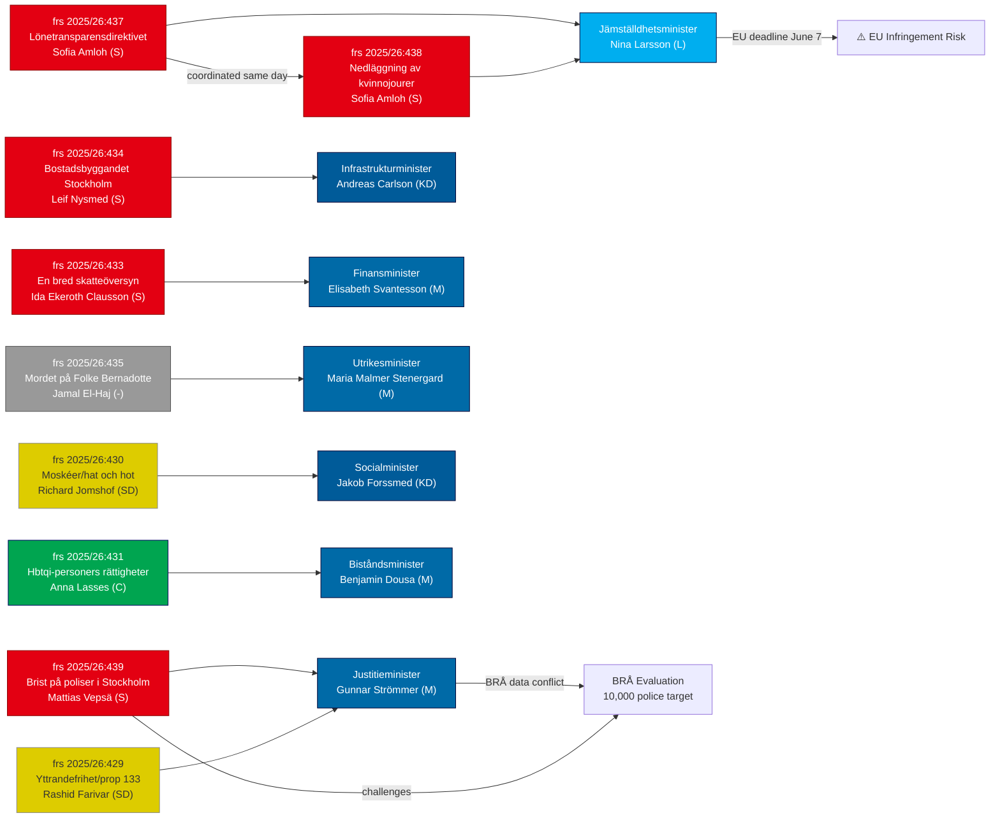

# Cross-Reference Map — Interpellations 2026-04-21

**Date**: 2026-04-21
**Riksmöte**: 2025/26

## Document Relationships

## Thematic Cross-References

### Theme 1: Gender Equality (Coordinated Attack)
- **HD10437** (frs 2025/26:437) + **HD10438** (frs 2025/26:438): Both filed by Sofia Amloh (S) on 2026-04-17
- Both target Nina Larsson (L), Jämställdhetsminister
- EU Pay Directive creates external legal deadline; women's shelter closures create domestic political pressure
- **Strategic objective**: Force Nina Larsson to defend two gender equality failures simultaneously before May 5 deadline

### Theme 2: Public Safety (Police & Crime)
- **HD10439** (frs 2025/26:439): Stockholm police gap — Mattias Vepsä (S) → Gunnar Strömmer (M)
- **HD10429** (frs 2025/26:429): Freedom of expression + anti-crime bill — Rashid Farivar (SD) → Gunnar Strömmer (M)
- **HD10420** (frs 2025/26:420): Police racial discrimination — Lawen Redar (S) → Gunnar Strömmer (M)
- Three simultaneous interpellations targeting Justice Minister create contradictory pressures

### Theme 3: Infrastructure Crisis (Andreas Carlson Under Siege)
- **HD10434**: Stockholm housing starts
- **HD10428**: Scandinavian Mountain Airport emergency designation
- **HD10425**: Defense infrastructure cost allocation
- **HD10424**: Torsby/Hagfors airline shutdown
- **HD10418**: Riksväg 62 rockslide risk
- **HD10417**: Södra stambanan Alvesta-Växjö double track
- **HD10413**: Kupolen housing company bankruptcy
- **HD10412**: Accessibility for disabled persons
- **HD10410**: Västerdalsbanan railway shutdown
- **Pattern**: 9 interpellations across separate S MPs — coordinated but not same-day

### Theme 4: Foreign Policy/Israel
- **HD10435** (frs 2025/26:435): Bernadotte assassination accountability
- **HD10426** (frs 2025/26:426): Israel death penalty laws
- Both target Maria Malmer Stenergard (M), Utrikesminister
- Context: Gaza war, ongoing Swedish humanitarian position debates

### Theme 5: Fiscal/Economic Policy
- **HD10433** (frs 2025/26:433): Broad tax review → Svantesson
- **HD10427** (frs 2025/26:427): PostNord state ownership policy → Svantesson
- **HD10421** (frs 2025/26:421): Integration policy impact on public finances → Svantesson

## Response Status Matrix

| dok_id | Filed | Status | Response Deadline | Days Remaining |
|--------|-------|--------|-------------------|----------------|
| HD10439 | 2026-04-20 | Skickad | 2026-04-30 | 9 days |
| HD10438 | 2026-04-17 | Skickad | 2026-05-05 | 14 days |
| HD10437 | 2026-04-17 | Skickad | 2026-05-05 | 14 days |
| HD10435 | 2026-04-16 | Skickad | 2026-04-30 | 9 days |
| HD10434 | 2026-04-15 | Skickad | 2026-04-29 | 8 days |
| HD10433 | 2026-04-15 | Skickad | 2026-04-29 | 8 days |
| HD10436 | 2026-04-16 | Skickad | Unknown | N/A (space industry) |
