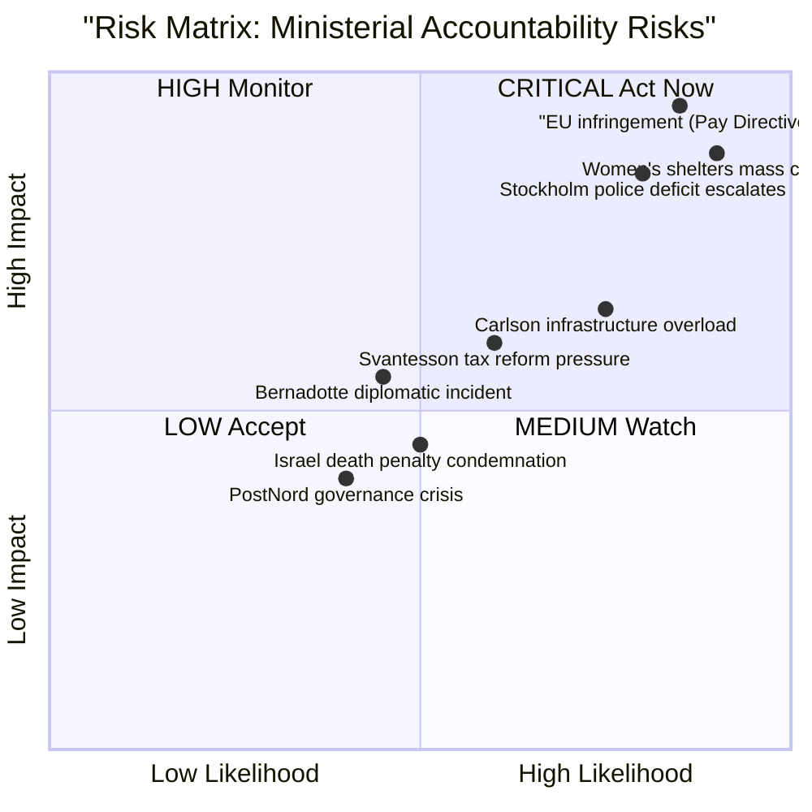

# Risk Assessment — Interpellations 2026-04-21

**Date**: 2026-04-21
**Riksmöte**: 2025/26

## Risk Matrix (Likelihood × Impact)

## Numeric Risk Scores (Likelihood × Impact, scale 1-5)

| Risk ID | Risk Description | Likelihood (L) | Impact (I) | Score (L×I) | Owner | Deadline |
|---------|-----------------|----------------|------------|-------------|-------|----------|
| R01 | EU infringement proceedings if Pay Directive not transposed | 4.5 | 5.0 | 22.5 | Nina Larsson (L) | 2026-06-07 |
| R00 | Finance Minister parliamentary misstatement exposed by court judgment | 4.8 | 4.8 | 23.0 | Elisabeth Svantesson (M) | 2026-05-05 (debate) |
| R02 | Women's shelters continue closing; election optics crisis | 4.8 | 4.5 | 21.6 | Nina Larsson (L) | Ongoing |
| R03 | Stockholm police deficit hardens S's "hollow victory" narrative | 4.2 | 4.8 | 20.2 | Gunnar Strömmer (M) | 2026-04-30 |
| R04 | Healthcare building investment gap triggers regional media crisis | 4.0 | 4.8 | 19.2 | Elisabet Lann (KD) | Ongoing |
| R04b | Occupational physician supply collapse; mandatory safety checks fail | 4.0 | 4.5 | 18.0 | Johan Britz (L) | 2026-05-05 |
| R05 | Andreas Carlson infrastructure accumulation becomes "Carlson crisis" narrative | 3.8 | 4.5 | 17.1 | Andreas Carlson (KD) | Per response |
| R06 | Bernadotte interpellation prompts Israel diplomatic response to Sweden | 3.0 | 5.0 | 15.0 | Maria Malmer Stenergard (M) | 2026-04-30 |
| R07 | Tax reform demand creates pressure on election-year budget credibility | 3.5 | 3.8 | 13.3 | Elisabeth Svantesson (M) | Medium-term |
| R08 | SD freedom of expression interpellation (prop 133) creates intra-coalition tension | 3.0 | 3.5 | 10.5 | Gunnar Strömmer (M) | Ongoing |
| R09 | PostNord ownership policy failure becomes privatization narrative | 2.5 | 3.0 | 7.5 | Elisabeth Svantesson (M) | Medium-term |
| R10 | Space industry interpellation (withdrawn) resurfaces after sector event | 2.0 | 3.0 | 6.0 | Lotta Edholm (L) | Unlikely |

## Ministerial Response Timeline Analysis

| Minister | Interpellations | Response Deadline | Status | Risk |
|----------|----------------|-------------------|--------|------|
| Elisabeth Svantesson (M) | HD10442, HD10433, HD10427, HD10421 | 2026-05-05 | Skickad | CRITICAL — court judgment exposes false Riksdag statement |
| Nina Larsson (L) | HD10437, HD10438 | 2026-05-05 | Skickad (sent) | HIGH — EU compliance + women's safety |
| Gunnar Strömmer (M) | HD10439, HD10441 | 2026-04-30 / 2026-05-05 | Skickad | HIGH — BRÅ data + rule of law |
| Johan Britz (L) | HD10440 | 2026-05-05 | Skickad | HIGH — occupational medicine vacuum |
| Andreas Carlson (KD) | HD10434 | 2026-04-29 | Skickad | HIGH — 9 cumulative interpellations |
| Maria Malmer Stenergard (M) | HD10435 | 2026-04-30 | Skickad | HIGH — diplomatic implications |

## Forward Risk Indicators

1. **47 days to EU Pay Directive deadline** (June 7, 2026): If Nina Larsson does not announce transposition timetable before May 5 response deadline, EU infringement proceedings become near-certain → R01 escalates to Critical
2. **BRÅ Stockholm Police data** (HD10439): Minister Strömmer's April 30 response will reveal whether government has a plan for the ~1,000 officer gap; evasive answer will be weaponized by S in election campaign
3. **Women's shelter closures** (HD10438): If more NGOs announce closure before May 5, media amplification increases exponentially — Nina Larsson faces simultaneous pressure on two fronts
4. **Carlson Infrastructure Accumulation**: With 9 interpellations outstanding, any major infrastructure incident (bridge collapse, rail failure) would create "accountability gap" narrative

## Election 2026 Risk Assessment

| Area | Vulnerability | S Attack Vector | Coalition Defense |
|------|-------------|----------------|------------------|
| Police/Safety | MEDIUM-HIGH | "10,000 police lie — Stockholm still short" | "National target met; city growth issue" |
| Gender Equality | HIGH | "Women's shelters closing; EU law violated" | "EU compliance ongoing; sector reform needed" |
| Housing | HIGH | "900 fewer homes in Stockholm 2026" | "Market conditions; long-term planning" |
| Healthcare | HIGH | "1960s hospitals crumbling; no state plan" | "Regional responsibility; investment coming" |
| Infrastructure | HIGH | "Carlson overwhelmed; 9 unanswered questions" | "Record infrastructure investment" |
