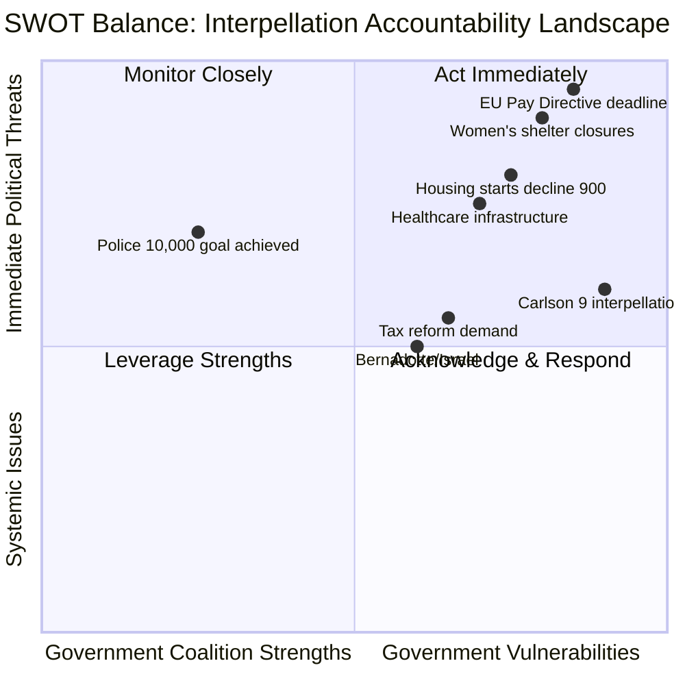

# SWOT Analysis — Interpellations 2026-04-21

**Date**: 2026-04-21
**Riksmöte**: 2025/26
**Analysis Depth**: Deep

## Multi-Stakeholder SWOT Framework

## SWOT Matrix by Stakeholder Group

---

### 1. Citizens [SWOT Group 1]

| # | Statement | Evidence (frs ID/dok_id) | Confidence | Impact | Entry Date |
|---|-----------|--------------------------|------------|--------|------------|
| S1 | Police presence improved nationally with 10,000-officer milestone achieved | frs 2025/26:439; BRÅ report March 2026 | [HIGH] | Moderate | 2026-04-21 |
| S2 | EU Pay Transparency Directive will force employers to report wages publicly | frs 2025/26:437; EU Directive 2023/970 | [HIGH] | Significant | 2026-04-21 |
| W1 | Stockholm residents face declining police density — 1,000 officers short vs peer regions | frs 2025/26:439; BRÅ evaluation 2026 | [HIGH] | High | 2026-04-21 |
| W2 | Domestic violence survivors losing access to women's shelters as NGOs close | frs 2025/26:438; ideburet sector reports | [HIGH] | High | 2026-04-21 |
| O1 | Interpellations create public accountability record; ministers must answer on camera | Parliamentary procedure | [HIGH] | Moderate | 2026-04-21 |
| T1 | Housing starts fell by 900 in Stockholm region for 2026; supply shortfall deepening | frs 2025/26:434; Stockholms region prognos | [HIGH] | High | 2026-04-21 |

---

### 2. Government Coalition [SWOT Group 2]

| # | Statement | Evidence (frs ID/dok_id) | Confidence | Impact | Entry Date |
|---|-----------|--------------------------|------------|--------|------------|
| S1 | BRÅ confirms 10,000 police milestone reached — signature M achievement of the term | frs 2025/26:439; BRÅ report March 2026 | [HIGH] | Positive | 2026-04-21 |
| S2 | Coalition maintains consistent position on EU obligations including Pay Directive | frs 2025/26:437; Government programme | [MEDIUM] | Moderate | 2026-04-21 |
| W1 | Andreas Carlson (KD) faces 9 interpellations across infrastructure/housing portfolio — unsustainable accountability burden | HD10434, HD10428, HD10425, HD10424, HD10418, HD10417, HD10413, HD10412, HD10410 | [HIGH] | High | 2026-04-21 |
| W2 | Nina Larsson (L) has not answered either gender equality interpellation (HD10437, HD10438) within 30-day window; response deadline May 5 | frs 2025/26:437, frs 2025/26:438; dokaktivitet status Skickad | [HIGH] | High | 2026-04-21 |
| W3 | S using interpellations as systematic pre-election attack platform — 11/14 recent interpellations from S | Classification analysis | [HIGH] | Strategic | 2026-04-21 |
| O1 | Interpellation debates allow ministers to present policy achievements in controlled parliamentary setting | Parliamentary procedure | [MEDIUM] | Moderate | 2026-04-21 |
| T1 | EU infringement risk if Pay Transparency Directive not transposed by June 7, 2026 — 47-day window remaining | frs 2025/26:437; EU Directive 2023/970 | [HIGH] | Critical | 2026-04-21 |
| T2 | Police shortage in Stockholm exposed by BRÅ report contradicts narrative of policing success | frs 2025/26:439; BRÅ March 2026 | [HIGH] | High | 2026-04-21 |

---

### 3. Opposition Bloc [SWOT Group 3]

| # | Statement | Evidence (frs ID/dok_id) | Confidence | Impact | Entry Date |
|---|-----------|--------------------------|------------|--------|------------|
| S1 | S filing 11/14 recent interpellations demonstrates disciplined pre-election accountability strategy | Classification analysis; all HD10424-HD10439 | [HIGH] | Strategic | 2026-04-21 |
| S2 | Coordinated twin attack: Sofia Amloh filed both HD10437 and HD10438 against same minister (Nina Larsson) on same day | frs 2025/26:437, frs 2025/26:438; datum 2026-04-17 | [HIGH] | High | 2026-04-21 |
| S3 | EU deadline on Pay Directive provides external legal leverage — infringement proceedings argument is credible | frs 2025/26:437 | [HIGH] | Significant | 2026-04-21 |
| W1 | SD support for coalition limits opposition coordination on some issues | Parliamentary arithmetic | [MEDIUM] | Moderate | 2026-04-21 |
| O1 | Stockholm police deficit finding comes from non-partisan BRÅ report — opposition can cite credible source | frs 2025/26:439; BRÅ | [HIGH] | High | 2026-04-21 |
| O2 | Bernadotte interpellation (HD10435) links Israel's 1948 assassination to current Gaza policy — international law frame | frs 2025/26:435 | [MEDIUM] | Moderate | 2026-04-21 |
| T1 | SD's parallel interpellations (HD10429, HD10430) on free speech and mosque hate create complexity for unified opposition messaging | frs 2025/26:429, frs 2025/26:430 | [MEDIUM] | Low | 2026-04-21 |

---

### 4. Business/Industry [SWOT Group 4]

| # | Statement | Evidence (frs ID/dok_id) | Confidence | Impact | Entry Date |
|---|-----------|--------------------------|------------|--------|------------|
| S1 | EU Pay Transparency Directive will create level playing field across EU for salary reporting | frs 2025/26:437 | [MEDIUM] | Moderate | 2026-04-21 |
| W1 | Housing construction decline reduces workforce availability in Stockholm; 900 fewer starts = fewer homes for workers | frs 2025/26:434 | [HIGH] | Significant | 2026-04-21 |
| W2 | Tax review interpellation signals potential fiscal policy changes — investment uncertainty | frs 2025/26:433 | [MEDIUM] | Moderate | 2026-04-21 |
| O1 | Space industry interpellation (HD10436) signals parliamentary awareness of sector's strategic importance | frs 2025/26:436 | [LOW] | Low | 2026-04-21 |
| T1 | Data center energy policy interpellation (HD10414) indicates parliamentary pressure on electricity availability | frs 2025/26:414 | [MEDIUM] | Moderate | 2026-04-21 |

---

### 5. Civil Society [SWOT Group 5]

| # | Statement | Evidence (frs ID/dok_id) | Confidence | Impact | Entry Date |
|---|-----------|--------------------------|------------|--------|------------|
| S1 | Women's shelter interpellation (HD10438) directly represents ideburet organizations' lobbying — parliamentary voice secured | frs 2025/26:438 | [HIGH] | Significant | 2026-04-21 |
| W1 | Many women's shelters closing without state replacement funding secured; NGO model under pressure | frs 2025/26:438 | [HIGH] | High | 2026-04-21 |
| W2 | Disability rights organizations noted absence in Funktionsrätt Sverige review (previous batch, HD10416) | frs 2025/26:416 | [MEDIUM] | Moderate | 2026-04-21 |
| O1 | LGBTQI+ rights interpellation (HD10431, Center) shows cross-party civil society advocacy | frs 2025/26:431 | [MEDIUM] | Moderate | 2026-04-21 |
| T1 | Social dumping interpellation (HD10423) signals community organizations overwhelmed by inter-municipal transfer of vulnerable individuals | frs 2025/26:423 | [HIGH] | High | 2026-04-21 |

---

### 6. International/EU [SWOT Group 6]

| # | Statement | Evidence (frs ID/dok_id) | Confidence | Impact | Entry Date |
|---|-----------|--------------------------|------------|--------|------------|
| S1 | Sweden generally seen as EU rule of law compliant; Pay Directive is opportunity to lead on implementation | frs 2025/26:437 | [MEDIUM] | Moderate | 2026-04-21 |
| W1 | Sweden risks EU infringement proceedings if Pay Directive not transposed by June 7, 2026 | frs 2025/26:437; EU Directive 2023/970 | [HIGH] | Critical | 2026-04-21 |
| W2 | Foreign affairs minister faces dual interpellations on Israel/Palestine — Gaza war creates sustained diplomatic pressure | frs 2025/26:435, frs 2025/26:426 | [HIGH] | Significant | 2026-04-21 |
| O1 | Bernadotte case (HD10435) offers Sweden opportunity to demonstrate continued commitment to UN Charter and international law | frs 2025/26:435 | [MEDIUM] | Moderate | 2026-04-21 |
| T1 | LGBTQI+ rights backsliding globally could force Swedish aid conditionality decisions (HD10431) | frs 2025/26:431 | [MEDIUM] | Moderate | 2026-04-21 |

---

### 7. Judiciary/Constitutional [SWOT Group 7]

| # | Statement | Evidence (frs ID/dok_id) | Confidence | Impact | Entry Date |
|---|-----------|--------------------------|------------|--------|------------|
| S1 | Swedish constitution provides robust framework for interpellation procedure as democratic accountability tool | Parliamentary procedure; RF Ch. 13 | [HIGH] | Structural | 2026-04-21 |
| W1 | Bill 2025/26:133 may create tension between new crime-fighting powers and freedom of expression (HD10429 by Farivar/SD) | frs 2025/26:429 | [MEDIUM] | Moderate | 2026-04-21 |
| O1 | DO lawsuit against Police Authority (HD10420) presents test case for discrimination law enforcement | frs 2025/26:420; DO case against Polismyndigheten | [HIGH] | Significant | 2026-04-21 |
| T1 | Israel death penalty legislation (HD10426) tests Sweden's position on capital punishment in foreign states | frs 2025/26:426 | [MEDIUM] | Low | 2026-04-21 |

---

### 8. Media/Public Opinion [SWOT Group 8]

| # | Statement | Evidence (frs ID/dok_id) | Confidence | Impact | Entry Date |
|---|-----------|--------------------------|------------|--------|------------|
| S1 | BRÅ report provides authoritative, quotable data for Stockholm police coverage — journalists have concrete numbers | frs 2025/26:439; BRÅ March 2026 | [HIGH] | High | 2026-04-21 |
| S2 | Expressen investigative report triggered HD10430 mosque hate — media-parliament feedback loop active | frs 2025/26:430; Expressen investigation | [HIGH] | Moderate | 2026-04-21 |
| W1 | Women's shelter closures likely under-reported; interpellation creates news hook for regional outlets | frs 2025/26:438 | [HIGH] | Significant | 2026-04-21 |
| O1 | Police debate (HD10439) creates opportunity for opposition messaging: "10,000 police target met but Stockholm still short" | frs 2025/26:439 | [HIGH] | High | 2026-04-21 |
| T1 | Multiple simultaneous high-profile interpellations create attention competition — some stories may not break through media cycle | Multiple | [MEDIUM] | Moderate | 2026-04-21 |
