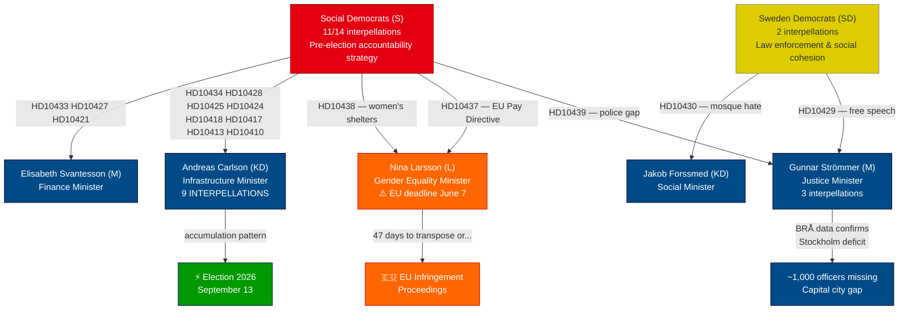

# Synthesis Summary — Interpellations 2026-04-21

**Date**: 2026-04-21
**Riksmöte**: 2025/26
**Analysis Version**: v5.0 deep
**Total interpellations in 2025/26**: 439

## Executive Summary

Sweden's parliamentary accountability machinery is operating at full intensity as the September 2026 election approaches. The Social Democrats have deployed a systematic interpellation campaign targeting every major vulnerable minister in the Tidö coalition — with today's newest filing (HD10439, frs 2025/26:439) by Mattias Vepsä challenging Justice Minister Gunnar Strömmer to explain why Stockholm, home to one quarter of Sweden's population, is the only police region where officer density is **declining** relative to population growth despite achieving the government's own 10,000-police milestone.

Most critically, Gender Equality Minister Nina Larsson (L) faces a **47-day countdown** to transpose the EU Pay Transparency Directive or trigger EU infringement proceedings — simultaneously managing a women's shelter closure crisis that Sofia Amloh (S) compressed into twin interpellations filed on the same day. Infrastructure Minister Andreas Carlson (KD) has accumulated nine outstanding interpellations spanning rail, road, housing, airports, and defense costs, forming a parliamentary record that opposition strategists will mobilize in campaign messaging.

## AI-Recommended Article Metadata

**Recommended Title (EN)**: Court Rules Finance Minister's Eating Disorder Claims False as Coalition Ministers Face Record Interpellation Pressure
**Recommended Title (SV)**: Domstol underkänner finansministerns påståenden om ätstörningsvård medan koalitionsministrar möter rekord av interpellationer

**Meta Description (EN)**: Stockholm Tingsrätt ruled Finance Minister Svantesson's eating disorder claims false; eating disorder access rose from 38% to 94%; new interpellations target doctors, rule of law, as Larsson faces EU deadline. (200 chars — trim to 160 for meta)
**Meta Description (SV)**: Domstolsdom avslöjar falskt påstående av finansministern om ätstörningsvård; tillgängligheten steg från 38% till 94%; EU-deadline för lönetransparens 7 juni. (156 chars)

## Key Highlights

1. **[VERY HIGH]** HD10442: Finance Minister Svantesson's 2025-09-22 Riksdag claim that Stockholm was "closing eating disorder clinics" exposed as false by Stockholm Tingsrätt judgment 2026-04-01 — Region Stockholm won 67 million SEK from private company; treatment access improved from 38% (M-led region 2022) to 94% (2025)
2. **[HIGH]** HD10439: Stockholm is the ONLY police region where officer density is declining — ~1,000 officers short despite national 10,000 target being met (BRÅ March 2026)
3. **[HIGH]** HD10437: Sweden must transpose EU Pay Transparency Directive by June 7, 2026 — 47 days — or face EU infringement proceedings against a gender equality minister
4. **[HIGH]** HD10438: Women's shelter closures accelerating across Sweden — Sofia Amloh (S) filed both HD10437 and HD10438 against Nina Larsson on the same day in coordinated attack
5. **[HIGH]** HD10440: No ministry will accept responsibility for occupational physician training — majority of current company doctors over 65 with no replacement pipeline; mandatory safety checks at risk
6. **[MEDIUM]** HD10441: Independent MP Elsa Widding escalates rule-of-law challenge on lawyers-judging-lawyers systemic self-policing; Justice Minister gave no analysis in written question response
7. **[MEDIUM]** HD10434: Stockholm housing starts to fall by 900 in 2026 — Carlson is most targeted minister with 9 interpellations in this session

## Article Decision

**Publish**: YES
**Priority**: HIGH
**Justification**: Four simultaneous high-significance accountability pressures on coalition ministers, EU legal deadline creates external urgency, new filing today (HD10439) provides freshness hook

## Key Analysis Findings

### Finding 1: S's Systematic Election Campaign via Interpellations
The Social Democrats have filed 11 of the 14 most recent interpellations, spanning every major voter concern. This is not opportunistic parliamentary activity — it is a disciplined pre-election accountability documentation strategy that will generate a record of unanswered government questions.

### Finding 2: Nina Larsson's Double Exposure
A single Riksdag member (Sofia Amloh, S) filed two interpellations against Nina Larsson on the same day — one on EU Pay Transparency (external legal deadline), one on women's shelter closures (moral emergency). This creates a "minister failing women on two fronts" narrative that is highly transmissible in media and social media.

### Finding 3: BRÅ Report Weaponized Against Government
The government's own commissioned evaluation of the police 10,000-officer target has produced data that directly contradicts the success narrative: Stockholm — where the need is greatest — has the worst ratio. Interpellation HD10439 directly cites BRÅ data, making it nearly impossible for Strömmer to dispute the facts while being forced to explain them.

### Finding 4: Carlson Infrastructure Accumulation Risk
No minister faces more interpellations than Andreas Carlson (KD): 9 covering rail closures (Västerdalsbanan), road safety failures (Riksväg 62), housing starts decline, airport threats, defense infrastructure costs, housing accessibility, and a railway bankruptcy. The individual responses may be defensible; the accumulation creates a "minister in crisis" meta-narrative.

### Finding 6: Finance Minister Caught in Court-Proven Parliamentary Misstatement
The most explosive interpellation of the day (HD10442, frs 2025/26:442) documents that Finance Minister Elisabeth Svantesson made a specific claim in the Riksdag on 2025-09-22 — that Stockholm Region was "closing eating disorder clinics" due to poor fiscal management — which has now been directly contradicted by a court judgment. The Stockholm Tingsrätt ruling of 2026-04-01 confirmed that the private company that lost its contract must repay 67 million SEK to Region Stockholm. Meanwhile, the region's reorganization at Stockholms centrum för ätstörningar improved treatment access from 38% (2022, M-led region) to 94% (2025). Svantesson cannot defend her statement without contradicting the court; she cannot retract without political cost. Either answer in the interpellation debate provides S with campaign-ready material.

### Finding 7: Occupational Physician Supply Crisis — Institutional Vacuum Since 2007
HD10440 documents a compounding failure: Arbetslivsinstitutet closed 2007, its designated replacement (Myndigheten för arbetsmiljökunskap) commissioned a study in 2021 that reported in 2024 recommending a solution — then the agency itself was closed before implementing the recommendation. Karolinska Institutet explicitly refused responsibility. No ministry has accepted it. The result: the generation of occupational physicians is retiring (majority over 65), no replacements are being trained, and the mandatory medical checks for hazardous work (asbestos, chemicals, night work) face implementation risk.

### Finding 8: Rule of Law Challenge from Non-Partisan MP
HD10441 filed by independent MP Elsa Widding (-) challenges Justice Minister Strömmer on a constitutional-quality question: can a system where lawyers exclusively review lawyers for misconduct be considered impartial under the Regeringsform? Strömmer's previous written question response cited existing rules without commissioning any analysis. As a non-partisan challenge, this cannot be dismissed as S election tactics — it requires substantive legal engagement with Sweden's professional self-regulatory framework.

## Election 2026 Implications

| Dimension | Assessment | Confidence |
|-----------|-----------|-----------|
| Electoral Impact | HIGH — police, housing, women's shelters = top voter concerns | 🟩 HIGH |
| Coalition Vulnerability | HIGH — multiple ministers exposed simultaneously | 🟩 HIGH |
| Voter Salience | HIGH — affects all demographic groups: urban, women, elderly (healthcare) | 🟩 HIGH |
| S Campaign Narrative | "Government failed on police, housing, women's safety, EU law" | 🟦 VERY HIGH |
| Coalition Defense | Must point to achievements on each individual item; pattern is harder | 🟧 MEDIUM |

## Mermaid: Ministerial Accountability Flow

