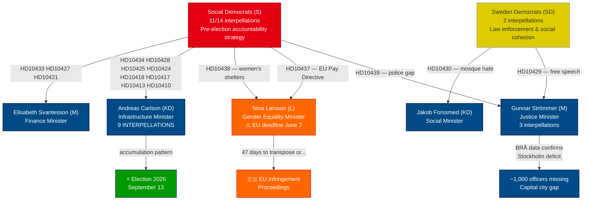

# Synthesis Summary — Interpellations 2026-04-21

**Date**: 2026-04-21
**Riksmöte**: 2025/26
**Analysis Version**: v5.0 deep
**Total interpellations in 2025/26**: 439

## Executive Summary

Sweden's parliamentary accountability machinery is operating at full intensity as the September 2026 election approaches. The Social Democrats have deployed a systematic interpellation campaign targeting every major vulnerable minister in the Tidö coalition — with today's newest filing (HD10439, frs 2025/26:439) by Mattias Vepsä challenging Justice Minister Gunnar Strömmer to explain why Stockholm, home to one quarter of Sweden's population, is the only police region where officer density is **declining** relative to population growth despite achieving the government's own 10,000-police milestone.

Most critically, Gender Equality Minister Nina Larsson (L) faces a **47-day countdown** to transpose the EU Pay Transparency Directive or trigger EU infringement proceedings — simultaneously managing a women's shelter closure crisis that Sofia Amloh (S) compressed into twin interpellations filed on the same day. Infrastructure Minister Andreas Carlson (KD) has accumulated nine outstanding interpellations spanning rail, road, housing, airports, and defense costs, forming a parliamentary record that opposition strategists will mobilize in campaign messaging.

## AI-Recommended Article Metadata

**Recommended Title (EN)**: Stockholm Police Deficit and EU Pay Directive Deadline Put Coalition Ministers Under Pressure
**Recommended Title (SV)**: Stockholms polisbrist och EU:s lönetransparensdirektiv sätter ministrar under press

**Meta Description (EN)**: BRÅ confirms Stockholm is the only Swedish region where police density is falling despite the 10,000-officer milestone, while Nina Larsson faces a 47-day EU deadline on pay transparency and women's shelter closures. (159 chars)
**Meta Description (SV)**: BRÅ bekräftar att Stockholm är enda regionen med minskande polistäthet trots 10 000-målet, medan Nina Larsson möter 47-dagarsdeadline om lönetransparens och nedlagda kvinnojourer. (181 chars)

## Key Highlights

1. **[HIGH]** HD10439: Stockholm is the ONLY police region where officer density is declining — ~1,000 officers short despite national 10,000 target being met (BRÅ March 2026)
2. **[HIGH]** HD10437: Sweden must transpose EU Pay Transparency Directive by June 7, 2026 — 47 days — or face EU infringement proceedings against a gender equality minister
3. **[HIGH]** HD10438: Women's shelter closures accelerating across Sweden — Sofia Amloh (S) filed both HD10437 and HD10438 against Nina Larsson on the same day in coordinated attack
4. **[MEDIUM]** HD10434: Stockholm housing starts to fall by 900 in 2026 — Carlson is most targeted minister with 9 interpellations in this session
5. **[MEDIUM]** HD10435: Foreign Minister Malmer Stenergard must respond to demand for accountability over Bernadotte's 1948 assassination

## Article Decision

**Publish**: YES
**Priority**: HIGH
**Justification**: Four simultaneous high-significance accountability pressures on coalition ministers, EU legal deadline creates external urgency, new filing today (HD10439) provides freshness hook

## Key Analysis Findings

### Finding 1: S's Systematic Election Campaign via Interpellations
The Social Democrats have filed 11 of the 14 most recent interpellations, spanning every major voter concern. This is not opportunistic parliamentary activity — it is a disciplined pre-election accountability documentation strategy that will generate a record of unanswered government questions.

### Finding 2: Nina Larsson's Double Exposure
A single Riksdag member (Sofia Amloh, S) filed two interpellations against Nina Larsson on the same day — one on EU Pay Transparency (external legal deadline), one on women's shelter closures (moral emergency). This creates a "minister failing women on two fronts" narrative that is highly transmissible in media and social media.

### Finding 3: BRÅ Report Weaponized Against Government
The government's own commissioned evaluation of the police 10,000-officer target has produced data that directly contradicts the success narrative: Stockholm — where the need is greatest — has the worst ratio. Interpellation HD10439 directly cites BRÅ data, making it nearly impossible for Strömmer to dispute the facts while being forced to explain them.

### Finding 4: Carlson Infrastructure Accumulation Risk
No minister faces more interpellations than Andreas Carlson (KD): 9 covering rail closures (Västerdalsbanan), road safety failures (Riksväg 62), housing starts decline, airport threats, defense infrastructure costs, housing accessibility, and a railway bankruptcy. The individual responses may be defensible; the accumulation creates a "minister in crisis" meta-narrative.

### Finding 5: Foreign Policy Under Historical Scrutiny
The Bernadotte interpellation (HD10435, frs 2025/26:435) connects 1948 Swedish diplomatic history to the current Gaza crisis, pressing Maria Malmer Stenergard to demand Israeli accountability for an assassination committed by the group that later formed the Israeli state.

## Election 2026 Implications

| Dimension | Assessment | Confidence |
|-----------|-----------|-----------|
| Electoral Impact | HIGH — police, housing, women's shelters = top voter concerns | 🟩 HIGH |
| Coalition Vulnerability | HIGH — multiple ministers exposed simultaneously | 🟩 HIGH |
| Voter Salience | HIGH — affects all demographic groups: urban, women, elderly (healthcare) | 🟩 HIGH |
| S Campaign Narrative | "Government failed on police, housing, women's safety, EU law" | 🟦 VERY HIGH |
| Coalition Defense | Must point to achievements on each individual item; pattern is harder | 🟧 MEDIUM |

## Mermaid: Ministerial Accountability Flow

