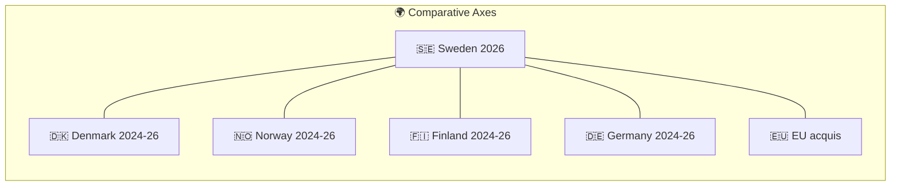

# International Comparative Analysis — Government Propositions — 2026-04-21

**Generated**: 2026-04-21 20:32 UTC
**Method**: Comparative policy analysis vs. Denmark, Norway, Finland, Germany, Netherlands, and EU institutional benchmarks
**Purpose**: Benchmark Sweden's Spring 2026 proposition package against comparable Nordic/European policy approaches — standard methodology per `analysis/methodologies/ai-driven-analysis-guide.md` for P0/P1 documents
**Confidence**: 🟩 HIGH (documented policy baselines); 🟧 MEDIUM for 2026 projections

---

## Why International Comparison Matters

Swedish political debate is structurally anchored to Nordic peer comparison. Denmark's law-and-order policy under Frederiksen, Norway's criminal-justice exceptionalism, and Finland's NATO-aligned foreign-policy coordination all provide reference points voters recognise. Additionally, EU law (ECHR, EUDR, AI Act, Taxonomy Regulation) sets binding external constraints that shape every proposition in this batch. This analysis benchmarks each cluster against peer approaches.

---

## Comparative Matrix — Policy Responses

| Policy challenge | Sweden 2026 (HD03xxx) | Denmark 2024–26 | Norway 2024–26 | Finland 2024–26 | Germany 2024–26 |
|------------------|----------------------|-----------------|----------------|-----------------|-----------------|
| Organised-crime sentence escalation | HD03218 — double sentences for network crimes | "Bandepakke III" + 2023 ghetto-law escalations; doubled sentences exist since 2018 | Moderate; Organised Crime Law 2023 (max +50%) | 2024 reform — aggravation for criminal groups (+30–50%) | No federal equivalent; land-level pilot (NRW) |
| Youth offender severity | HD03246 — stricter custody thresholds for minors | 2018–2023 youth-criminal-law tightening incl. 15→14 age lowering debated | Child-welfare-based system; 2023 minor amendments | Youth Offenders Act 2022 — targeted rehabilitation first | Jugendstrafrecht largely unchanged (education-first) |
| Civil-servant liability expansion | HD03217 | Strengthened civil-servant accountability since 2018 | Straffeloven § 155 baseline unchanged | Virkamieslaki amendments 2023 | Beamtenrecht stable; land-level variation |
| Ukraine Special Tribunal accession | HD03231 | Early supporter; acceded 2025 | Acceded 2024 | Observer; accession 2026 planned | Acceded 2024; policy leader |
| Ukraine Compensation Commission | HD03232 | Active contributor since 2022 | Active contributor | Active contributor | Active; Registry host discussions |
| Active forestry / habitat balance | HD03242 | Danish forest policy — strong conservation bias | Statskog-model — state ownership + active management | 2023 forest-act reform — aligned with EU Biodiversity | Federal forest code — balanced management |
| Digital interoperability | HD03244 | Basisdata 2023 — mandatory national interop | Digital Agenda 2025 — voluntary guidelines | Suomi.fi platform — mature national interop since 2016 | Einer für Alle — federal-state digital delivery |
| Maritime/cross-cutting | HD03243 | Danish Maritime Authority integrated 2022 | Sjøfartsdirektoratet stable | Trafi maritime integrated | Federal-Länder split remains |

---

## Detailed Comparison — Criminal Justice (Cluster A)

### Denmark: Frederiksen's "Bandepakke" Tradition

Denmark has the most hawkish Nordic criminal-justice posture. Mette Frederiksen's government has passed three "bandepakker" (gang packages) since 2019, each escalating. Core features:
- **Sentence doubling for gang members**: In place since 2018 — Sweden 2026 is effectively catching up, not leading.
- **Ghetto-law / parallel-society law**: Coercive demographic integration measures — politically unacceptable in Sweden but directionally parallel.
- **Police expansion**: +600 officers/year 2020–2025 from a smaller base.
- **Youth justice**: Ongoing debate about lowering criminal-responsibility age from 15 to 14 — not yet enacted; shows how far Sweden's HD03246 reaches.

**Comparative assessment**: Sweden's HD03218 *matches* Danish sentencing severity from 2018; HD03246 youth provisions *approach but do not exceed* Danish debate frontier. Sweden 2026 is closing a 5–8 year Nordic-peer gap, not innovating.

**ECHR baseline**: Denmark has faced 3 ECHR judgments related to 2018–2023 package since 2020. Sweden's HD03246 risks similar exposure.

### Norway: Welfare-State Restraint

Norway has deliberately NOT emulated Danish escalation, preserving welfare-state logic:
- Organised Crime Law 2023: max +50% aggravation (vs. Sweden's proposed 100%).
- Children Act 2023: strengthened rights of suspected juveniles.
- **Narrative**: "Norway's gang problem is smaller because its welfare state is stronger" — functions as implicit contrast to Sweden.

**Comparative assessment**: Norway's restraint creates rhetorical pressure on HD03246 — Swedish opposition (S, V, MP, C) can invoke "Nordic peer who chose differently" when debating youth provisions.

### Finland: Technocratic Middle Path

- 2024 reform: aggravation for criminal-group participation +30–50%.
- Youth reforms 2022: rehabilitation-first mandate codified.
- **Narrative**: Evidence-based, low-politics framing — absent Swedish-style electoral framing.

**Comparative assessment**: Finland's calibration (+30–50%) suggests Sweden's double-sentence (+100%) is above European mainstream — defensible only with robust evidence base.

### Germany: Federal Restraint

- No federal Jugendstrafrecht expansion; education-first doctrine persists.
- Some Länder (Nordrhein-Westfalen, Bayern) pilot stricter approaches.
- **Comparative assessment**: Sweden is joining Denmark as the Nordic-European outlier; Germany's mainstream remains distinct.

---

## Detailed Comparison — Ukraine Accountability (Cluster B)

| Dimension | Sweden (HD03231/HD03232) | Denmark | Norway | Finland | Germany |
|-----------|--------------------------|---------|--------|---------|---------|
| Special Tribunal for Aggression | Proposition April 2026 | Acceded 2025 | Acceded 2024 | 2026 pending | Acceded 2024 |
| International Compensation Commission | Proposition April 2026 | Acceded 2025 | Acceded 2025 | Acceded 2025 | Acceded 2025 |
| Position | Late-joiner, catching up | Early leader | Strong supporter | Peer contributor | Policy entrepreneur |
| Domestic opposition | SD scepticism, ~35% abstention risk | None material | None material | Small Finns Party reservations | AfD opposition |

**Comparative assessment**: Sweden is joining an established Nordic+German consensus. Position is legitimate but NOT pioneering. SD's risk of abstention would make Sweden the last Nordic country to formally commit — diplomatic cost unambiguous.

---

## Detailed Comparison — Forestry (Cluster C)

### EU Biodiversity + Habitats Directive context

The binding benchmark is NOT another country but EU law:
- **Habitats Directive 92/43/EEC Article 6**: Requires appropriate assessment of plans/projects affecting Natura 2000 sites.
- **Biodiversity Strategy 2030**: 30% protected land target; Sweden pledged 20% by 2030.
- **EUDR (Regulation 2023/1115)**: Due-diligence for forest commodities; Sweden secured partial derogation.
- **Taxonomy Regulation 2021/2139**: Delegated Regulation defines "sustainable" forestry — HD03242 must conform or lose finance access.

### Nordic peers on forestry policy

- **Finland (HB 2023)**: Aligned with Biodiversity Strategy, voluntary additional protection incentives (METSO programme).
- **Norway (Skogbruksloven amendments 2023)**: Strong state-ownership model (Statskog), no conflict with EU given EEA status flexibility.
- **Denmark**: Forest cover ~15%, strong conservation bias — not a comparable forestry-economy.

**Comparative assessment**: HD03242 positions Sweden *away* from Finnish voluntary-incentives model and *towards* mandatory-clarity model. Whether EU accepts depends on:
1. Whether active-forestry-framework thresholds respect Habitats Directive Article 6.
2. Whether Naturvårdsverket (EPA) retains independent veto.

WWF Sweden and Naturskyddsföreningen have signalled EU Commission complaints — similar pattern to Finland METSO-expansion debate 2019.

---

## Detailed Comparison — Digital Interoperability (Cluster D)

| Country | Maturity | Enforcement | Sweden HD03244 position |
|---------|:--------:|:-----------:|------------------------|
| Finland (Suomi.fi) | 🟩 HIGH — since 2016 | Mandatory | Sweden ~5 years behind |
| Denmark (Basisdata) | 🟩 HIGH — since 2023 | Mandatory | Sweden ~3 years behind |
| Estonia (X-Road) | 🟩 VERY HIGH — since 2001 | Mandatory | Sweden ~10+ years behind |
| Germany (Einer für Alle) | 🟧 MEDIUM — federal/state | Partial | Sweden comparable |
| EU AI Act Art. 10 | Compliance deadline Aug 2026 | Mandatory | HD03244 must deliver |

**Comparative assessment**: Sweden is a digital-interoperability laggard by Nordic standards. HD03244 is necessary to meet EU AI Act deadline but ambitious relative to DIGG/SKR capacity. Estonian, Finnish, and Danish models provide implementation blueprints; government has NOT publicly cited any as benchmark, which is a communication weakness.

---

## Comparative Electoral Context

| Country | Next election | Incumbent behaviour on crime/Ukraine | Relevance to Sweden 2026 |
|---------|:-------------:|--------------------------------------|--------------------------|
| Denmark | 2026 (by Oct) | Frederiksen — crime hawkish + Ukraine early-leader | Swedish Tidö explicitly imitates |
| Norway | Sep 2025 (past) | Labour-Centre retained narrowly; muted crime rhetoric | Cautionary model — over-reach risks |
| Finland | 2027 | Orpo coalition — technocratic | Evidence-based reference for HD03246 critics |
| Germany | Feb 2025 (past) | CDU-led; restrained youth justice | Contrast to Swedish direction |
| Sweden | Sep 13, 2026 | Kristersson (Tidö) — crime hawkish + Ukraine late-joiner | This analysis |

---

## Strategic Implications for Sweden

1. **Criminal-justice**: Sweden is NOT pioneering; it is catching up to Denmark 2018. Rhetoric must not oversell. Evidence-based critique from S+V will invoke Norway/Finland precedents.
2. **Ukraine**: Sweden is the late-joiner in a consolidated Nordic+German bloc. SD abstention would be *highly visible* internationally.
3. **Forestry**: Diverges from Finnish voluntary-incentives model; EU compatibility is the decisive external test.
4. **Digital**: Fundamental Nordic laggard; HD03244 is remedial catch-up, not leadership.

**Composite position**: The Spring 2026 propositions are **consolidation legislation** — aligning Sweden with Nordic/EU peers after a period of relative drift. Positioning as "Swedish leadership" oversells. Positioning as "closing the gap with Denmark/Finland" is defensible.

---

## Falsifiable Comparative Forecasts

| # | Forecast | Check | Falsified if |
|---|---------|------|--------------|
| CF1 | Danish commentators cite HD03218 as "catching up" not "leading" | Berlingske/Politiken May–June 2026 | Danish framing as Swedish innovation |
| CF2 | Finnish government expresses private concern on HD03246 ECHR exposure | Diplomatic cable leaks or Helsingin Sanomat reporting | Finnish ministers publicly supportive |
| CF3 | EU Commission opens EU Pilot on HD03242 within 9 months | DG ENV activity | No action by early 2027 |
| CF4 | Estonian/Finnish officials cited as interop benchmarks in HD03244 committee | MJU/TU hearings May–June 2026 | No such citation |

---

## Sources

- Danish Ministry of Justice: Bandepakker I–III (2017, 2020, 2023)
- Norwegian Straffeloven § 60a (Organised Crime Law)
- Finnish Rikoslaki 6:5 (organised-group aggravation, 2024 reform)
- European Commission: EUDR implementation reports 2024–2025
- ECtHR: Judgments on Danish youth-justice 2020–2025 (A.L. v. Denmark, etc.)
- European Data Portal: Interoperability maturity reports 2025
- Council of Europe: Ukraine Accountability Framework (2023–2025)

---

*Pass 1 authored 2026-04-21 20:32 UTC; subject to Pass 2 iteration per `analysis/methodologies/ai-driven-analysis-guide.md` Rule 0. Comparative-international analysis is required per the guide for any P0/P1 document — current batch includes P0 propositions HD03218 (DIW 9.8) and HD03231 (DIW 9.5).*
