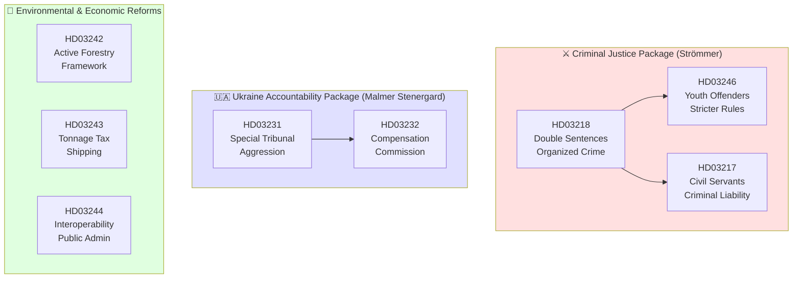

# Cross-Reference Map — Government Propositions 2026-04-21

**Analysis Date**: 2026-04-21 20:15 UTC  
**Analyst**: AI Political Intelligence Agent

---

## Cross-Proposition Thematic Architecture

---

## Cross-References to Prior Legislative Documents

| Proposition | Related Prior Documents | Thematic Link |
|-------------|------------------------|--------------|
| HD03218 | HD03238 (evening analysis 2026-04-21), previous JuU crime measures | Organized crime reform continuum |
| HD03246 | Previous Prop. 2022/23:91 (Youth Justice Reform I) | Escalating juvenile sentencing reform |
| HD03231 | Prop. 2023/24:112 (NATO accession), ICC Rome Statute ratification | Ukraine international law architecture |
| HD03232 | Ukraine aid packages (2023-2024 parliamentary votes) | Ukraine financial accountability |
| HD03242 | Prop. 2022/23:155 (Species Protection Reform), EU Biodiversity Strategy 2030 | Forestry-environment legislative cycle |
| HD03244 | EU Interoperability Framework, AI Act (2024 EU) | EU digital governance harmonization |
| HD03243 | 2022 Tonnage Tax Reform (Prop. 2021/22:200) | Maritime competitiveness update |
| HD03217 | Kommittédirektiv Dir. 2023:156 (Civil Servant Accountability Commission) | Anti-corruption legislative track |

---

## Cross-Reference to Today's Riksdag Activity

**Related Committee Reports** (from analysis/daily/2026-04-21/committeeReports/):
- FiU48: Budget appropriations relevant to criminal justice capacity (Kriminalvården expansion)
- TU16: Digital infrastructure — partially implements interoperability framework of HD03244

**Related Interpellations** (from analysis/daily/2026-04-21/interpellations/):
- Several interpellations on gang violence from previous sessions — context for HD03218/HD03246 urgency

---

## Policy Domain Interaction Effects

### Criminal Justice + Ukraine Propositions

Both sets of propositions reinforce the government's "rule of law" brand. The criminal justice package targets domestic lawlessness; the Ukraine propositions target international lawlessness (Russian aggression). Together they create a coherent narrative: "Sweden takes the rule of law seriously, at home and abroad." This thematic coherence is likely deliberate — all tabled the same week.

### Forestry + Digital Governance: "Modernization" Cluster

HD03242 and HD03244 both address modernization of established systems: forestry regulation (update to 1993 Skogsvårdslagen framework) and digital infrastructure (update to 2017 e-förvaltning framework). Both are technically complex, relatively low electoral temperature, but important for Sweden's long-term competitiveness.

### Tonnage Tax: Isolated Reform

HD03243 has no significant cross-reference connections — it is a narrow, technically-driven reform with limited political linkages. Place at end of any article coverage.

---

## Forward Intelligence: Watch Items

| Watch Item | Trigger | Timeline |
|-----------|---------|---------|
| Law Council opinion on HD03246 | Published in Riksdag documents | May 2026 |
| SD committee position on HD03231/232 | UU committee vote | May-June 2026 |
| WWF EU complaint on HD03242 | WWF press release | June-Sep 2026 |
| Brå statistics on gang violence | Annual report | August 2026 |
| Election day outcome | Sep 13, 2026 | Sep 2026 |
