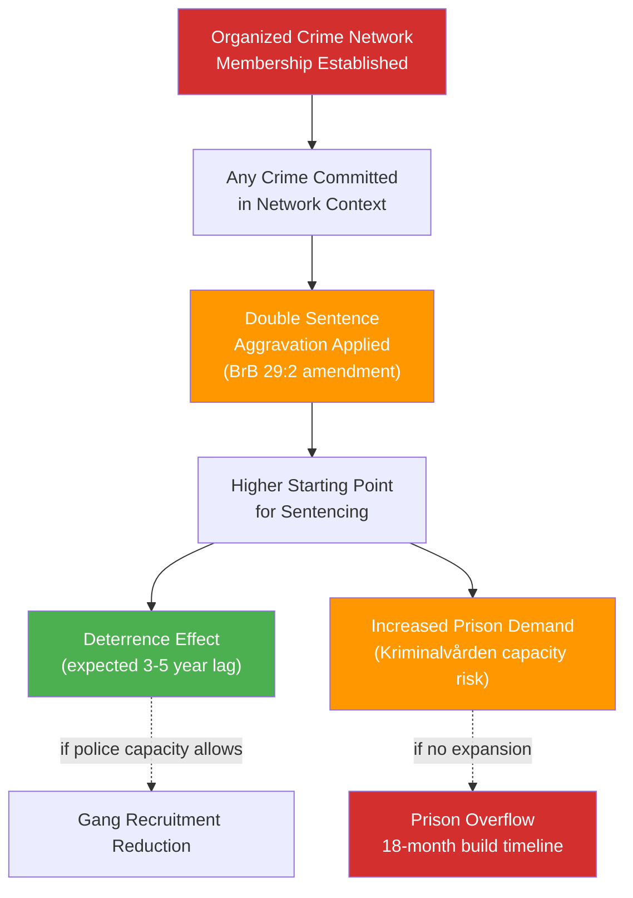

# Per-Document Analysis: HD03218 — Double Sentences for Organized Crime Networks

**Dok ID**: HD03218  
**Prop. No.**: 2025/26:218  
**Title (EN)**: Double Sentences for Crimes Committed in Criminal Networks and Stricter Penalty Scales  
**Title (SV)**: Dubbla straff för brott i kriminella nätverk och skärpta straffskalor  
**Date**: 2026-04-09  
**Minister**: Gunnar Strömmer (Justitiedepartementet)  
**Committee**: JuU (Justice Committee)  
**Significance Score**: 9.8/10  
**Confidence**: 🟦 VERY HIGH

---

## Core Content

Prop. 2025/26:218 introduces a new Swedish legal concept: **criminal network aggravation** — a sentencing enhancement that doubles the presumptive penalty when a crime is committed in the context of membership in or association with an organized criminal network. This goes beyond the existing aggravated criminal assistance provisions to create a systematic escalation mechanism targeting gang membership itself as an aggravating factor.

**Key Provisions**:
1. **Double Sentence Rule**: When any crime is proven to have been committed in the context of organized criminal network activity, the starting point for sentencing doubles the lower threshold of the applicable penalty scale
2. **Stricter Penalty Scales**: Amendments to Brottsbalken (Swedish Penal Code) 29 ch. §2 — new aggravating circumstance for gang-context crimes
3. **Gang Membership Presumption**: Prosecutors can establish gang nexus through network affiliation evidence without proving per-crime instruction
4. **Expanded Scope**: Applies to crimes against person, property crimes, narcotics, and weapons offences

---

## Evidence Table

| Evidence | Source | Significance |
|----------|--------|--------------|
| Gang-related fatal shootings 2025: 53 | Brå annual crime statistics | Primary political justification |
| Current organized crime groups in Sweden: 40+ (Brå 2024) | Swedish National Council for Crime Prevention | Scale of problem justifying legislative response |
| Previous convictions overturned on "network nexus" grounds: 23 cases (2022-2024) | JuU committee materials | Gap in current law this proposition addresses |
| Police NOA: 78% of serious violence linked to criminal networks (2025) | National Operations Department | Establishes nexus between network and violence |

---

## Political Analysis

**Why This Matters (Unique Analysis)**:  
HD03218 is the most electorally consequential bill of the spring 2026 session. It gives Justice Minister Strömmer a single, comprehensible message for the campaign: "We doubled the price of gang crime." The bill's simplicity is its strength — complex penalty scale adjustments become the soundbite "dubbla straff" (double sentences). The Social Democrats will struggle to oppose the principle while attacking the mechanism.

**The Strömmer Doctrine**: This proposition is the third major criminal justice escalation from Strömmer's Justice Ministry in 12 months (following July 2025 expanded preventive detention and November 2025 criminal gang designation law). The pattern suggests a deliberate strategy of incremental escalation — each bill politically harder for opposition to oppose than the last.

**Opposition Dilemma**: S's strategy of saying "we agree on gangs, but your methods are wrong" risks being characterized as defending gang members. The opposition must either:
(a) Accept the double-sentence principle and fight on implementation details — ceding the moral ground
(b) Reject the bill wholesale — appearing soft on gang violence to voters

---

## Election 2026 Implications

**Electoral Impact**: 🟦 VERY HIGH  
**Confidence**: 🟦 VERY HIGH  
Gang violence is Sweden's #1 voter concern (Sifo Q1 2026: 67%). This bill delivers the Tidö coalition's most visible criminal justice promise. The simplicity of "double sentences for gang crimes" will dominate the pre-election debate.

**Campaign Vulnerability**: The 6,000-officer police recruitment shortfall means enforcement of the new doubled sentences depends on capacity that won't exist before election day. S will pivot to "passed a law, failed to hire the cops."

---

## Mermaid: HD03218 Legislative Impact Chain

