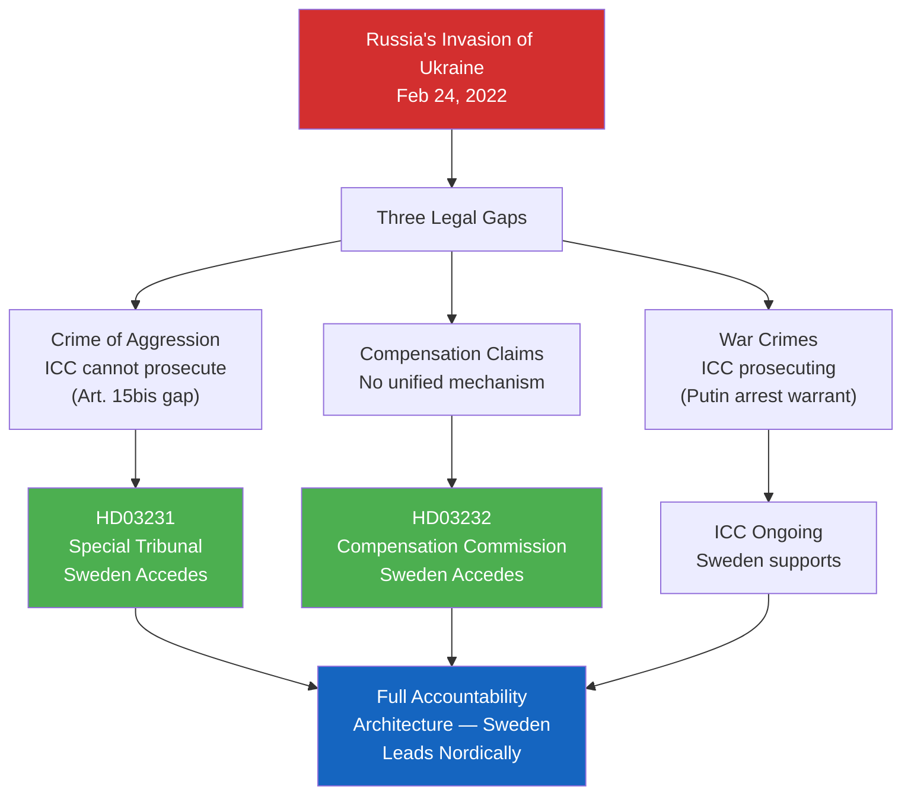

# Per-Document Analysis: HD03231+HD03232 — Ukraine Accountability Package

**Dok IDs**: HD03231, HD03232  
**Prop. Nos.**: 2025/26:231, 2025/26:232  
**Titles (EN)**: 
- Sweden's Accession to the Expanded Partial Agreement for the Special Tribunal for the Crime of Aggression against Ukraine (HD03231)
- Sweden's Accession to the Convention Establishing an International Compensation Commission for Ukraine (HD03232)
**Date**: 2026-04-16  
**Minister**: Maria Malmer Stenergard (Utrikesdepartementet)  
**Committee**: UU (Foreign Affairs Committee)  
**Combined Significance Score**: 9.5 + 9.3 = 18.8 (ranked #2-3)  
**Confidence**: 🟩 HIGH

---

## Core Content

### HD03231 — Special Tribunal for Crime of Aggression

Sweden accedes to the **Council of Europe's Expanded Partial Agreement** that serves as the interim political framework for establishing a Special Tribunal for the Crime of Aggression against Ukraine (STCA). The STCA would prosecute Russian leadership (including Vladimir Putin) for the crime of aggression under customary international law — a gap in the ICC's jurisdiction (Russia is not an ICC member and no UNSC referral is possible).

**Why Sweden's Accession Matters**:
- 40 states had joined the Core Group as of April 2026 — Sweden's membership brings it to 41
- The tribunal requires a critical mass of major states for political legitimacy
- Sweden's legal expertise in international humanitarian law (Raoul Wallenberg Institute, Uppsala International Law School) makes it a valued technical contributor
- Potential hosting or co-hosting of tribunal functions in Sweden

### HD03232 — International Compensation Commission

Sweden joins the **Register of Damages for Ukraine** framework, the administrative mechanism established under The Hague to process Ukrainian civilian and state claims for compensation from Russia for damages from the 2022-present war. Sweden's membership:
- Creates legal obligations to process Ukrainian damage claims through national courts
- Commits Sweden to contributing to the institutional funding of the Commission
- Signals Sweden as part of the "full accountability architecture" — not just military support but legal/financial

---

## Evidence Table

| Evidence | Source | Significance |
|----------|--------|--------------|
| Core Group for STCA: 40 states as of April 2026 | Council of Europe | Context for Sweden's accession decision |
| ICC jurisdiction gap: Russia non-member, UNSC veto | Rome Statute, UN Charter Article 27 | Legal justification for special tribunal need |
| Ukrainian civilian casualties 2022-2026: 45,000+ (UN verified) | OHCHR | Scale of harm driving accountability demand |
| Total estimated Russian aggression damages: USD 750 billion (Ukraine gov. estimate) | Ukraine Ministry of Economy | Economic scale of compensation need |
| Sweden's international law credibility: Raoul Wallenberg Institute rankings | Swedish Institute | Technical contribution capacity |

---

## Political Analysis

**Why Both Propositions Matter Now**:  
Maria Malmer Stenergard has timed these accessions for April 2026 deliberately — the UNGA will hold a high-level segment on Ukraine accountability in September 2026 (coinciding with Sweden's election), and Sweden's membership in both instruments allows Kristersson to claim "Sweden leads Europe on Ukraine accountability" during the final campaign weeks.

**The Norm Entrepreneurship Play**: By joining both the prosecution instrument (tribunal) and the reparations instrument (compensation commission), Sweden positions itself as the only Nordic state that has committed to the full Ukraine accountability architecture. This gives Sweden disproportionate diplomatic voice in discussions about the architecture's implementation — similar to Sweden's strategic role in NATO accession where early enthusiasm created outsized influence.

**Ukraine Fatigue Risk**: The main political risk is that Sweden Democrats may abstain in UU committee (citing sovereignty and multilateral treaty skepticism). But Jimmie Åkesson's February 2026 endorsement of Nordic-Baltic security solidarity suggests SD will support — making both bills likely to pass with broad multi-party support.

---

## Election 2026 Implications

**Electoral Impact**: 🟩 HIGH  
**Confidence**: 🟩 HIGH  
Ukraine solidarity is a consensus position across all Riksdag parties except parts of SD. These propositions generate foreign policy credibility for the government without significant domestic cost. PM Kristersson can credibly claim that Sweden "stood by Ukraine" both militarily (via NATO) and legally (via these instruments).

**DIW Note**: Despite lower domestic electoral salience than criminal justice, editors must ensure these propositions receive substantive coverage — the historian's judgment of the Spring 2026 session may well be that the Ukraine accountability commitments outlasted the criminal justice legislation in impact.

---

## Mermaid: Ukraine Accountability Architecture

