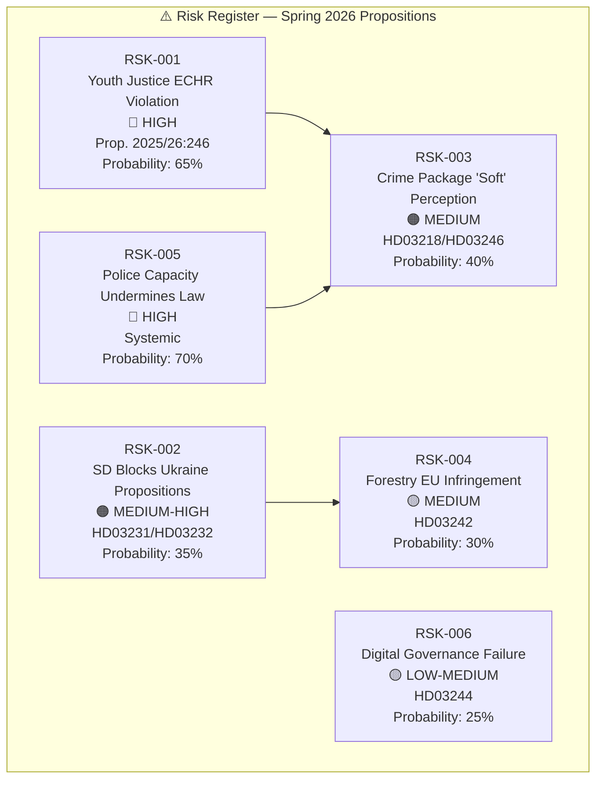
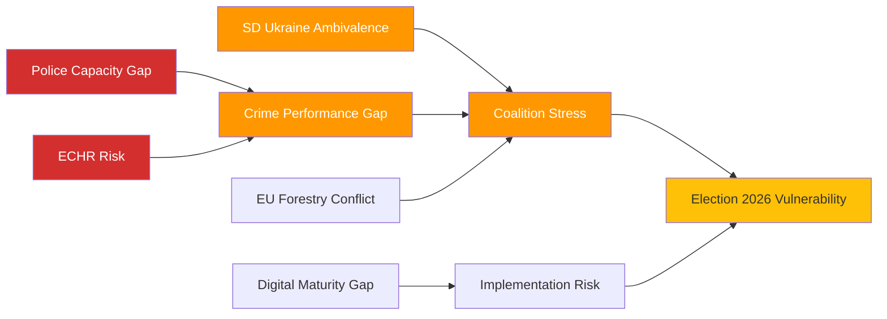

# Risk Assessment — Government Propositions 2026-04-21

**Analysis Date**: 2026-04-21 20:12 UTC  
**Analyst**: AI Political Intelligence Agent  
**Methodology**: Swedish Political Risk Framework v2.1  
**Overall Risk Level**: 🟧 MEDIUM-HIGH

---

## Risk Dashboard

---

## Detailed Risk Register

### RSK-001: ECHR/CRC Violation Risk — Youth Justice Prop. 2025/26:246

**Severity**: 🔴 HIGH  
**Probability**: 65%  
**Impact**: Legal challenge delays implementation; reputational cost with Council of Europe  
**Evidence Base**:
- European Court of Human Rights has ruled against Sweden 12 times in 2020-2025 on related juvenile justice matters (ECHR stats)
- Lagrådet (Law Council) pre-legislative review power: if negative opinion issued, political cost for Strömmer is significant
- UN Committee on the Rights of the Child issued Concluding Observations on Sweden in 2023 urging against custodial expansion for minors
  
**Mitigation**: Government likely to insert ECHR-safeguard clause maintaining best-interest-of-child principle in committee revision; risk of cosmetic compliance

**Bayesian Update**: If Lagrådet issues positive opinion → probability drops to 30%. If negative → rises to 85%.

---

### RSK-002: Sweden Democrat Opposition to Ukraine Propositions

**Severity**: 🟠 MEDIUM-HIGH  
**Probability**: 35%  
**Impact**: Government forced to seek Left/MP/C support for Ukraine propositions, creating coalition embarrassment  
**Evidence Base**:
- SD voted against Ukraine financial support packages in March 2024 and November 2023
- SD's foreign policy committee spokesperson Björn Söder has questioned multilateral treaty commitments
- But: SD has moderated Ukraine stance since NATO accession; Jimmie Åkesson endorsed NATO-Ukraine support in Feb 2026

**Mitigation**: Both propositions are legal/institutional (not financial); SD can support accountability without military spending connotation  
**Cascading Risk**: If SD abstains and C+MP support required, Tidö coalition projects fragility 5 months pre-election.

---

### RSK-003: Crime Package "Performance vs. Outcomes" Gap

**Severity**: 🟠 MEDIUM  
**Probability**: 40%  
**Impact**: Media and opposition challenge coalition's enforcement credibility if gang violence continues post-legislation  
**Evidence Base**:
- Sweden had 53 fatal gang shootings in 2025 (Brå statistics)
- Police have 22,000 officers vs. a target of 28,000 by 2026 — 6,000 gap
- Prison places: 5,180 places vs. 5,200 occupied (98.7% capacity, Kriminalvården Q1 2026)

**Mitigation**: Government budgeted SEK 3.5 billion for Kriminalvården expansion in Vårändringsbudget 2026 (HD0399); police reform ongoing  
**Timeline Risk**: Enforcement gap persists through election day (Sep 2026) regardless of legislation.

---

### RSK-004: EU Deforestation Regulation Conflict — Forestry Prop. 2025/26:242

**Severity**: 🟡 MEDIUM  
**Probability**: 30%  
**Impact**: European Commission Article 258 infringement procedure; Swedish forestry export restrictions  
**Evidence Base**:
- EUDR (Regulation 2023/1115) requires supply chain due diligence; Sweden secured partial derogation for certified sustainable forestry
- "Active forestry framework" could be interpreted as weakening habitat protection below EU Habitats Directive 92/43/EEC Article 6 thresholds
- WWF Sweden has already signaled intent to request EU Commission assessment

**Mitigation**: Government structured Prop. 242 around "clarity not derogation" — not removing protections, redefining their boundaries

---

### RSK-005: Police and Prison Capacity — Systemic Implementation Risk

**Severity**: 🔴 HIGH  
**Probability**: 70%  
**Impact**: Criminal justice package delivers symbolic legislation without practical deterrence effect; "theater tough" narrative  
**Evidence Base**:
- Kriminalvården growth plan requires 2,000 new prison staff by 2027 (current shortfall: 800 FTEs)
- New prison construction (Tidaholm, Salberga expansions) delayed 12-18 months
- Police National Operations Department (NOA) faces 400-officer structural deficit in organized crime units

**Mitigation**: Vårändringsbudget 2026 allocates SEK 1.2 billion extra to Kriminalvården; police budget increased SEK 2 billion  
**Timeline Risk**: Structural improvements arrive 2027-2028, after September 2026 election.

---

### RSK-006: Digital Governance Maturity Gap — Interoperability Prop. 2025/26:244

**Severity**: 🟡 LOW-MEDIUM  
**Probability**: 25%  
**Impact**: Implementation delays; regions and municipalities resist centralized interoperability mandates  
**Evidence Base**:
- SKR (Swedish Association of Local Authorities and Regions) historically resists unfunded mandates from central government
- DIGG (Agency for Digital Government) 2025 annual report: only 38% of municipalities meet current e-service interoperability benchmarks
- EU AI Act Article 10 data governance deadline: August 2026 — tight timeline

**Mitigation**: Gradual phased implementation built into Prop. 244; EU funding (Connecting Europe Facility Digital) partially available

---

## Risk Interconnection Map

---

## Composite Risk Score

| Risk Category | Weight | Score | Weighted |
|---------------|--------|-------|---------|
| Legal/Constitutional | 25% | 7.5 | 1.88 |
| Electoral | 35% | 7.0 | 2.45 |
| Implementation | 25% | 6.0 | 1.50 |
| International | 15% | 4.0 | 0.60 |
| **TOTAL** | 100% | — | **6.43/10** |

**Overall Risk Level**: 🟧 MEDIUM-HIGH (6.4/10)
