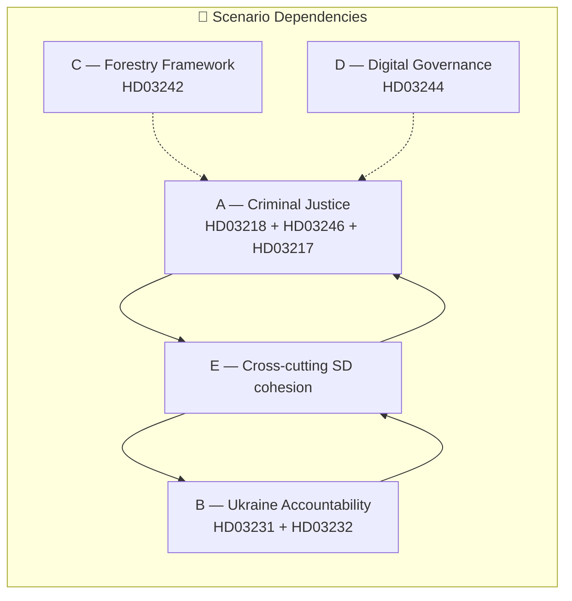

# Scenario Analysis — Government Propositions — 2026-04-21

**Generated**: 2026-04-21 20:30 UTC
**Method**: Analysis of Competing Hypotheses (ACH) + Three-Scenario Forecasting (Best / Most Likely / Worst)
**Horizon**: Riksdag passage (June 2026) → September 2026 general election → Implementation (2027–2029)
**Confidence**: 🟧 MEDIUM (forecasts beyond June have materially higher uncertainty)
**Scope**: 5-cluster analysis of the Spring 2026 proposition package (HD03217, HD03218, HD03231, HD03232, HD03242, HD03243, HD03244, HD03246)

---

## Scenario Framework

Each proposition cluster is evaluated across three scenarios — Best / Most Likely / Worst — anchored on falsifiable indicators, with explicit probability estimates, electoral impact, and fiscal/legal consequences. Scenarios are NOT independent: Cluster A (criminal justice) outcomes condition Cluster C (forestry) political bandwidth; Cluster B (Ukraine) interacts with SD cohesion across all votes.

---

## Cluster A — Criminal Justice Package (HD03218 + HD03246 + HD03217)

### A1. BEST CASE — "Law-and-Order Delivery Narrative Holds" (Probability 30%)

**Trigger conditions:**
- Lagrådet issues clean or minor-caveat opinion on HD03246 (no Article 3 ECHR warning).
- Q2 2026 gang-shooting fatalities decline ≥ 20% vs. Q2 2025 (from 13 to ≤ 10).
- JuU committee passes all three bills with ≥ 8/17 majority by late June 2026.
- SD votes WITH government on all three — no Åkesson defection.

**Consequences:**
- Kristersson secures "competence on crime" as central 2026 campaign asset.
- S forced into defensive position: either oppose (soft-on-crime attack) or validate (government-competence validation).
- Expected electoral uplift for M-led bloc: **+1.5 to +2.5 pp**, primarily reclaiming SD-curious voters.
- Retention probability for Tidö coalition: **~55%**.

**Leading indicators (watch May–June 2026):**
- Lagrådet opinion publication (expected mid-May 2026).
- Brå Q2 statistics (published early July 2026 — just before election campaign peak).
- Kriminalvården occupancy dropping below 97% (currently 98.7%).

### A2. MOST LIKELY — "Symbolic Passage, Enforcement Gap Persists" (Probability 50%)

**Trigger conditions:**
- Lagrådet issues warning on HD03246 youth provisions but government proceeds with minor adjustments.
- Gang-shooting statistics roughly flat through Q2 2026.
- Bills pass with opposition "not-planned" or mixed votes in committee; full chamber passage secured via M+KD+L+SD 175-seat bloc.
- SD supports HD03218/HD03246 but uses Ukraine propositions as leverage (see Cluster B).

**Consequences:**
- Legislation enacted but Brå data gives opposition attack surface: "theatre tough, streets unchanged."
- S+V frame: "Government legislates, criminals continue, victims ignored."
- Expected electoral impact: **neutral to slightly negative** (−0.5 to +0.5 pp); base turnout holds but SD-curious voters do not shift.
- Retention probability for Tidö: **~42%**.

**Leading indicators:**
- Gang shootings ≥ 12 in Q2 2026 (flat or up).
- Lagrådet opinion issuing "substantive concerns" language.
- Rädda Barnen launches public campaign against HD03246 (May–June 2026).

### A3. WORST CASE — "Lagrådet Derails Youth Justice, Coalition Embarrassed" (Probability 20%)

**Trigger conditions:**
- Lagrådet issues negative opinion on HD03246 citing Article 3 ECHR and UN CRC incompatibility.
- Rädda Barnen + Barnombudsmannen + ≥ 5 law professors publish joint open letter.
- Strömmer forced to withdraw or substantially redraft HD03246.
- A gang-related child-victim incident dominates May–June news cycle.

**Consequences:**
- Tidö "law and order competence" narrative damaged 3–4 months before election.
- L (Liberals) pressured by liberal base to distance from coalition criminal-justice orthodoxy.
- Expected electoral impact: **−2 to −3 pp** for M+KD+L bloc.
- Retention probability for Tidö: **~25%**.

**Leading indicators:**
- Early signs Lagrådet preparing extensive concerns (chair Göran Lambertz's historical pattern on child-rights cases).
- Legal academic commentary intensity (Dagens Juridik, SvJT) >3× 2025 baseline.

---

## Cluster B — Ukraine Accountability (HD03231 + HD03232)

### B1. BEST CASE — "Consensus Ratification, Nordic Leadership" (Probability 45%)

**Trigger conditions:**
- UU committee passes both with broad majority (M+KD+L+S+MP+C — SD abstains or supports).
- Finland and Norway announce similar CoE tribunal accession by June 2026.
- Swedish legal/diplomatic community praises as norm-entrepreneurship.

**Consequences:**
- Sweden secures "principled foreign policy" asset for NATO/EU partners.
- Malmer Stenergard's (M, Foreign Minister) profile elevated ahead of UNGA 2026.
- Electoral impact: **+0.5 to +1 pp** for M specifically; S cannot attack without appearing un-Ukrainian.
- Retention probability: **contributes to overall Tidö competence narrative**.

### B2. MOST LIKELY — "SD Abstention, Cross-Bloc Passage" (Probability 35%)

**Trigger conditions:**
- SD foreign-policy spokesperson Björn Söder signals abstention citing sovereignty concerns.
- Government secures passage via S+MP+C+L votes — coalition publicly dependent on opposition.
- Media frames as "coalition fragility on foreign policy."

**Consequences:**
- Legislation passes but narrative cost: Tidö visibly not-unified.
- Åkesson uses abstention to signal SD's "independent foreign policy voice" to base.
- Electoral impact: **marginal negative (−0.5 pp)** for Tidö cohesion perception; **+0.5 pp** for SD as "principled" among eurosceptic voters.
- Complication: S would own some credit for passage — unpredictable spillover.

### B3. WORST CASE — "SD Blocks, Coalition Forced to Delay" (Probability 20%)

**Trigger conditions:**
- SD votes against in committee; government lacks simple majority without SD.
- Ukraine war situation deteriorates dramatically (major Russian advance or ceasefire under Russian terms).
- Åkesson formally distances from Ukraine escalation narrative.

**Consequences:**
- Government postpones to autumn 2026 (post-election).
- If election shifts to S+MP+C+V coalition, they pass it anyway — Tidö loses credit.
- Electoral impact: **−1 to −2 pp** for Tidö "foreign policy coherence"; possible bonus for SD.
- EU/NATO partners signal private displeasure; Swedish ambassadorial corps reports damage.

---

## Cluster C — Active Forestry Framework (HD03242)

### C1. BEST CASE — "Balanced Compromise, EU Accepts" (Probability 30%)

**Trigger conditions:**
- European Commission signals provisional acceptance during informal consultations (Q2 2026).
- WWF Sweden + Naturskyddsföreningen issue critical but not campaign-grade response.
- Skogsstyrelsen publishes clear implementation guidance within 3 months.

**Consequences:**
- LRF declares "decade-long conflict resolved."
- Peter Kullgren (KD, Rural Minister) cements portfolio legacy.
- Rural voter goodwill for KD; C (Centre) struggles to differentiate.
- Electoral: **+0.5 to +1 pp for KD** in rural constituencies; modest negative for C.

### C2. MOST LIKELY — "Contested Passage, Litigation Follows" (Probability 50%)

**Trigger conditions:**
- MJU committee passes with narrow majority; WWF Sweden launches Article 258 infringement request to European Commission.
- Implementation begins but 2–3 court cases filed by environmental NGOs.
- Commission opens EU Pilot procedure (not formal infringement) by late 2026.

**Consequences:**
- Legislation enacted; litigation extends uncertainty through 2027–2028.
- Narrative battle: rural delivery vs. environmental responsibility.
- Electoral: **neutral overall**; net voter shift minimal but intensity polarised.

### C3. WORST CASE — "Commission Infringement, Domestic Litigation Cascade" (Probability 20%)

**Trigger conditions:**
- European Commission opens formal Article 258 procedure within 6 months of enactment.
- Swedish court grants preliminary injunction in environmental NGO case.
- Investor concerns over forestry-bond access materialise (SEK 3–5 billion market impact).

**Consequences:**
- Sweden faces reputational and regulatory damage; EU Taxonomy classification question escalates.
- Tidö "rural delivery" narrative inverted into "EU non-compliance."
- Electoral: **−0.5 to −1 pp** for KD specifically; C gains rural-moderate voters.

---

## Cluster D — Digital Governance Interoperability (HD03244)

### D1. BEST CASE — "Quiet Technical Success" (Probability 25%)

- DIGG + SKR negotiate phased implementation.
- First interoperability certifications issued by Q4 2026.
- EU AI Act Article 10 compliance achieved on time.
- Electoral impact: **negligible** (~±0.1 pp).

### D2. MOST LIKELY — "SKR Resistance, Slow Implementation" (Probability 55%)

- SKR publicly complains about unfunded mandate.
- 2026 milestones missed; EU AI Act deadline (August 2026) not met on data-governance requirement.
- Commission sends formal letter; no immediate infringement.
- Electoral impact: **negligible**; issue too technical to mobilise voters.

### D3. WORST CASE — "Full SKR Revolt + EU Compliance Failure" (Probability 20%)

- Major municipal authorities publicly refuse implementation.
- Commission formal notice under AI Act.
- Digitalisation minister Erik Slottner forced onto defensive.
- Electoral impact: **−0.3 to −0.5 pp** for coalition "competence" narrative; amplifies Cluster A risk of "government legislates but delivers nothing."

---

## Cluster E — SD Cohesion (Cross-cutting variable)

SD's votes are THE single most important variable across Clusters A and B.

| SD behaviour | Probability | Impact on Clusters |
|-------------|:-----------:|-------------------|
| Full support A+B | 25% | A1, B1 enabled |
| Support A, abstain B | 45% | A2 + B2 — most likely combined path |
| Support A, block B | 15% | A2 + B3 |
| Full defection (block A+B) | 5% | Coalition collapse risk |
| Other permutations | 10% | Varied |

---

## Synthesis — Integrated Most-Likely Path (Probability ~35–40%)

Combining highest-probability branches across clusters:

1. **HD03218 + HD03217** pass cleanly with SD support (A2 core).
2. **HD03246** passes with Lagrådet concerns acknowledged; minor redraft (A2).
3. **HD03231 + HD03232** pass via cross-bloc support with SD abstention (B2).
4. **HD03242** passes; litigation follows but no EU infringement within election window (C2).
5. **HD03244** implementation slow; SKR resistance; marginal impact (D2).

**Composite electoral impact (May–September 2026):** Neutral to slightly negative for Tidö (−0.5 to +0.5 pp). Base holds, but enforcement-gap narrative prevents expansion. Retention probability of Tidö coalition post-September 2026: **~42%**.

---

## Falsifiable Forecasts (for Pass 2 / next-day validation)

| # | Forecast | Check date | Falsified if |
|---|----------|-----------|--------------|
| F1 | Lagrådet issues concerns on HD03246 | 2026-05-20 | Clean opinion published |
| F2 | Gang shootings Q2 2026 flat or up | 2026-07-10 | Brå reports ≥ 20% decline |
| F3 | SD abstains on HD03231/HD03232 in UU | 2026-05-30 | SD votes for or against |
| F4 | WWF Sweden launches EU Commission request | 2026-06-30 | No such action |
| F5 | EU AI Act Art. 10 compliance missed | 2026-08-31 | Full compliance certified |

**Horizon confidence:** 🟩 HIGH through June 2026 (procedural certainty). 🟧 MEDIUM through September 2026 (election-campaign volatility). 🟥 LOW beyond October 2026 (possible government change resets all cluster forecasts).

---

*Pass 1 authored 2026-04-21 20:30 UTC; subject to Pass 2 iteration per `analysis/methodologies/ai-driven-analysis-guide.md` Rule 0.*
