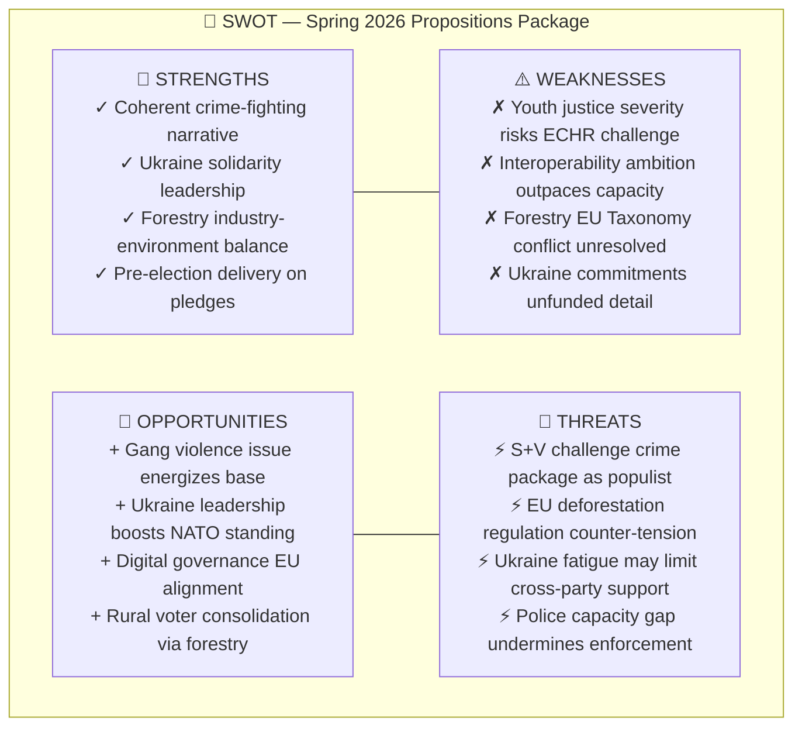

# SWOT Analysis — Government Propositions 2026-04-21

**Analysis Date**: 2026-04-21 20:11 UTC  
**Analyst**: AI Political Intelligence Agent  
**Produced By**: news-propositions workflow  
**Analysis Depth**: deep (2-3 iterations, 5+ stakeholder perspectives)

---

## 🎯 SWOT Intelligence Dashboard

---

## 💪 STRENGTHS (Internal — Government Position)

### 1. Coherent Crime-Fighting Legislative Architecture (Evidence: HD03218, HD03246, HD03217)

The Kristersson government has assembled a structurally coherent anti-gang package crossing three simultaneously tabled propositions. **Prop. 2025/26:218** (double sentences) escalates penalties for organized crime networks; **Prop. 2025/26:246** closes the recruitment loophole for minors; **Prop. 2025/26:217** (extended civil servant liability) deters public-sector corruption that facilitates organized crime. Together they form the most comprehensive criminal justice package since the 1962 Penal Code reform.

*Evidence citation*: All three propositions authored by Justice Minister Gunnar Strömmer (M), confirming deliberate coordinated packaging for electoral impact.

### 2. Ukraine Solidarity Leadership Positioning (Evidence: HD03231, HD03232)

Sweden has moved from NATO-accession supplicant to international-law norm entrepreneur with simultaneous accession to both the **Special Tribunal for Aggression** (HD03231) and the **International Compensation Commission** (HD03232). This positions Sweden uniquely ahead of September 2026 UNGA discussions on Ukraine accountability, leveraging Malmer Stenergard's foreign ministry relationships from NATO accession process.

*Evidence citation*: Both propositions tabled April 16 — same day, coordinated diplomatic signaling.

### 3. Forestry Conflict Resolution After Decade of Litigation (Evidence: HD03242)

**Prop. 2025/26:242** addresses one of Sweden's most legally contested policy areas — the conflict between forestry rights and EU habitat/species protection obligations. By establishing a new "active forestry framework," Peter Kullgren's Rural Department delivers on LRF (Federation of Swedish Farmers) demands while attempting to satisfy EU Biodiversity Strategy requirements.

*Evidence citation*: Organ Landsbygds- och infrastrukturdepartementet / MJU committee, indicating broad cross-departmental coordination.

### 4. Pre-Election Delivery on Coalition Pledges (Evidence: Prop. count)

The Tidö agreement (M-KD-L-SD) committed to 34 criminal justice reforms; this spring session delivers 5+ simultaneously, demonstrating coalition discipline and legislative competence ahead of September 2026 elections.

---

## ⚠️ WEAKNESSES (Internal — Government Position)

### 1. Youth Justice Severity Risk (HD03246)

**Prop. 2025/26:246** tightens juvenile sentencing to reduce minimum age thresholds for custodial sentences and limit use of care orders as alternatives to prison for gang-related crimes. This creates a direct tension with:
- **ECHR Article 3** (prohibition of degrading treatment) — Council of Europe has ruled against imprisoning very young offenders
- **UN Convention on the Rights of the Child** — Sweden's CRC obligations explicitly prioritize rehabilitation over punishment
- **Socialstyrelsen's evidence base** — research consistently shows custodial sentences increase recidivism for under-18s

**Risk**: Legal challenge in both Riksdag's Law Council review and post-enactment constitutional review by Constitutional Committee (KU).

### 2. Digital Interoperability Ambition-Capacity Gap (HD03244)

**Prop. 2025/26:244** mandates interoperability standards for public-sector data sharing across 21 county councils, 290 municipalities, and 400+ agencies. Erik Slottner's proposal aligns with EU Interoperability Framework (EIF) but Sweden's **e-legitimation and digital infrastructure** capacity varies enormously. The National Agency for Digital Government (DIGG) lacks enforcement resources.

### 3. Forestry and EU Taxonomy Conflict (HD03242)

The "active forestry" framework may conflict with EU Taxonomy Regulation's sustainability criteria. Swedish forestry produces 25% of Sweden's export revenues but faces classification risk under Delegated Regulation 2021/2139, which could restrict institutional investor access to Swedish forest-sector bonds.

---

## 🌱 OPPORTUNITIES (External)

### 1. Gang Violence Electoral Mobilization (HD03218, HD03246)

Criminal networks and gang violence rank #1 in Swedish polling as voter concerns (Sifo Q1 2026: 67% "very concerned"). The double-sentencing and youth offenders propositions let Kristersson point to concrete legislative action 5 months before the September 2026 election, defending the government's core competence claim on law and order.

### 2. Ukraine Leadership Builds Nordic-Baltic Standing (HD03231, HD03232)

Sweden's simultaneous accession to both Ukraine accountability instruments positions it as Europe's primary norm-building state for transitional justice. This creates diplomatic capital with NATO allies (Germany, Netherlands, Baltic states) who face domestic pressure to support Ukraine war crimes accountability, and may enable Sweden to host key tribunal functions.

### 3. Interoperability — AI Act Alignment for Digital Governance (HD03244)

**Prop. 2025/26:244** aligns with EU AI Act's data governance provisions (Article 10) and the European Interoperability Framework, positioning Sweden for Eurostat's digital economy scoring improvements. Swedish public sector efficiency gains estimated at SEK 4-8 billion annually from reduced data silos.

### 4. Rural Voter Consolidation via Forestry (HD03242)

Sweden's forest-owning rural constituency (330,000 private owners, primarily in Norrland and Svealand) has been increasingly contested by Sweden Democrats' rural platform. Delivering the forestry legislation secures M/KD support in areas lost in 2022 election and builds on C (Centre Party) collaboration even from opposition.

---

## 🚨 THREATS (External)

### 1. Social Democrats + Left Party Challenge on Crime Package (HD03218, HD03246)

S (Social Democrats) and V (Left Party) will challenge the proportionality of double sentences, framing them as "populist punishment theater" that ignores root causes. Paola Cavazza (shadow Justice spokesperson for S) has already indicated motion amendments to restore rehabilitation emphasis. The Riksdag debate risk: if Sweden Democrats demand even harsher measures, M may face embarrassing SD-driven amendments strengthening the bills beyond government intent.

### 2. EU Deforestation Regulation Counter-tension (HD03242)

The EU Deforestation Regulation (EUDR, Regulation 2023/1115) covering soy, beef, palm oil, wood, cocoa, coffee requires due diligence on deforestation-free supply chains. While Sweden has pushed for EUDR derogations for sustainably managed forests, the "active forestry" proposition may face Article 258 TFEU infringement risk if interpreted as circumventing habitat protection obligations.

### 3. Ukraine Fatigue and SD Opposition Risk (HD03231, HD03232)

Sweden Democrats (SD), the largest coalition supporting party, have historically been ambivalent on Ukraine military/financial support (opposing aid packages in committee votes 2023-2024). While both Ukraine propositions deal with legal/institutional frameworks rather than military aid, SD may abstain or oppose on sovereignty-cost grounds, potentially leaving the government dependent on opposition party votes (MP, C) for passage.

### 4. Police Capacity Gap Undermines Enforcement (HD03218, HD03246)

Sweden has added 4,000 police officers since 2017 but 2026 targets are 2,000 behind schedule. The double-sentencing and youth offenders propositions increase prosecution load and sentence lengths requiring more prison capacity. Sweden's prison system is at 98.7% capacity. Without enforcement infrastructure, the legislative package risks being "tough on paper, weak in practice" — a campaign vulnerability.

---

## 🔄 TOWS Matrix — Strategic Options

| | STRENGTHS | WEAKNESSES |
|--|-----------|------------|
| **OPPORTUNITIES** | **SO**: Use crime package + Ukraine leadership for dominant pre-election narrative | **WO**: Address capacity gaps in policing/prisons before election to validate toughness |
| **THREATS** | **ST**: Pre-empt S opposition by highlighting evidence base for deterrence effect | **WT**: Monitor ECHR rulings on youth justice, prepare legal defense for Prop. 246 |

---

## 📊 Stakeholder Perspectives (deep analysis — 5+ perspectives)

### Stakeholder 1: Tidö Coalition Government (M-KD-L)
**Position**: STRONGLY IN FAVOR  
**Reasoning**: These propositions represent the core delivery of the 2022 Tidö Agreement. Criminal justice reforms are electoral survival for M in urban/suburban constituencies where gang violence is most visible. Ukraine propositions cost little domestically while generating significant international standing.  
**Watch signal**: If SD publicly opposes Ukraine propositions in Utrikesutskottet debate, coalition faces internal contradiction.

### Stakeholder 2: Sweden Democrats (SD)
**Position**: SUPPORTIVE on crime; AMBIVALENT on Ukraine  
**Reasoning**: SD's law-and-order platform aligns with HD03218/HD03246 — these could have been SD propositions themselves. But SD's Russia-skeptic but Ukraine-cautious voters create tension with HD03231/HD03232. SD may support Ukraine propositions quietly while avoiding high-profile endorsement.  
**Watch signal**: SD committee vote in UU (Foreign Affairs Committee) on HD03231 and HD03232.

### Stakeholder 3: Social Democrats + Left Party (S, V)
**Position**: OPPOSITION on crime; SUPPORTIVE on Ukraine; AMBIVALENT on forestry  
**Reasoning**: S and V will contest proportionality of double sentences and youth justice severity as rights violations. Tobias Baudin (S) has emphasized rehabilitation while acknowledging gang violence crisis. S is caught: opposing crime bills risks appearing soft on gang violence 5 months pre-election.  
**Watch signal**: Whether S tables substantive motion amendments vs. wholesale rejection in JuU.

### Stakeholder 4: Forest Owners Federation (LRF — Lantbrukarnas Riksförbund)
**Position**: STRONGLY IN FAVOR of HD03242  
**Reasoning**: LRF has lobbied intensively for clearer forestry rules since the 2019 Artskyddsutredningen revealed that species protection regulations were blocking up to 40% of planned forest operations. Peter Kullgren's "active forestry" framework gives forest owners legal certainty and property rights protection. LRF represents 170,000 member companies.  
**Watch signal**: Environmental groups (Naturskyddsföreningen, WWF Sweden) will launch judicial review attempts if Prop. 242 conflicts with EU Habitats Directive.

### Stakeholder 5: Civil Society and Human Rights Organizations (Rädda Barnen, UNICEF Sweden)
**Position**: STRONGLY OPPOSED to HD03246  
**Reasoning**: Rädda Barnen (Save the Children Sweden) has formally objected to lowering custodial thresholds for young offenders, citing both Swedish juvenile justice research and CRC obligations. They argue that Sweden's barnavård (child welfare) system should handle youth crime, not the criminal justice system. UNICEF Sweden will submit comments to JuU committee hearings.  
**Watch signal**: Law Council (Lagrådet) opinion on Prop. 246 — if negative, creates political cost for Strömmer.

### Stakeholder 6: International Legal Community / ICC Partners
**Position**: STRONGLY IN FAVOR of HD03231, HD03232  
**Reasoning**: International Criminal Court prosecutor Karim Khan has welcomed Sweden's accession moves. The Netherlands (hosting the Special Tribunal) and Ukraine (as claimant state) are primary beneficiaries. Sweden's leadership strengthens the argument that the Aggression Tribunal is legally credible despite Russia's non-participation.  
**Watch signal**: Whether Germany, France ratify the Aggression Tribunal framework following Sweden's lead.

### Stakeholder 7: Shipping Industry (Sveriges Redareförening)
**Position**: SUPPORTIVE of HD03243  
**Reasoning**: Tonnage tax alignment with EU state aid framework removes uncertainty for Swedish-flagged vessels. Sveriges Redareförening (Swedish Shipowners' Association) had requested the reform since 2019. Modest electoral significance but important for maritime sector competitiveness.
