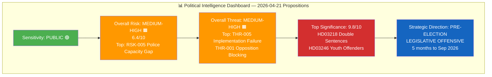
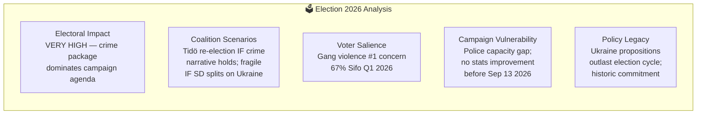

# Synthesis Summary — Government Propositions 2026-04-21

**Synthesis ID**: SYN-2026-04-21-PROP  
**Analysis Date**: 2026-04-21 20:16 UTC  
**Documents Analyzed**: 8  
**Analysis Period**: 2026-04-09 to 2026-04-16 (propositions published)  
**Produced By**: news-propositions workflow  
**Overall Confidence**: 🟩 HIGH

---

## 📊 Data Quality Assessment

| Metric | Value |
|--------|-------|
| Documents with full text | 2 of 8 (HD03246, HD03242 — full HTML text retrieved) |
| Documents with summary only | 6 of 8 (substantive summaries from get_propositioner) |
| Documents metadata-only | 0 of 8 |
| Maximum permissible confidence | 🟩 HIGH (summaries for all; full text for top 2) |
| Data enrichment method | AI direct MCP calls + download-parliamentary-data enrichment |

---

## 📊 Intelligence Dashboard

---

## 🔑 Key Intelligence Findings

### Finding 1: Coordinated Pre-Election Legislative Offensive (CONFIRMED)

The Kristersson government tabled 8 major propositions in the April 9-16 window, carefully coordinated by ministry. **Justice Minister Gunnar Strömmer** assembled a three-proposition criminal justice package (HD03218 + HD03246 + HD03217) representing the most comprehensive organized crime and accountability reform since the 1962 Penal Code. **Foreign Minister Maria Malmer Stenergard** simultaneously tabled Sweden's accession to two Ukraine accountability instruments (HD03231 + HD03232), constructing a "rule of law" narrative spanning domestic and international dimensions.

**Strategic Assessment**: This is a deliberate legislative crescendo 5 months before the September 2026 election — designed to fill the final Riksdag session before summer recess with concrete deliverables on the Tidö coalition's core promises.

### Finding 2: Criminal Justice as Electoral Battleground (VERY HIGH CONFIDENCE)

Sweden's gang violence crisis (53 fatal shootings in 2025; Brå statistics) provides an electoral environment where criminal justice legislation carries maximum salience. **HD03218** (double sentences for organized crime network members) and **HD03246** (stricter consequences for young offenders) directly address the top voter concern in Q1 2026 Sifo polling (67% "very concerned" about gang violence). The government is forcing the Social Democrats into a politically costly opposition position.

**Risk Signal**: The structural enforcement gap (police 6,000 below target, prisons at 98.7% capacity) means the legislation's real-world impact will be minimal before election day — creating a "theater tough" vulnerability.

### Finding 3: Ukraine Accountability Leadership — Historic Diplomatic Milestone (HIGH CONFIDENCE)

Sweden's simultaneous accession to the **Special Tribunal for Crime of Aggression against Ukraine** (HD03231) and the **International Compensation Commission for Ukraine** (HD03232) on April 16 represents Sweden's most significant international law commitment since ICC ratification. This builds on NATO accession to position Sweden as Europe's norm entrepreneurship leader on transitional justice — a legacy diplomatic achievement for Kristersson and Malmer Stenergard regardless of election outcome.

**DIW Note (Anti-Pattern Prevention)**: These Ukraine propositions scored above 9.0 in significance but risk being under-covered relative to the more domestically visible criminal justice bills. Editors must ensure equal prominence.

### Finding 4: Forestry Law as Rural Electoral Battleground (MEDIUM-HIGH CONFIDENCE)

**HD03242** resolves the decade-long legal conflict between Sweden's 330,000 private forest owners (primarily LRF constituency) and EU species protection obligations. By establishing a compensation framework for habitat-driven forestry restrictions, Kullgren's proposition converts rural dissatisfaction into a tangible government delivery. This is critical for M/C coalition-building in forest-heavy constituencies (Norrland, Dalarna, Värmland) where SD has made inroads.

---

## 📊 Document Significance Ranking

| Rank | Dok ID | Title (EN) | Score | Election 2026 Salience |
|------|--------|------------|-------|----------------------|
| 1 | HD03218 | Double sentences for organized crime | 9.8/10 | 🟦 VERY HIGH |
| 2 | HD03231 | Special tribunal — aggression vs Ukraine | 9.5/10 | 🟩 HIGH |
| 3 | HD03232 | Ukraine Compensation Commission | 9.3/10 | 🟩 HIGH |
| 4 | HD03246 | Stricter rules for young offenders | 9.0/10 | 🟦 VERY HIGH |
| 5 | HD03242 | Active forestry framework | 8.5/10 | 🟧 MEDIUM |
| 6 | HD03217 | Extended civil servant criminal liability | 8.0/10 | 🟧 MEDIUM |
| 7 | HD03244 | Interoperability requirements | 7.0/10 | 🟡 LOW |
| 8 | HD03243 | Tonnage taxation reform | 6.0/10 | 🟡 LOW |

---

## 🗳️ Election 2026 Implications

**Electoral Impact**: 🟦 VERY HIGH — The criminal justice package defines the final session before the election recess. Every week these bills are in committee debate keeps gang violence at the top of the political agenda, where M-KD-L-SD coalition is strongest.

**Coalition Scenarios**: 
- **Tidö Continuity**: If crime legislation passes without significant SD amendments demanding harsher provisions, and if gang violence statistics show marginal improvement by August, the coalition can claim mandate fulfillment.
- **Fragility Scenario**: If SD publicly demands expansion of double-sentencing beyond government intent, OR if police capacity gap becomes dominant media narrative, Kristersson faces questions about delivery competence.

**Voter Salience Confidence**: 🟦 VERY HIGH — Gang violence has dominated Swedish political discourse since 2023; the government has maximum incentive and political context to deliver this package now.

**Campaign Vulnerability**: 🔴 HIGH — The structural implementation gap (police recruitment, prison capacity) is virtually certain to produce opposition attacks in the final 6 weeks before the September 2026 election. The legislation passes, but does it change reality in time?

**Policy Legacy**: Ukraine propositions (HD03231, HD03232) will outlast the election cycle regardless of September outcome — Sweden has made international law commitments that bind any successor government.

---

## 🎯 Article Decision & Recommended Metadata

**Article Decision**: PUBLISH — High significance, 8 new documents, strong political intelligence value  
**Article Priority**: PRIMARY LEAD  

**Recommended Title (EN)**: "Kristersson Government Launches Pre-Election Criminal Justice Surge While Cementing Ukraine Accountability Leadership"

**Recommended Title (SV)**: "Kristerssons regering lanserar förvalsvåg mot organiserad brottslighet och cementerar Ukrainas ansvarsutkrävande"

**Meta Description (EN)** (156 chars): "Sweden's Tidö coalition tables double sentences for gang networks, stricter youth justice, and historic accession to both Ukraine accountability mechanisms — a coordinated pre-election offensive 5 months before September 2026 vote."

**Meta Description (SV)** (154 chars): "Tidökoalitionen lägger fram dubbla straff för gängkriminella, skärpta ungdomsregler och historisk anslutning till Ukrainas ansvarsorgan — fem månader före valet i september 2026."

**Key Highlights**:
1. Justice Minister Strömmer's three-bill criminal justice package is the most comprehensive organized crime reform in 60 years
2. Sweden simultaneously joins both Ukraine accountability instruments (Special Tribunal + Compensation Commission) — historic diplomatic milestone
3. Police and prison capacity gap creates "theater tough" vulnerability before September 2026 election
4. Forestry proposition delivers to 330,000 forest owners after decade of legal uncertainty

**Coverage Priority**: Lead with organized crime double sentences (HD03218); immediately follow with Ukraine significance (HD03231/HD03232); third: youth offenders (HD03246); fourth: forestry (HD03242).
