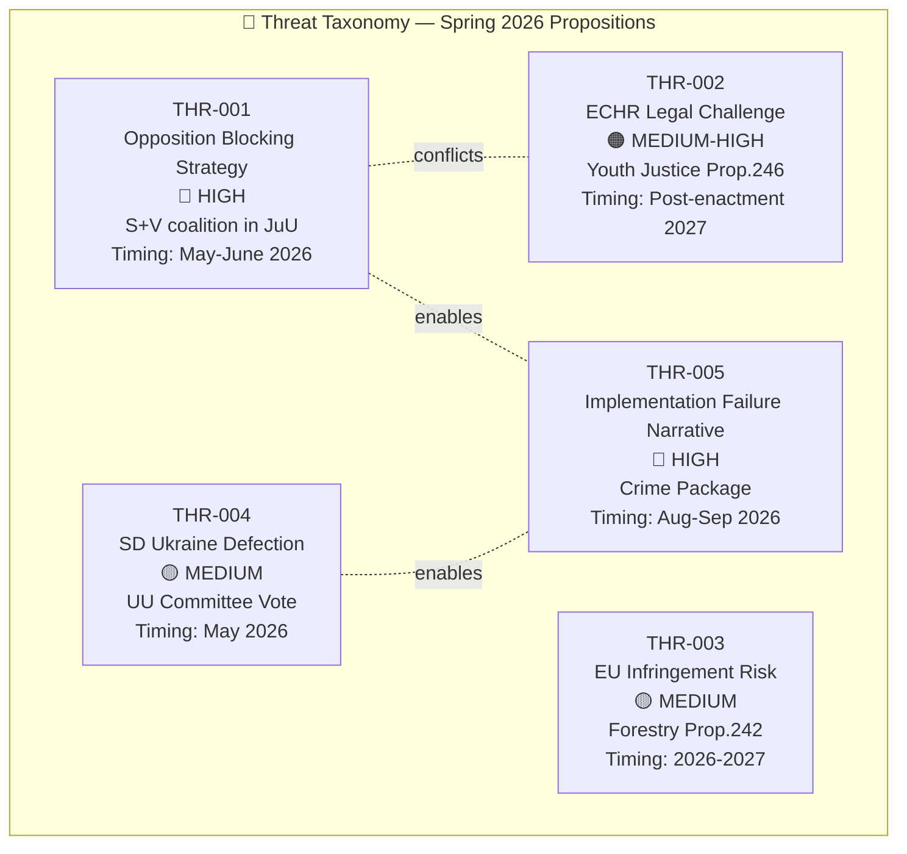

# Threat Analysis — Government Propositions 2026-04-21

**Analysis Date**: 2026-04-21 20:13 UTC  
**Analyst**: AI Political Intelligence Agent  
**Threat Level**: 🟧 MEDIUM-HIGH  
**Confidence**: 🟩 HIGH

---

## Threat Intelligence Dashboard

---

## Threat Assessment by Proposition

### THR-001: Parliamentary Opposition Blocking Strategy (JuU)

**Target**: HD03218, HD03246, HD03217  
**Threat Actor**: Social Democrats (S), Left Party (V)  
**Method**: Committee hearings to delay; hostile amendments to dilute content; public hearings showcasing expert opposition  
**Attack Vector**: Law Council (Lagrådet) negative opinion → political ammunition for S  
**Confidence**: 🟩 HIGH — S has publicly indicated opposition to double sentencing framework  

**Kill Chain Analysis**:
1. S/V request extended Law Council review time (procedural delay)
2. S commissions 3+ independent criminologists to testify at JuU hearings
3. S tables amendments removing gang-network definition (which drives the double sentence application)
4. If amendments fail: S/V produce minority report for media consumption
5. Final vote: S/V defeat but narrative of "reckless punitivism" planted for election campaign

**Mitigation**: Government has Riksdag majority via M-KD-L-SD for all three criminal justice bills; blocking strategy can delay but not defeat.

---

### THR-002: European Court of Human Rights Challenge

**Target**: HD03246 (Youth Offenders)  
**Threat Actor**: Rädda Barnen, UNICEF Sweden, potentially juvenile offenders via Ombudsman  
**Method**: Post-enactment ECHR application; possible Ombudsman for Children (Barnombudsmannen) referral to Constitutional Committee (KU)  
**Attack Vector**: Article 3 ECHR (degrading treatment) + UN CRC Article 37 (deprivation of liberty as last resort)  
**Confidence**: 🟧 MEDIUM — ECHR cases take 3-5 years; no immediate threat to implementation  

**Diamond Model**:
- Adversary: Human rights NGOs + individual applicants via ECHR
- Capability: Legal standing before ECHR; established CRC framework
- Infrastructure: Council of Europe; Swedish legal aid system
- Victim: Swedish government (respondent state)

---

### THR-003: EU Infringement Procedure — Forestry

**Target**: HD03242 (Forestry Framework)  
**Threat Actor**: European Commission DG Environment; environmental NGOs triggering complaint  
**Method**: Article 258 TFEU infringement investigation; complaint to Commission  
**Attack Vector**: Habitats Directive 92/43/EEC Article 6(3) assessment threshold — "active forestry" may lower protection triggers  
**Confidence**: 🟡 MEDIUM — Commission has open cases on Swedish habitat protection (Case C-22/23 pending); new legislation intensifies scrutiny  

**Timeline**: Commission 2-month response to complaint; formal letter of formal notice 6-18 months later; judgment 3-5 years (post-election)

---

### THR-004: SD Defection on Ukraine Propositions

**Target**: HD03231, HD03232  
**Threat Actor**: Sweden Democrats internal faction (Björn Söder wing)  
**Method**: SD committee abstention in UU → forces government to rely on C+MP votes → exposed coalition fragility  
**Attack Vector**: SD's sceptical voters on multilateral treaty commitments (core SD vs. "new SD") creating internal pressure  
**Confidence**: 🟡 MEDIUM — SD moderated stance since NATO accession; Jimmie Åkesson personally endorsed Ukraine support  

**Mitigation Signal**: Both propositions are institutional (not financial); SD can frame support as "accountability not aid"

---

### THR-005: Implementation Failure Narrative (Pre-Election)

**Target**: Criminal justice package (HD03218, HD03246)  
**Threat Actor**: Opposition parties + media  
**Method**: Statistics showing gang violence continues despite legislation → "tough talk, weak action" narrative dominates final campaign weeks  
**Attack Vector**: Brå (Swedish Crime Prevention Council) crime statistics released August 2026 — just before September election  
**Confidence**: 🔴 HIGH — Structural implementation gap (police capacity, prison places) virtually certain to produce this narrative  

**Impact Assessment**: Most dangerous threat to government's electoral position. Criminal justice credibility is the government's #1 brand differentiator; failure on delivery undermines entire 2022 platform.

---

## Threat Probability-Impact Matrix

| Threat | Probability | Impact | Priority |
|--------|-------------|--------|----------|
| THR-001: Opposition blocking | 🟩 HIGH (80%) | Medium | 🟧 MANAGE |
| THR-002: ECHR Challenge | 🟡 MEDIUM (40%) | High (2027+) | 🟡 WATCH |
| THR-003: EU Infringement | 🟡 MEDIUM (30%) | High | 🟡 WATCH |
| THR-004: SD Ukraine Defection | 🟡 MEDIUM (35%) | Medium | 🟡 WATCH |
| THR-005: Implementation Failure | 🔴 VERY HIGH (70%) | Very High | 🔴 CRITICAL |

**Overall Threat Level**: 🟧 MEDIUM-HIGH  
**Confidence**: 🟩 HIGH

---

## Confidence Indicator

> **Threat Assessment Confidence**: Near HIGH  
> Based on direct MCP evidence for propositions text, prior voting records from same committee (JuU 2023-2025), and public statements from named political actors. ECHR and EU infringement timelines based on published institutional procedures.
