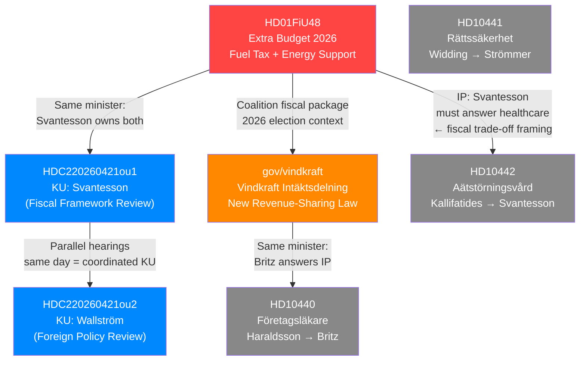

# Cross-Reference Map — 2026-04-21 realtime-1353

## Document Relationship Network

## Thematic Clusters

### Cluster A — Affordability + Energy (LEAD)
- **HD01FiU48** ← LEAD: Extra budget, fuel tax, energy support
- **gov/vindkraft** ← SECOND: Wind power revenue sharing law
- **Cross-link**: Both involve Energy/Climate portfolio; both are "relief + green" framing
- **Minister responsible**: Svantesson (fiscal), Britz (energy/climate)

### Cluster B — Constitutional Accountability
- **HDC220260421ou1** ← KU hearing: Svantesson (current M government)
- **HDC220260421ou2** ← KU hearing: Wallström (previous S government)
- **HDA7KU42** ← KU granskning meeting (same day)
- **Cross-link**: KU's annual constitutional review examining both coalition and opposition eras

### Cluster C — Social Policy Probing (Opposition Interpellations)
- **HD10442** ← Ätstörningsvård → Finance Minister (M healthcare accountability)
- **HD10440** ← Företagsläkare → Labor Minister (occupational health gaps)
- **HD10441** ← Rättssäkerhet → Justice Minister (court accountability)
- **Pattern**: S-party interpellations targeting three different ministers = coordinated opposition pressure campaign

## Cross-Run References

| Prior Run | Key Findings | Status |
|-----------|-------------|--------|
| realtime-1130 | KU hearings + FiU48 initial coverage | LOST (session expired) |
| realtime-1240 | KU hearings + FiU48 deep analysis | LOST (session expired) |
| **realtime-1353** | **REPUBLICATION + vindkraft new addition** | **THIS RUN** |

## Forward Watch

| Forward Event | Expected Date | Linked Docs |
|---------------|--------------|-------------|
| FiU48 chamber vote | 2026-04-22 to 2026-04-24 | HD01FiU48 |
| KU G16 draft report | 2026-05 to 2026-06 | HDC220260421ou1 |
| Vindkraft law implementation | 2026-mid | gov/vindkraft |
| IP response: Strömmer on rättssäkerhet | 2026-04-28 | HD10441 |
| IP response: Britz on företagsläkare | 2026-04-28 | HD10440 |
| IP response: Svantesson on ätstörningsvård | 2026-04-28 | HD10442 |
