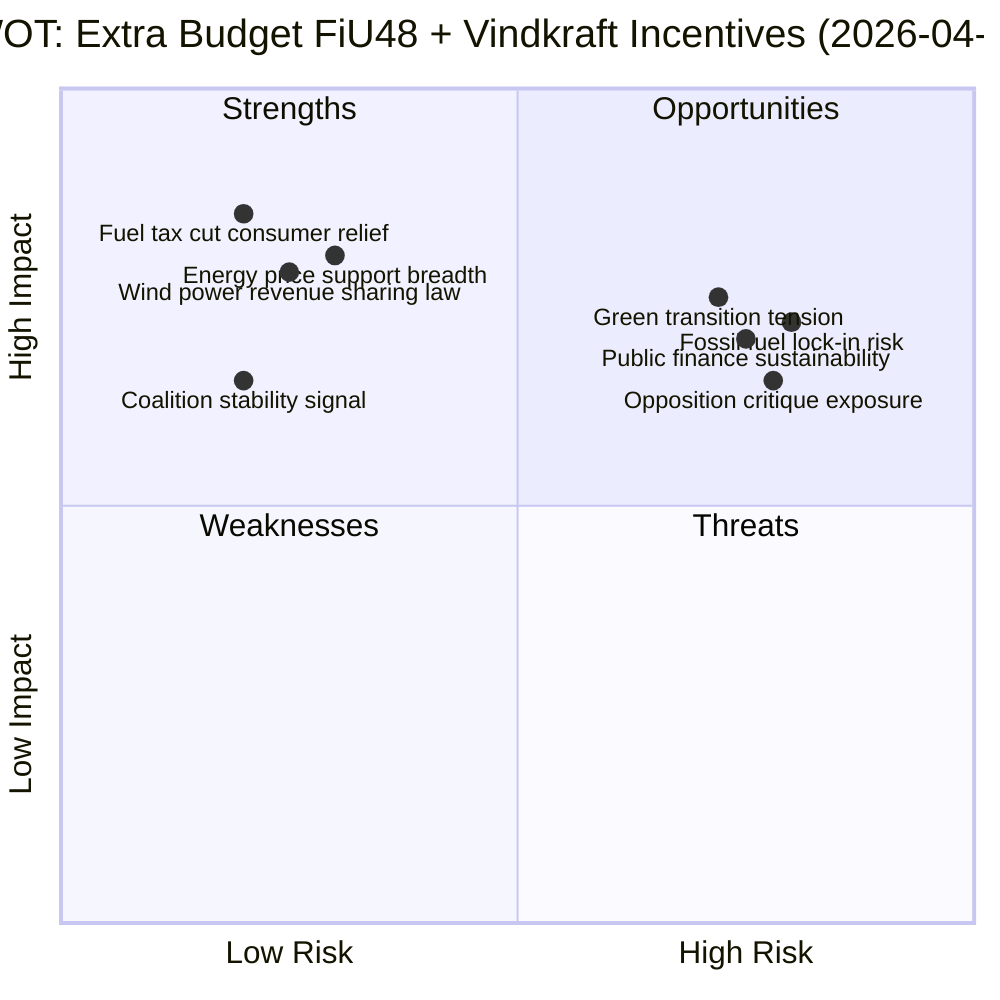

# SWOT Analysis — 2026-04-21 realtime-1353

## Context Table

| Field | Value |
|-------|-------|
| Analysis Date | 2026-04-21 |
| Run | realtime-1353 |
| Lead Doc | HD01FiU48 — Extra ändringsbudget 2026 |
| Secondary | Vindkraft intäktsdelning (new law) |
| Analyst Confidence | HIGH (live MCP data, committee report available) |
| Political Context | Tidöalliansen (M+SD+KD+L) governing coalition, 2022-2026 mandate |

## SWOT Analysis — Extra Budget FiU48 + Energy Policy

### Strengths

| Strength | Evidence | dok_id | Confidence |
|----------|----------|--------|------------|
| Immediate consumer relief from fuel tax cut | FiU48 reduces fuel tax burden for ~6M vehicle owners; energy support helps ~3M households | HD01FiU48 | HIGH |
| Wind power revenue sharing builds local acceptance | Up to 9 turbine-heights radius compensation creates incentive for communes to approve farms | gov/vindkraft | HIGH |
| Three-pillar vindkraftspaket coherence | Commune subsidies (budget 2025) → resident compensation (new law) → property buy-out study | gov/vindkraft | HIGH |
| FiU approval signals coalition discipline | Finance Committee (FiU) approving extra budget shows M+SD+KD+L bloc cohesion | HD01FiU48 | MEDIUM |
| Cross-party fiscal pragmatism | Extra budget outside main annual budget cycle demonstrates crisis-response capability | HD01FiU48 | MEDIUM |

### Weaknesses

| Weakness | Evidence | dok_id | Confidence |
|----------|----------|--------|------------|
| Fuel tax cut undermines climate commitments | Sweden's 2030 fossil-free transport target conflicts with reducing fuel tax incentive | HD01FiU48 | HIGH |
| Temporary energy support complexity | El- och gasprisstöd creates complex administration for Försäkringskassan/Skatteverket | HD01FiU48 | MEDIUM |
| Vindkraft compensation may be insufficient | Residents closest to turbines may still oppose; law-mandated minimum may not match market | gov/vindkraft | MEDIUM |
| Extra budget process signals fiscal improvisation | Multiple extra changes budgets in one year suggests reactive rather than strategic fiscal planning | HD01FiU48 | MEDIUM |

### Opportunities

| Opportunity | Evidence | dok_id | Confidence |
|-------------|----------|--------|------------|
| Accelerate Sweden's fossil-free electricity buildout | If wind power expansion succeeds → Sweden can export renewable energy surplus → economic gain | gov/vindkraft | HIGH |
| Energy price support → political dividend for coalition | Direct household relief 2026 → potential electoral credit before 2026 elections | HD01FiU48 | HIGH |
| Property buy-out model from Denmark → innovation | Investigating Danish property inlösen model → potential Swedish innovation in land rights | gov/vindkraft | MEDIUM |
| Reframing wind power from NIMBY to YIMBY | Revenue-sharing turns opponents into stakeholders → paradigm shift in local acceptance | gov/vindkraft | MEDIUM |
| KU hearings strengthen democratic accountability | Svantesson + Wallström hearings reinforce institutional norms of ministerial accountability | KU hearings | MEDIUM |

### Threats

| Threat | Evidence | dok_id | Confidence |
|--------|----------|--------|------------|
| Fuel tax cut locks in fossil dependency | Each SEK/liter reduction reduces price signal for EV adoption; risks missing 2030 targets | HD01FiU48 | HIGH |
| Coalition may face EU criticism | EU Green Deal compliance tension if Sweden reduces fossil fuel taxes | HD01FiU48 | MEDIUM |
| Vindkraft compensation law challenged in court | Property rights vs. developer rights may trigger legal challenges from landowners | gov/vindkraft | MEDIUM |
| Opposition S may counter with alternative energy support | S-led opposition could propose more targeted support → political embarrassment | HD01FiU48 | MEDIUM |
| KU scrutiny may surface governance failures | Wallström (S) investigation could reveal policy failures damaging coalition's credibility | KU hearings | LOW |

## Cross-Cutting SWOT Dynamics

**Strength–Threat Tension**: The fuel tax cut provides genuine short-term consumer relief (S) but threatens long-term climate targets (T). This tension defines the political debate: coalition argues affordability NOW vs. opposition argues sustainability LATER.

**Opportunity–Weakness Interaction**: Wind power revenue sharing (O) directly addresses local opposition (W) but may be legally challenged (T). The Danish model study (O) signals openness to bolder reforms.

**Scenario Dependency**: If energy prices remain elevated through 2026, el- och gasprisstöd becomes politically essential and FiU48 looks prescient. If energy prices drop, the extra budget looks wasteful.
