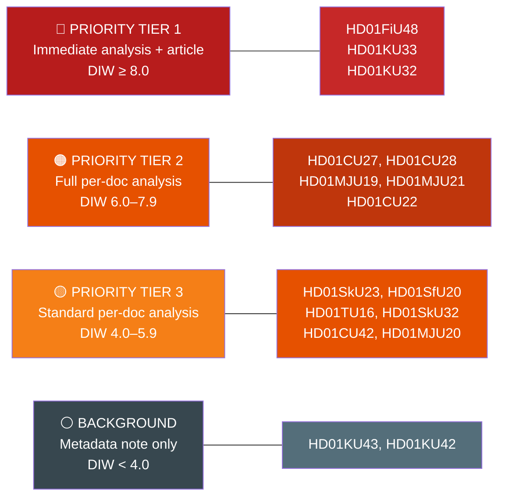

# Classification Results — Committee Reports
## analysis/daily/2026-04-22/committeeReports/classification-results.md
**Date:** 2026-04-22 | **Riksmöte:** 2025/26 | **Methodology:** political-classification-guide.md (7 dimensions)
**Classification:** Public | **Analyst:** James Pether Sörling

---

## 🔒 Classification Framework

Per political-classification-guide.md: 7 dimensions assessed — Political Temperature, Legislative Stage, Policy Domain, Controversy Index, Time Sensitivity, Coalition Alignment, Public Salience.

---

## Document Classification Table

| dok_id | Political Temp | Stage | Domain | Controversy | Time-Sensitive | Coalition Align | Public Salience | Tier | Retention |
|--------|----------------|-------|--------|-------------|----------------|-----------------|-----------------|------|-----------|
| HD01FiU48 | 🔴 Hot | Adopted 2026-04-22 | Fiscal/Energy | High | Immediate | Cross-party | Very High | **T1** | 5 years |
| HD01KU33 | 🟠 Warm | First reading (vilande) | Constitutional | High | Pre-election | Coalition | High | **T1** | 10 years |
| HD01KU32 | 🟠 Warm | First reading (vilande) | Constitutional | Medium | Pre-election | Coalition | Medium | **T1** | 10 years |
| HD01CU27 | 🟡 Moderate | Adopted 2026-04-17 | Housing/Crime | Medium | Mid-term | Coalition | Medium-High | **T2** | 7 years |
| HD01CU28 | 🟡 Moderate | Adopted 2026-04-17 | Housing | Low | Long-term | Coalition | Medium | **T2** | 7 years |
| HD01MJU19 | 🟡 Moderate | Adopted 2026-04-16 | Environment/EU | Low | Mid-term | Coalition | Medium | **T2** | 5 years |
| HD01MJU21 | 🟡 Moderate | Riksrevisionen report | Climate/Agriculture | Medium | Pre-election | Watchdog | Medium | **T2** | 5 years |
| HD01CU22 | 🟡 Moderate | Adopted 2026-04-17 | Social Welfare | Low | Mid-term | Coalition | Medium | **T2** | 5 years |
| HD01SkU23 | 🟢 Low | Adopted 2026-04-16 | Tax/Green | Low | Mid-term | Coalition | Low | **T3** | 3 years |
| HD01SfU20 | 🟢 Low | Adopted 2026-04-16 | Social/Admin | Low | Mid-term | Coalition | Low | **T3** | 3 years |
| HD01TU16 | 🟢 Low | Adopted 2026-04-21 | Transport | Low | Long-term | Coalition | Low | **T3** | 3 years |
| HD01SkU32 | 🟢 Low | Adopted 2026-04-16 | International Tax | Very Low | Mid-term | Coalition | Very Low | **T3** | 3 years |
| HD01CU42 | 🟢 Low | Riksrevisionen noted | Administrative | Low | Long-term | Watchdog | Low | **T3** | 3 years |
| HD01MJU20 | 🟢 Low | Riksrevisionen noted | Climate policy | Medium | Pre-election | Watchdog | Low | **T3** | 3 years |
| HD01KU43 | ⚪ Neutral | Adopted | Administrative | None | Low | Coalition | None | **T4** | 1 year |
| HD01KU42 | ⚪ Neutral | Adopted | Administrative | None | Long-term | Coalition | None | **T4** | 1 year |

---

## Access Classification
- All documents: **Public** (riksdagen.se, publicly published betänkanden)
- Analysis artifacts: **Public** (Riksdagsmonitor.com, GitHub Pages)
- GDPR: All actors named (MPs, ministers) have exercised public political function; Art. 9(2)(e) publicly made political opinions; Art. 9(2)(g) substantial public interest in democratic accountability

---

## Constitutional Documents: Special Retention
HD01KU33 and HD01KU32 are **Grundlagsändringar** (constitutional amendments) requiring two Riksdag readings across a general election. Special retention: 10 years. Forward indicator: Monitor 2027 Riksdag session for second reading.
