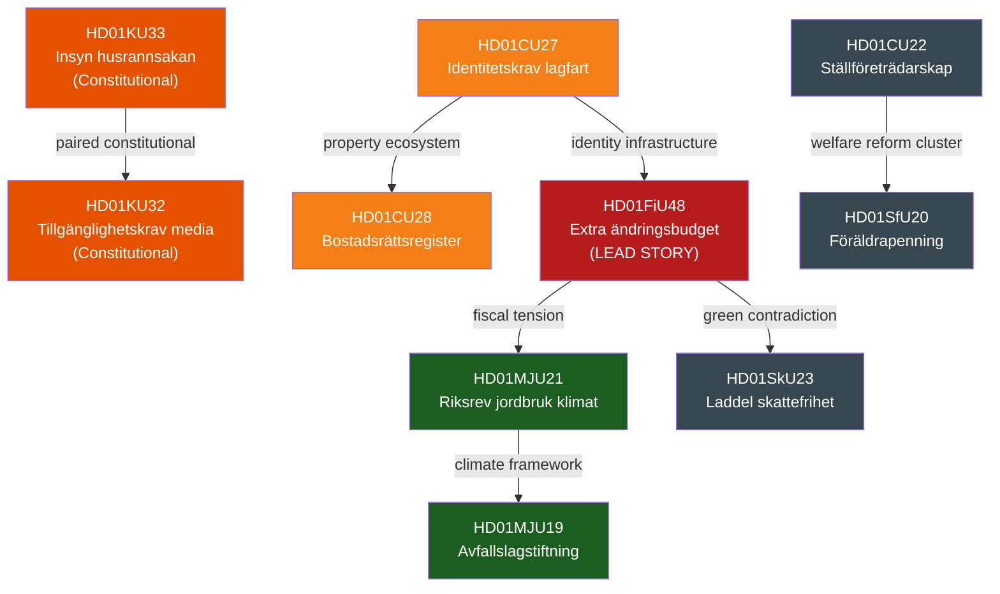

# Cross-Reference Map — Committee Reports
## analysis/daily/2026-04-22/committeeReports/cross-reference-map.md
**Date:** 2026-04-22 | **Riksmöte:** 2025/26 | **Methodology:** structural-metadata-methodology.md
**Classification:** Public | **Analyst:** James Pether Sörling

---

## 🔗 Intra-Week Cross-References

---

## Thematic Cross-References

### 1. Fiscal-Energy-Climate Nexus
- **HD01FiU48** ↔ **HD01SkU23**: Dual messaging — temporary fuel tax cut (fossil) + permanent EV charging exemption (green). Government trying to balance both constituent groups simultaneously.
- **HD01FiU48** ↔ **HD01MJU21**: Riksrevisionen finds agricultural climate transition support inadequate (riksdagen.se HD01MJU21) the same week government cuts fuel tax (HD01FiU48) — creates climate credibility deficit.
- **HD01FiU48** ↔ **HD01MJU19**: Waste legislation reform (EU circular economy, HD01MJU19) advances green narrative while fuel tax cut undermines it.

### 2. Constitutional Track
- **HD01KU33** ↔ **HD01KU32**: Both are grundlagsändringar (§TF and §YGL respectively) adopted as "vilande" on 2026-04-17; both require second Riksdag reading after 2026 election. Paired constitutional reform batch.
- **Forward link:** Next session (2026/27) must vote second readings — Election 2026 outcome determines passage.

### 3. Housing & Identity Ecosystem
- **HD01CU27** ↔ **HD01CU28**: Identity requirements for property title + national bostadsrättsregister are complementary — CU27 ensures who can hold title; CU28 ensures the register exists to track ownership. Together they form the core property transparency framework.
- **HD01CU27** ↔ **HD01TU21** (planned): CU27 identity requirements and the planned state e-legitimation (HD01TU21, BEH 2026-06-15) build toward an integrated digital identity + property ecosystem.

### 4. Riksrevisionen Watchdog Cluster
- **HD01MJU21** ↔ **HD01MJU20** ↔ **HD01CU42**: Three Riksrevisionen-derived reports processed this week. Pattern: Riksdag consistently acknowledges audit findings without binding government commitments. Monitor subsequent government responses (skrivelser) for follow-through.

---

## Continuity Contracts with Prior Analyses

| Prior Analysis | Connection | Forward Action |
|----------------|------------|----------------|
| analysis/daily/2026-04-21/evening-analysis/ (if exists) | FiU48 vote was pending as of 2026-04-21; this analysis confirms adoption | Mark FiU48 as adopted in any pending cross-reference |
| analysis/daily/2026-04-20/propositions/ (if exists) | KU33/KU32 were expected from proposition batch | Confirm first reading completed 2026-04-17 |
| Future: analysis/daily/2026-04-22+/ | KU33/KU32 second reading required post-election | Flag for 2027 Riksdag session monitoring |

---

## 🔄 Forward Intelligence Indicators

| Indicator | Watch Date | Source |
|-----------|-----------|--------|
| FiU48 extension decision (fuel tax beyond Sep 2026) | Aug 2026 | Finansdepartementet/FiU |
| KU33 second reading result (post-election Riksdag) | Jan 2027 | Riksdagen/KU |
| KU32 second reading result (post-election Riksdag) | Jan 2027 | Riksdagen/KU |
| CU28 bostadsrättsregister operational date | 2027-01-01 | Lantmäteriet |
| TU21 state e-legitimation chamber vote | 2026-06-15 | Riksdagen/TU |
| MJU21 government response to Riksrevisionen | Q3 2026 | Regeringen |
