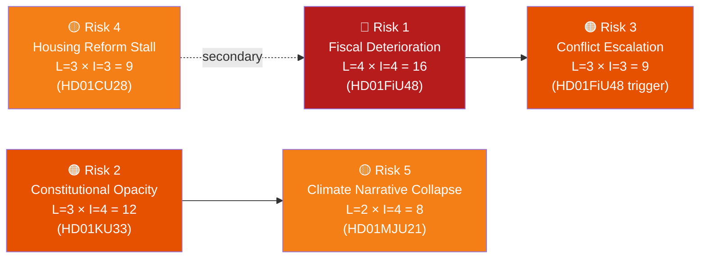

# Risk Assessment — Committee Reports
## analysis/daily/2026-04-22/committeeReports/risk-assessment.md
**Date:** 2026-04-22 | **Riksmöte:** 2025/26 | **Methodology:** political-risk-methodology.md (5×5 L×I matrix)
**Classification:** Public | **Analyst:** James Pether Sörling

---

## 🎯 Risk Overview



---

## Top 5 Risks

### Risk 1 — Fiscal Deterioration from Extra Supplementary Budget [HD01FiU48]
**Source:** HD01FiU48, rickdagen.se/riksdagen.se; World Bank Sweden GDP 2024 = 0.82%
**Likelihood:** 4 (Very likely — budget impact is legally enacted)
**Impact:** 4 (High — 4.1 GSEK budgetary deterioration in a low-growth economy)
**Risk Score:** 16 (CRITICAL)

| Dimension | Assessment |
|-----------|-----------|
| Fiscal magnitude | 4.1 billion SEK worsened balance in 2026 (HD01FiU48) |
| Economic context | GDP growth 2024: 0.82%; 2023: -0.20% (World Bank); limited fiscal headroom |
| Cascading risk | If Middle East conflict continues, temporary May–Sep 2026 cut may be extended — compounding deficit |
| Posterior probability | ~80% that additional fiscal relief is required before Sep 2026 election if energy prices remain elevated |

**Mitigation:** Finance committee (FiU) monitoring of Riksgälden borrowing; potential VÅP (spring supplementary budget) offset measures

---

### Risk 2 — Constitutional Opacity via Digital Seizure Records [HD01KU33]
**Source:** HD01KU33, riksdagen.se/riksdagen.se; KU first reading 2026-04-17
**Likelihood:** 3 (Likely — requires second Riksdag reading after 2026 election; opposition may reverse)
**Impact:** 4 (High — restricts Offentlighetsprincipen; chills investigative journalism)
**Risk Score:** 12 (HIGH)

| Dimension | Assessment |
|-----------|-----------|
| Constitutional scope | Amends Tryckfrihetsförordningen (§TF) — fundamental law requiring two readings across election |
| Transparency risk | Digital records seized in criminal investigations excluded from allmän handling status |
| Journalistic risk | Investigative journalists covering state misconduct lose access route to seized documents |
| Election risk | Post-election Riksdag may reject second reading, making current adoption politically contested |
| Posterior probability | ~55% second reading passes post-election given current coalition arithmetic |

---

### Risk 3 — Middle East Conflict Fuel Price Escalation [HD01FiU48 trigger]
**Source:** HD01FiU48 explicitly cites Middle East conflict; riksdagen.se
**Likelihood:** 3 (Roughly even — geopolitical escalation scenarios)
**Impact:** 3 (Medium — requires policy response but within fiscal capacity)
**Risk Score:** 9 (MEDIUM-HIGH)

| Dimension | Assessment |
|-----------|-----------|
| Trigger | If oil price exceeds $110/barrel, Swedish fuel price relief inadequate |
| Policy response | Government may need additional supplementary budget or consumer subsidy scheme |
| Timeline | May–Sep 2026 window of fuel tax cut; election Sept 2026 makes extension politically sensitive |
| Posterior probability | ~35% conflict escalation materially worsens Swedish energy costs before election |

---

### Risk 4 — Bostadsrättsregister Implementation Delay [HD01CU28]
**Source:** HD01CU28, riksdagen.se; effective date 2027-01-01
**Likelihood:** 3 (Likely — complex IT system for Lantmäteriet)
**Impact:** 3 (Medium — housing market uncertainty, not systemic)
**Risk Score:** 9 (MEDIUM-HIGH)

| Dimension | Assessment |
|-----------|-----------|
| Implementation complexity | New national register requires IT procurement + Lantmäteriet capacity expansion |
| Timeline risk | Core law effective 2027-01-01; full system operational date unclear |
| Market impact | Mortgage banks and real estate agents in transitional uncertainty |
| Posterior probability | ~45% that register roll-out slips beyond initial 2027 date |

---

### Risk 5 — Climate Narrative Collapse [HD01MJU21 + HD01FiU48 tension]
**Source:** HD01MJU21 (jordbruk klimatomställning, riksdagen.se); HD01MJU19 (avfallslagstiftning)
**Likelihood:** 2 (Unlikely — reputational risk, not policy failure)
**Impact:** 4 (High — damages Sweden's international climate credibility)
**Risk Score:** 8 (MEDIUM)

| Dimension | Assessment |
|-----------|-----------|
| Credibility tension | Riksrevisionen HD01MJU21 critiques government agricultural climate support while FiU48 cuts fuel taxes simultaneously |
| Audience | International investors, EU partners, climate-aligned voters (MP, C base) |
| Election implication | MP and Vänsterpartiet likely to campaign on government green inconsistency |
| Posterior probability | ~30% this becomes a dominant election-campaign narrative before Sep 2026 |

---

## 🔗 Cascading Risk Chain

```
HD01FiU48 (Fuel Tax Cut, enacted) 
    → Risk 1: Budget deterioration [-4.1 GSEK]
        → Risk 3: Conflict escalation compounds cost
            → Extension of fuel cut likely → further fiscal deterioration
    → Risk 5: Climate narrative contradiction
        → Environmental credibility of Tidö government weakened

HD01KU33 (Constitutional, first reading)
    → Risk 2: Press freedom regression
        → Second reading post-election uncertain
```
