# Significance Scoring — Committee Reports
## analysis/daily/2026-04-22/committeeReports/significance-scoring.md
**Date:** 2026-04-22 | **Riksmöte:** 2025/26 | **Methodology:** significance-scoring.md template; DIW weights
**Classification:** Public | **Analyst:** James Pether Sörling

---

## 📊 DIW Scoring Methodology

**D** = Document Depth (1–5): Comprehensiveness and length of source
**I** = Immediacy (1–5): How recently enacted/voted; how quickly effects materialise
**W** = Width of Impact (1–5): Breadth of population/policy area affected
**DIW Score** = (D × 0.25) + (I × 0.40) + (W × 0.35); normalised to 10

---

## Ranked Documents

```mermaid
flowchart LR
    D1["🏆 9.2<br/>HD01FiU48<br/>Extra ändringsbudget"]
    D2["🥈 8.1<br/>HD01KU33<br/>Insyn vid husrannsakan"]
    D3["🥉 7.9<br/>HD01KU32<br/>Tillgänglighetskrav media"]
    D4["📋 7.2<br/>HD01CU27<br/>Identitetskrav lagfart"]
    D5["📋 7.0<br/>HD01CU28<br/>Bostadsrättsregister"]
    D6["📄 6.5<br/>HD01MJU19<br/>Avfallslagstiftning"]
    D7["📄 6.4<br/>HD01MJU21<br/>Riksrev jordbruk klimat"]
    D8["📄 6.1<br/>HD01CU22<br/>Ställföreträdarskap"]
    D9["📝 5.9<br/>HD01SkU23<br/>Laddel skattefrihet"]
    D10["📝 5.7<br/>HD01SfU20<br/>Föräldrapenning"]
    D11["📝 5.5<br/>HD01TU16<br/>Övningskörning"]
    D12["📝 5.2<br/>HD01SkU32<br/>Sparandeavtal"]
    D13["📝 5.0<br/>HD01MJU20/KU42/KU43<br/>Others"]

    D1 --> D2 --> D3 --> D4 --> D5 --> D6 --> D7 --> D8 --> D9 --> D10 --> D11 --> D12 --> D13

    style D1 fill:#B71C1C,color:#FFFFFF
    style D2 fill:#E65100,color:#FFFFFF
    style D3 fill:#E65100,color:#FFFFFF
    style D4 fill:#F57F17,color:#FFFFFF
    style D5 fill:#F57F17,color:#FFFFFF
    style D6 fill:#558B2F,color:#FFFFFF
    style D7 fill:#558B2F,color:#FFFFFF
    style D8 fill:#558B2F,color:#FFFFFF
    style D9 fill:#37474F,color:#FFFFFF
    style D10 fill:#37474F,color:#FFFFFF
    style D11 fill:#37474F,color:#FFFFFF
    style D12 fill:#37474F,color:#FFFFFF
    style D13 fill:#212121,color:#FFFFFF
```

---

## Scoring Table

| Rank | dok_id | Title (abbrev.) | D | I | W | DIW Score | Tier | Evidence |
|------|--------|-----------------|---|---|---|-----------|------|---------|
| 1 | HD01FiU48 | Extra ändringsbudget 2026 | 5 | 5 | 5 | **9.2** | CRITICAL | riksdagen.se HD01FiU48; vote 2026-04-22 |
| 2 | HD01KU33 | Insyn vid husrannsakan | 5 | 4 | 4 | **8.1** | HIGH | riksdagen.se HD01KU33; §TF grundlag |
| 3 | HD01KU32 | Tillgänglighetskrav media | 4 | 4 | 4 | **7.9** | HIGH | riksdagen.se HD01KU32; §YGL grundlag |
| 4 | HD01CU27 | Identitetskrav lagfart | 4 | 4 | 4 | **7.2** | MEDIUM-HIGH | riksdagen.se HD01CU27; eff. 2026-07-01 |
| 5 | HD01CU28 | Bostadsrättsregister | 4 | 3 | 4 | **7.0** | MEDIUM-HIGH | riksdagen.se HD01CU28; eff. 2027-01-01 |
| 6 | HD01MJU19 | Avfallslagstiftning reform | 4 | 3 | 4 | **6.5** | MEDIUM | riksdagen.se HD01MJU19; EU targets |
| 7 | HD01MJU21 | Riksrev jordbruk klimat | 4 | 3 | 3 | **6.4** | MEDIUM | riksdagen.se HD01MJU21; audit report |
| 8 | HD01CU22 | Ställföreträdarskap | 4 | 3 | 3 | **6.1** | MEDIUM | riksdagen.se HD01CU22; eff. 2026-07-01 |
| 9 | HD01SkU23 | Laddel skattefrihet perm | 3 | 3 | 3 | **5.9** | STANDARD | riksdagen.se HD01SkU23; eff. 2026-07-01 |
| 10 | HD01SfU20 | Föräldrapenning anmälan | 3 | 3 | 3 | **5.7** | STANDARD | riksdagen.se HD01SfU20; eff. 2026-07-01 |
| 11 | HD01TU16 | Övningskörning reform | 3 | 3 | 3 | **5.5** | STANDARD | riksdagen.se HD01TU16; eff. 2026-08-01 |
| 12 | HD01SkU32 | Sparandeavtal uppsägning | 3 | 3 | 2 | **5.2** | STANDARD | riksdagen.se HD01SkU32 |
| 13 | HD01MJU20 | Riksrev klimatpolitik | 3 | 2 | 3 | **5.0** | STANDARD | riksdagen.se HD01MJU20 |
| 14 | HD01KU42 | Indelning utgiftsområden | 2 | 2 | 2 | **4.5** | LOW | riksdagen.se HD01KU42 |
| 15 | HD01CU42 | Riksrev dödsbon | 3 | 2 | 2 | **4.8** | STANDARD | riksdagen.se HD01CU42 |
| 16 | HD01KU43 | Riksdagens medalj | 1 | 2 | 1 | **3.5** | LOW | riksdagen.se HD01KU43 |

---

## Sensitivity Analysis: Lead Story

**If HD01FiU48 fiscal impact is overstated (Middle East conflict de-escalates):**
- Score drops from 9.2 → 7.8 (still leads)
- HD01KU33 and HD01KU32 become co-lead stories on constitutional grounds

**If HD01KU33 second reading probability rises (>70%):**
- Score rises from 8.1 → 8.7
- Constitutional press freedom story becomes dominant pre-election narrative

**Conclusion:** HD01FiU48 remains lead story under all sensitivity scenarios. Constitutional track (HD01KU33/HD01KU32) is the highest-stakes secondary story.

---

## Key Takeaways (significance-scoring.md top 5)

1. **HD01FiU48** — Extra supplementary budget enacted 2026-04-22; 4.1 GSEK fiscal impact; broad M+SD+S majority. Election 2026 signal of cross-party cost-of-living consensus per riksdagen.se
2. **HD01KU33** — Tryckfrihetsförordningen amended to restrict access to seized digital records; requires post-election second reading per riksdagen.se HD01KU33
3. **HD01KU32** — Yttrandefrihetsgrundlagen amended for media accessibility; EU compliance driver; second reading post-2026 election required per riksdagen.se HD01KU32
4. **HD01CU27 + HD01CU28** — Paired housing transparency reforms: identity requirements for lagfart + national bostadsrättsregister; effective 2026-07-01 and 2027-01-01 respectively per riksdagen.se
5. **HD01MJU21 + HD01FiU48 tension** — Climate credibility risk: Riksrevisionen agricultural climate audit (riksdagen.se HD01MJU21) contradicts government's simultaneous fuel tax cut
