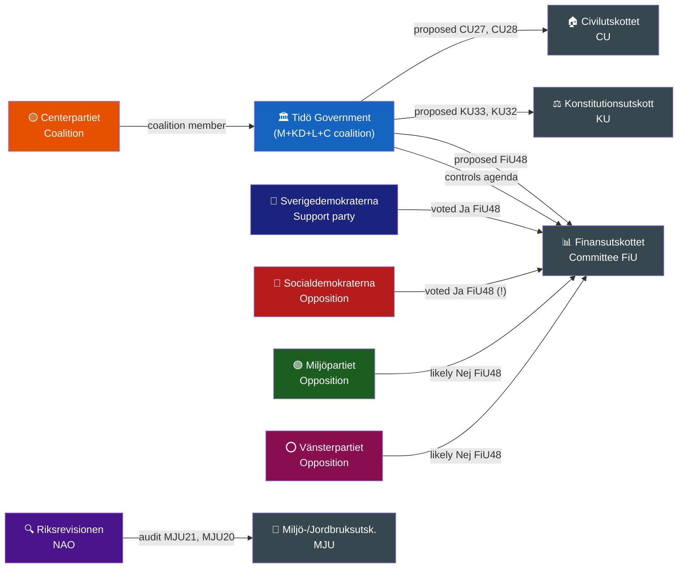

# Stakeholder Perspectives — Committee Reports
## analysis/daily/2026-04-22/committeeReports/stakeholder-perspectives.md
**Date:** 2026-04-22 | **Riksmöte:** 2025/26 | **Methodology:** analysis-templates/stakeholder-impact.md
**Classification:** Public | **Analyst:** James Pether Sörling

---

## 🎭 Influence Network Overview

---

## 👥 Stakeholder Briefing Cards

### 1. Tidö Government (Moderaterna + KD + L + C)
**Lead document:** HD01FiU48 | **Position:** Proponent
- **Interest:** Demonstrate cost-of-living responsiveness before September 2026 election
- **Action:** Proposed extra ändringsbudget; cited Middle East conflict and cold 2025/26 winter (HD01FiU48 summary at riksdagen.se)
- **Win:** 4.1 GSEK stimulus enacted with cross-party majority
- **Risk:** Green credibility undermined by simultaneous fuel tax cut + climate audit (HD01MJU21)

### 2. Sverigedemokraterna (SD)
**Lead documents:** HD01FiU48, HD01CU27 | **Position:** Supportive
- **Interest:** Maintain supply-and-confidence role; claim credit for household relief
- **Named MPs voting Ja FiU48:** Julia Kronlid (Stockholms län), Patrick Reslow (Malmö), Björn Söder (Skåne norra/östra)
- **Action:** Voted Ja on all fiscal and housing measures; supported identity requirements (HD01CU27 aligns with crime-reduction narrative)
- **Win:** Positioned as effective governing partner on cost-of-living

### 3. Socialdemokraterna (S)
**Lead documents:** HD01FiU48, HD01SfU20 | **Position:** Tactical co-operator
- **Interest:** Cannot oppose household relief pre-election; claim ownership of welfare measures
- **Named MPs voting Ja FiU48:** Kenneth G Forslund (VG västra), Anders Ygeman (Stockholm), Mikael Damberg (Stockholms län), Fredrik Olovsson (Södermanland), Hanna Westerén (Gotland), Ida Ekeroth Clausson (VG östra)
- **Action:** Voted Ja FiU48 — cross-aisle coalition signals pre-election fiscal consensus OR calculated cost-of-living concession
- **Tension:** S traditionally defends Riksgälden's fiscal mandate; voting Ja means accepting budget deterioration of 4.1 GSEK

### 4. Miljöpartiet (MP)
**Lead documents:** HD01MJU21, HD01FiU48 | **Position:** Critical/Opposed
- **Interest:** Climate credibility; press for consistent green policy
- **Named MP:** Malte Tängmark Roos (Malmö) — Frånvarande for FiU48 vote
- **Key argument:** Government claims climate commitment (MJU19, MJU21 responses) while cutting fuel tax — contradictory
- **Forward threat:** Will campaign on green inconsistency

### 5. Riksrevisionen (National Audit Office)
**Lead documents:** HD01MJU21, HD01MJU20, HD01CU42 | **Position:** Watchdog
- **Interest:** Ensure government programs deliver measurable climate and welfare outcomes
- **Action:** Three Riksrevisionen reports processed by Riksdag this week — agricultural climate transition (HD01MJU21), climate policy framework (HD01MJU20), estate handling (HD01CU42)
- **Findings:** Riksdag received and noted reports; government's response acknowledges key Riksrevisionen recommendations on agricultural climate support per HD01MJU21 summary
- **Impact:** Audit findings become opposition campaign material

### 6. Swedish Motorists & Households (Indirect Stakeholder)
**Lead document:** HD01FiU48 | **Position:** Beneficiary
- **Interest:** Fuel cost relief; energy support for Jan–Feb 2026
- **Benefit:** 82 öre/litre petrol reduction, 319 SEK/m³ diesel reduction (May–Sep 2026); electricity/gas support
- **Scale:** ~5 million Swedish motor vehicle registrations + ~4 million heated households

### 7. Lantmäteriet & Property Market
**Lead documents:** HD01CU27, HD01CU28 | **Position:** Implementor
- **Interest:** System capacity to implement new lagfart identity requirements and bostadsrättsregister
- **Challenge:** Register must be live by 2027-01-01 (HD01CU28); Lantmäteriet IT procurement required
- **Risk actors:** Real estate agents, mortgage banks — transitional compliance burden

### 8. Agricultural Sector
**Lead document:** HD01MJU21 | **Position:** Under scrutiny
- **Interest:** Maintaining subsidies for green transition without being penalised
- **Riksrevisionen finding:** Government climate support for agriculture lacks sufficient coherence with climate goals (HD01MJU21 per riksdagen.se)
- **Forward:** Election 2026 creates incentive to announce new agricultural climate package

---

## 🏆 Winners & Losers This Week

| Category | Actor | Outcome | Document |
|----------|-------|---------|---------|
| 🏆 Winner | Tidö Government | Extra budget enacted with S support — political win | HD01FiU48 |
| 🏆 Winner | SD | All priority votes passed, housing crime reform enacted | HD01FiU48, HD01CU27 |
| 🏆 Winner | Swedish Motorists | 82 öre/litre fuel tax cut (May–Sep 2026) | HD01FiU48 |
| ⚠️ Mixed | Socialdemokraterna | Voted Ja on fiscal measure — short-term popularity vs long-term fiscal credibility | HD01FiU48 |
| ❌ Loser | Miljöpartiet | Climate narrative undermined by government's dual messaging | HD01MJU21 + HD01FiU48 |
| ❌ Loser | Investigative Journalists | Digital seizure records restricted from public access | HD01KU33 |
| ❌ Loser | Riksgälden fiscal target | 4.1 GSEK additional deficit accepted by broad majority | HD01FiU48 |
