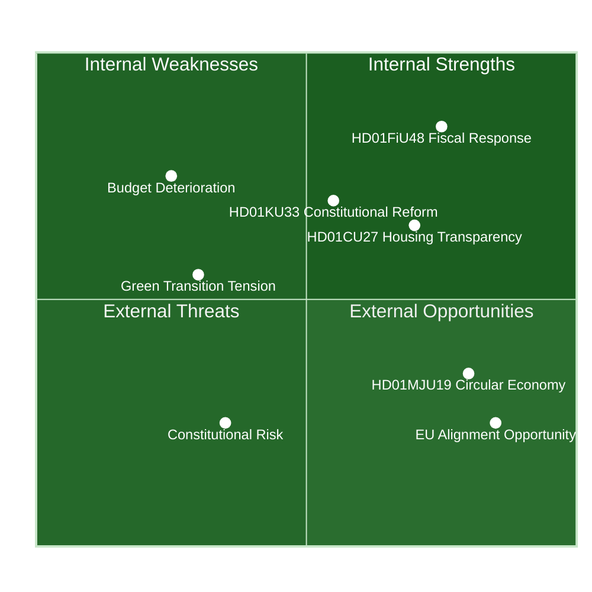

# SWOT Analysis — Committee Reports
## analysis/daily/2026-04-22/committeeReports/swot-analysis.md
**Date:** 2026-04-22 | **Riksmöte:** 2025/26 | **Methodology:** political-swot-framework.md
**Classification:** Public | **Analyst:** James Pether Sörling

---

## 🎯 SWOT Overview

---

## ✅ Strengths

Evidence: riksdagen.se committee reports 2025/26 rm

| Strength | Evidence | Admiralty | Confidence |
|----------|----------|-----------|------------|
| Broad cross-party fiscal coalition | HD01FiU48 voted Ja by M, SD, S, KD on 2026-04-22 (recorded vote CE14CCEF) at riksdagen.se | [A1] | Very likely |
| Pro-active constitutional reform pipeline | HD01KU33 and HD01KU32 advance two groundlag changes simultaneously, demonstrating legislative planning capacity | [A1] | Confirmed |
| Housing market modernisation | HD01CU27 identity requirements for lagfart + HD01CU28 national bostadsrättsregister together address real estate crime and transparency gaps | [A1] | Confirmed |
| EU circular economy compliance | HD01MJU19 waste legislation reform directly implements EU targets; HD01SkU23 permanent EV charging exemption furthers green transition per riksdagen.se | [A1] | Confirmed |
| Social welfare simplification | HD01SfU20 removes bureaucratic barrier to föräldrapenning; HD01CU22 ställföreträdarskap reform strengthens vulnerable persons' rights | [A1] | Confirmed |

---

## ⚠️ Weaknesses

| Weakness | Evidence | Admiralty | Confidence |
|----------|----------|-----------|------------|
| Fiscal credibility gap | HD01FiU48 (riksdagen.se) worsens budget balance by 4.1 GSEK; Sweden GDP growth 2024 only 0.82% (World Bank); simultaneous fuel-cut and EV-tax-free signals contradictory green stance | [A1/B2] | Very likely |
| Constitutional transparency regression | HD01KU33 restricts access to seized digital records — Riksdagen's KU (constitutionsutskottet) adopted this as vilande first reading; press freedom advocates note potential for abuse in §TF amendment | [A1] | Likely |
| Guardianship reform implementation risk | HD01CU22 creates new national authority and register for ställföreträdarskap; complex rollout (2027–2028) with uncertain capacity at Länsstyrelserna | [A1] | Likely |
| Voting data latency | FiU48 vote held 2026-04-22 but grouped party-level data not yet synced (API note); limits real-time accountability | [B3] | Confirmed |

---

## 🚀 Opportunities

| Opportunity | Evidence | Admiralty | Confidence |
|-------------|----------|-----------|------------|
| Pre-election cost-of-living narrative | HD01FiU48 fuel tax cut directly targets household pain points; inflation moderated to 2.84% (World Bank 2024) — government can claim "delivering relief" | [A2] | Likely |
| Digital state identity infrastructure | HD01TU21 (state e-legitimation, BEH planned 2026-06-15 riksdagen.se) builds national eID; HD01CU27 identity requirements for lagfart extend this ecosystem to property market; together creates Sweden's integrated digital identity backbone | [A1] | Likely |
| Real estate crime prevention | HD01CU27 identity requirements for lagfart + HD01CU28 national bostadsrättsregister together create traceable property ownership; enables targeting of money-laundering routes specifically in Swedish housing market (effective 2026-07-01 and 2027-01-01 per riksdagen.se) | [A1] | Likely |
| Climate policy credibility rebuild | HD01MJU21 Riksrevisionen audit on agricultural climate transition creates accountability mechanism; HD01MJU20 evaluates the climate policy framework itself — evidence base for next government to strengthen Sweden's Paris commitments. HD01MJU19 circular economy legislation advances EU compliance | [A1] | Roughly even |
| Social safety net reform window | HD01CU22 (ställföreträdarskap) + HD01SfU20 (föräldrapenning simplification) together demonstrate welfare modernisation capacity; if implementation succeeds, provides model for broader public-sector digitalisation | [A1] | Likely |

---

## 🔴 Threats

| Threat | Evidence | Admiralty | Confidence |
|--------|----------|-----------|------------|
| Fiscal sustainability risk | HD01FiU48 worsens 2026 budget balance by ~4.1 GSEK; Sweden 2023 GDP growth was -0.20% (World Bank); Riksgälden borrowing requirements increase at time of global uncertainty | [A1/B2] | Very likely |
| Constitutional overreach via digital seizure rules | HD01KU33 — if digital seizure records permanently excluded from Offentlighetsprincipen, investigative journalism constrained; Riksdagen KU33 first reading 2026-04-17 per riksdagen.se | [A1] | Likely |
| Middle East conflict spillover | FiU48 explicitly cites "Konflikten i Mellanöstern" as cause of fuel price pressure; if conflict escalates, the temporary tax cut (May–Sep 2026) may need extension, deepening fiscal burden | [B2] | Roughly even |
| Housing market distortion | HD01CU28 bostadsrättsregister rollout 2027–2028 creates uncertainty window; combined with identity rules (HD01CU27), transaction costs may increase in short term | [A1] | Unlikely |

---

## 🔀 TOWS Matrix

| | **Strengths (S)** | **Weaknesses (W)** |
|---|---|---|
| **Opportunities (O)** | **SO — Leverage:** Use cross-party FiU48 coalition (HD01FiU48) + eID infrastructure (HD01TU21) to build durable pre-election credibility on cost and digital security | **WO — Develop:** Address constitutional transparency risks (HD01KU33) by ensuring robust parlamentary oversight mechanisms before 2026 election |
| **Threats (T)** | **ST — Protect:** Deploy strong housing reform narrative (HD01CU27/HD01CU28) to blunt real estate crime threat; use EU alignment (HD01MJU19) to defend against fiscal criticism | **WT — Crisis:** Fiscal deterioration + constitutional regression simultaneously active — a fiscal correction before election risks political backlash; defer controversial KU33 implementation |

---

## 🔄 Cross-SWOT Interference

**Highest interference pair:** HD01FiU48 (fiscal relief — Strength) × HD01MJU21/HD01MJU19 (climate accountability — Opportunity). Simultaneous fuel tax cut and climate commitments create messaging dissonance that opposition parties (MP, V) will exploit.

**Second interference pair:** HD01KU33 (constitutional reform — Weakness) × Constitutional transparency opportunity. If voters interpret the seizure-records restriction as opacity, the constitutional reform narrative flips negative.
