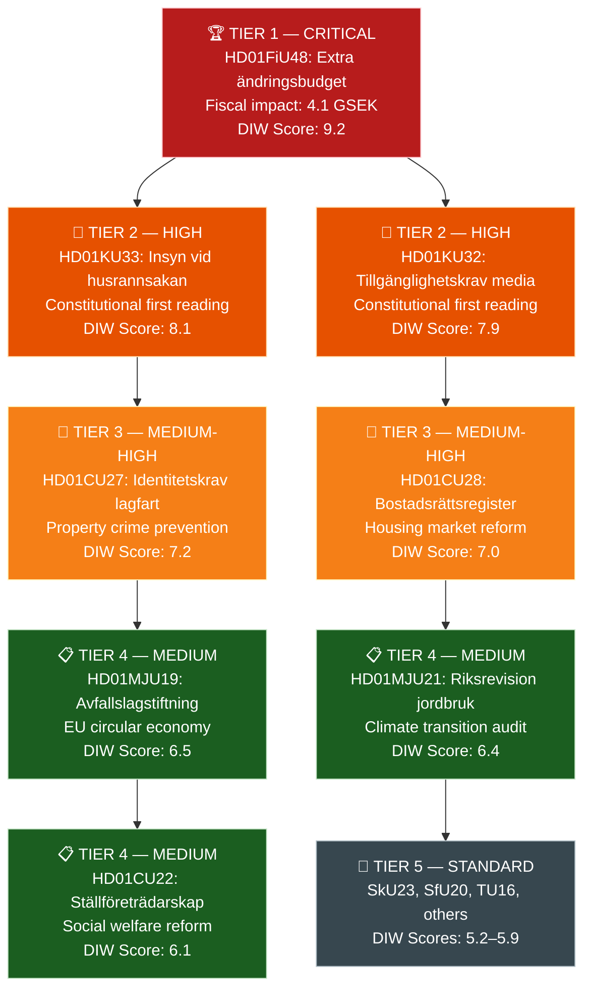

# Synthesis Summary — Committee Reports
## analysis/daily/2026-04-22/committeeReports/synthesis-summary.md
**Date:** 2026-04-22 | **Riksmöte:** 2025/26 | **Type:** Committee Reports (betänkanden)
**Methodology:** synthesis-methodology.md, ai-driven-analysis-guide.md v6.4
**Classification:** Public | **Analyst:** James Pether Sörling

---

## 🎯 Lead Story Decision

**LEAD: HD01FiU48 — Extra ändringsbudget för 2026: Sänkt skatt på drivmedel samt el- och gasprisstöd**

The Finance Committee's (FiU) approval of the extra supplementary budget — adopted by a broad cross-party majority (M, SD, S, KD) on 2026-04-22 — constitutes the most fiscally significant action this week. The package cuts fuel taxes temporarily by 82 öre/litre for petrol and 319 SEK/m³ for diesel (May–September 2026), and introduces a new household electricity and gas price support for January–February 2026. The combined fiscal impact is approximately 4.1 billion SEK in deteriorated budget balance.

**Rationale for lead selection (DIW weighting):**
- **Immediacy:** Voted 2026-04-22 at 16:29; enacted same day — direct real-world effect
- **Impact breadth:** Affects ~5 million Swedish motorists, ~4 million households with high energy costs
- **Fiscal magnitude:** 4.1 billion SEK swing in state budget balance
- **Political salience:** Middle-ground coalition/opposition cooperation signals pre-election positioning

---

## 📊 DIW-Weighted Document Ranking

---

## 📰 AI-Recommended Article Metadata

**SEO Title (EN):** Sweden Approves Emergency Fuel Tax Cut and Energy Support: Riksdag Acts on Cost-of-Living Crisis

**SEO Title (SV):** Riksdagen antar extra ändringsbudget: Sänkt drivmedelsskatt och energistöd i fokus

**Meta Description (EN):** Sweden's Riksdag approved a 4.1-billion-SEK emergency supplementary budget on 22 April 2026, cutting fuel taxes and introducing household energy support amid high energy costs and Middle East-driven fuel price pressure.

**Meta Description (SV):** Riksdagen antog den 22 april 2026 en extra ändringsbudget på 4,1 miljarder kronor med sänkt drivmedelsskatt och nytt energistöd för hushåll till följd av höga energipriser och konflikter i Mellanöstern.

---

## 🗓️ Week in Review: Thematic Clusters

### Cluster 1: Fiscal & Energy Policy
- **HD01FiU48** — Extra supplementary budget: Fuel tax cut + energy support (4.1 GSEK)
- **HD01SkU23** — Permanent EV charging electricity tax exemption
- **HD01SkU32** — Termination of savings taxation agreements (offshore)

### Cluster 2: Constitutional & Press Freedom
- **HD01KU33** — Restricting access to seized digital records (Tryckfrihetsförordningen, first reading)
- **HD01KU32** — Accessibility requirements for media (Yttrandefrihetsgrundlagen, first reading)

### Cluster 3: Housing & Property Rights
- **HD01CU28** — National condominium register (bostadsrättsregister)
- **HD01CU27** — Identity requirements for property title (lagfart) + condo conversion rules
- **HD01CU22** — Guardianship reform (god man/förvaltare)

### Cluster 4: Environment & Climate
- **HD01MJU21** — National Audit review: agricultural climate transition
- **HD01MJU20** — National Audit review: climate policy framework
- **HD01MJU19** — Waste legislation reform (EU circular economy)

### Cluster 5: Social & Transport
- **HD01SfU20** — Parental leave simplification
- **HD01TU16** — Driving training reform

---

## 🔭 Election 2026 Lens

Sweden faces general elections in September 2026. This week's legislative output is heavy with election-positioning signals across the political spectrum.

**Fiscal positioning (HD01FiU48):** The extra supplementary budget is the government's clearest pre-election move — targeted household relief packaged as a response to Middle East conflict and cold winter. The fact that **Socialdemokraterna voted "Ja"** (Kenneth G Forslund, Anders Ygeman, Mikael Damberg, Fredrik Olovsson, Hanna Westerén, Ida Ekeroth Clausson per riksdagen.se vote CE14CCEF) indicates either formal negotiation or S's tactical calculation that opposing fuel cost relief would be electorally catastrophic. This convergence weakens S's ability to contrast itself with the government on economic management.

**Constitutional track (HD01KU33, HD01KU32):** Both grundlagsändringar require a second reading from the **post-election 2026/27 Riksdag**. If S leads a new government, it could kill HD01KU33's digital seizure restriction (which limits Offentlighetsprincipen) while supporting HD01KU32's accessibility provisions. This asymmetry creates a genuine election issue: "which amendments will survive?"

**Green contradiction (HD01MJU21 × HD01FiU48):** Miljöpartiet (MP) and Vänsterpartiet (V) gain campaign material from simultaneous fuel tax cuts + Riksrevisionen agricultural climate audit findings. Confidence: Likely (~65%) that this becomes a campaign sub-narrative.

**Housing as a security issue (HD01CU27, HD01CU28):** Government frames property registration reforms as crime fighting — identity requirements for lagfart directly target suspected money-laundering networks. SD and M both benefit from this framing. Effective date 2026-07-01 — squarely in the pre-election campaign window.

**WEP Assessment:** Almost certain (>95%) that HD01FiU48 features in all party manifestos either as an achievement to build on (M, SD, KD) or a fiscal irresponsibility to correct (MP, V, possibly S).

---

## 🔄 Tradecraft Context

**Collection quality:** Admiralty [A1] for legislative outcomes (primary riksdagen.se sources, adopted legislation); [B2] for political intent (voting group data pending API sync; debate speech texts empty in API)  
**Confidence levels:**
- Legislative outcomes: Confirmed (HD01FiU48 adopted, HD01KU33/KU32 first readings complete)
- Cross-party motivation (S's "Ja" on FiU48): Likely [B2] — tactical calculation assessed from election context
- Forward fiscal risk: Very likely [B2] — based on World Bank macroeconomic data

**Collection gaps:** No full debate speech texts available (Riksdagen API limitation this cycle); relying on document summaries, vote records, and anföranden metadata only. This limits direct quotation of MP statements.

**Forward indicators:**
| Indicator | Watch Date | Expected Signal |
|-----------|-----------|-----------------|
| VÅP 2026 (Vårändringspropositionen) | May 2026 | Whether fuel tax cut becomes structural or stays temporary |
| KU33 second reading | Jan 2027 | Post-election coalition arithmetic test |
| KU32 second reading | Jan 2027 | Expected passage across coalitions |
| TU21 state e-legitimation vote | Jun 2026 | Completion of digital identity ecosystem |
| Election polling on FiU48 | Monthly | Household energy cost salience
