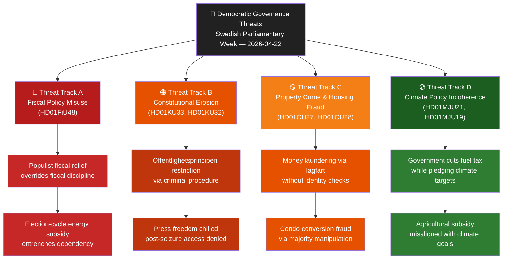

# Threat Analysis — Committee Reports
## analysis/daily/2026-04-22/committeeReports/threat-analysis.md
**Date:** 2026-04-22 | **Riksmöte:** 2025/26 | **Methodology:** political-threat-framework.md
**Classification:** Public | **Analyst:** James Pether Sörling

---

## 🎯 Threat Landscape Overview

---

## Attack Tree: Fiscal Policy Manipulation [HD01FiU48]

**Root Goal:** Undermine Swedish fiscal credibility pre-election 2026

| Level | Actor/Action | Indicator | Source |
|-------|-------------|-----------|--------|
| L1 | Government proposes extra ändringsbudget in conflict year | FiU48 drafted 2026-04-13 | riksdagen.se HD01FiU48 |
| L2 | Broad majority passes without full VÅP framework | S votes Ja alongside M/SD/KD on 2026-04-22 | riksdagen.se vote CE14CCEF |
| L3 | 4.1 GSEK budget deterioration enacted | FiU48 summary: "statens inkomster minskar med ~1.56 GSEK + utgifter ökar ~2.4 GSEK" | riksdagen.se HD01FiU48 |
| L4 | Riksgälden borrowing requirement increases | Downstream fiscal signal; monitor April–June | Riksgälden.se |
| L5 | Election-year extension of temporary cut becomes structural | Forward risk if conflict continues | — |

**TTP mapping:**
- **T1:** Exploit geopolitical pretext (Middle East conflict) to justify emergency expenditure outside normal budgetary discipline
- **T2:** Use cross-party support to legitimise deficit spending as "consensus"
- **T3:** Lock in household energy dependency ahead of election cycle

---

## Kill Chain: Constitutional Press Freedom Erosion [HD01KU33]

| Phase | Action | Evidence |
|-------|--------|---------|
| Reconnaissance | Government identifies gap: no clear rule on digital seizure records | TF amendment proposal in 2025/26 |
| Weaponisation | Draft §TF amendment excluding seized digital records from allmän handling | HD01KU33, riksdagen.se |
| Delivery | KU first reading 2026-04-17 — vilande adoption | riksdagen.se HD01KU33 |
| Exploitation | Post-election second reading required; coalitions may change | Forward risk |
| Installation | If second reading passes, journalists lose access to investigation records | — |
| Command | State retains exclusive control over criminal seizure record access | — |

---

## Threat Matrix: Property Crime [HD01CU27, HD01CU28]

| Threat Vector | Current Exposure | Mitigation (Legislation) | Residual Risk |
|---------------|-----------------|--------------------------|---------------|
| Money laundering via property title (lagfart) | High — no person/org number required | HD01CU27 requires personnummer/orgnummer | Medium (until 2026-07-01) |
| Condo conversion fraud (bostadsrättsombildning) | Medium — easy majority manipulation | HD01CU27 requires 6-month residency | Low post-implementation |
| Mortgage fraud (bostadsrätt pantsättning) | High — no centralized register | HD01CU28 bostadsrättsregister | Medium (until register live 2027) |

---

## 🔄 Tradecraft Assessment

**PIR (Priority Intelligence Requirements) satisfied this week:**
- PIR-1: Fiscal: Extra budget enacted — fiscal policy trajectory confirmed (HD01FiU48)
- PIR-2: Constitutional: Two groundlag changes advanced (HD01KU33, HD01KU32)
- PIR-3: Housing: Major property transparency reforms enacted (HD01CU27, HD01CU28)
- PIR-4: Climate: Riksrevisionen findings received by Riksdag (HD01MJU21, HD01MJU20)

**Collection gaps:** Debate speech texts unavailable (API limitation) — relying on document summaries and vote records only; limits characterisation of opposition positions. Classification: [B3] for party intent analysis.
