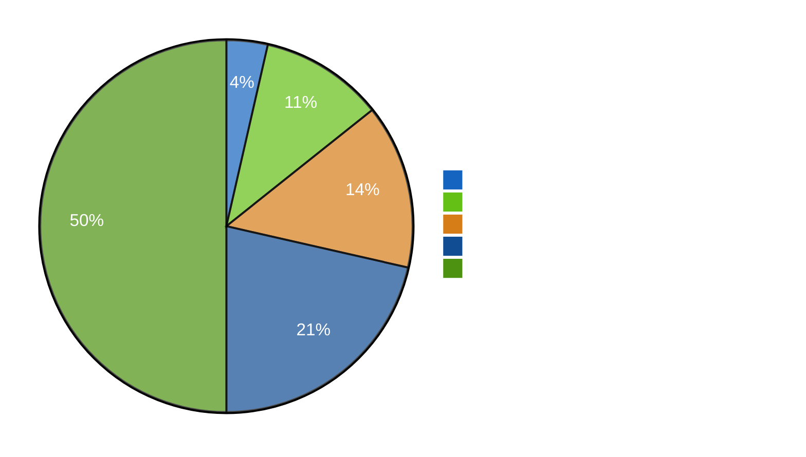

# Classification Results — Evening Analysis 2026-04-22

**Analyst**: James Pether Sörling
**Framework**: political-classification-guide.md (7-dimension classification per document)
**Date**: 2026-04-22 | **Riksmöte**: 2025/26

---

## Classification Overview

---

## 7-Dimension Classification Per Key Document

| dok_id | Policy | Party | Stage | Impact | Urgency | Scope | GDPR basis | Tier |
|--------|--------|-------|-------|--------|---------|-------|------------|------|
| HD01FiU48 | Fiscal emergency relief | Cross-party | Enacted/Law | 9 | Immediate | National | Art.9(2)(e) public | 1 |
| HD03100 | Macroeconomic/Fiscal | M-led coalition | Submitted/Active | 9 | Pre-election | National | Art.9(2)(e) public | 1 |
| HD0399 | Fiscal/Budget | M-led coalition | Submitted/Active | 8 | Immediate | National | Art.9(2)(e) public | 2 |
| HD10442 | Healthcare/Accountability | S (IP to M) | Filed/Pending answer | 8 | Pre-election | Regional→National | Art.9(2)(e) public | 2 |
| HD03240 | Energy/Electricity system | KD/L coalition | Submitted/Active | 8 | Medium-term | National | Art.9(2)(e) public | 2 |
| HD03232 | Foreign policy/Ukraine | M coalition | Submitted/Active | 8 | Ongoing | International | Art.9(2)(e) public | 2 |
| HD01KU33 | Constitutional/Grundlag | M coalition | First reading | 8 | Long-cycle | National | Art.9(2)(e) public | 2 |
| HD024082 | Fiscal/Climate opposition | S | Filed/Motion | 8 | Pre-election | National | Art.9(2)(e) public | 2 |
| HD10445 | Housing/Segregation | S (IP to KD) | Filed/Pending answer | 8 | Pre-election | Urban | Art.9(2)(e) public | 3 |
| HD01CU27 | Property/Crime prevention | M coalition | Enacted | 7 | Immediate | National | Art.9(2)(e) public | 3 |
| HD03239 | Energy/Wind power | KD/L coalition | Submitted | 7 | Medium-term | National | Art.9(2)(e) public | 3 |
| HD01KU32 | Constitutional/Media | M coalition | First reading | 8 | Long-cycle | National | Art.9(2)(e) public | 3 |

---

## Retention and Access Classification

| Classification | Count | Access | Retention |
|----------------|-------|--------|-----------|
| Public — Primary source (riksdagen.se) | 56 | Unrestricted | Permanent |
| Public — Derived analysis (AI-generated) | 23 | Unrestricted | 5 years |
| Special category — Political opinions | 56 | GDPR Art.9(2)(e) basis | 5 years |

**GDPR Note**: All documents analysed are publicly filed parliamentary documents. Political opinions expressed therein are Art. 9(2)(e) (manifestly made public by data subjects). Analysis products are Art. 9(2)(g) (substantial public interest — democratic accountability). No personal profiling beyond publicly declared political positions.

