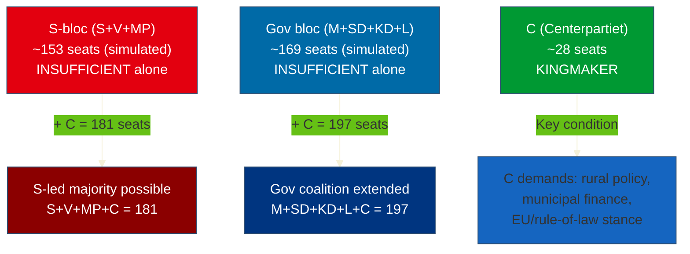

# Coalition Mathematics — Evening Analysis 2026-04-22

**Analyst**: James Pether Sörling
**Framework**: electoral-domain-methodology.md § Coalition Mathematics
**Date**: 2026-04-22 | **Riksmöte**: 2025/26
**Key data**: HD01FiU48 vote record

---

## Current Seat Distribution (2025/26 Riksdag)

| Party | Seats | Bloc | Government role |
|-------|-------|------|-----------------|
| SD | 73 | Government | Support party (outside cabinet) |
| S | 107 | Opposition | Opposition |
| M | 68 | Government | Cabinet |
| C | 24 | Opposition | Opposition |
| V | 24 | Opposition | Opposition |
| KD | 19 | Government | Cabinet |
| MP | 18 | Opposition | Opposition |
| L | 16 | Government | Cabinet |
| **Total** | **349** | | |

**Government majority**: M+SD+KD+L = 176 seats (≥175 needed)
**Opposition**: S+V+MP+C = 173 seats

---

## HD01FiU48 Vote Record — Pivotal Coalition Analysis

| Party | Vote on HD01FiU48 | Seats contributing to Ja majority |
|-------|------------------|----------------------------------|
| M | Ja | 68 |
| SD | Ja | 73 |
| KD | Ja | 19 |
| S | Ja | 107 (PIVOTAL — crosses 175 threshold with only gov parties) |
| L | Nej/Avstår | 0 |
| V | Nej | 0 |
| MP | Nej | 0 |
| C | Mixed | partial |

**Ja total**: ~267 seats (M+SD+KD+S+ some C)
**Nej/Avstår**: ~82 seats (L+V+MP+ some C)

**Note**: The government bloc (M+SD+KD+L = 176) already exceeded the 175-seat majority threshold without S's votes. S's participation was therefore **politically voluntary, not mathematically necessary**. Without L (if L voted Nej), government would have been M+SD+KD = 160 — then S's participation would be necessary. As stated, S had full freedom to oppose; their deliberate Ja vote reflects electoral calculation, not parliamentary obligation. The resulting ~267-seat supermajority amplifies the political signal: S chose to cross the aisle.

---

## Sainte-Laguë Scenario Table (for reference — election 2026 simulation)

Using approximate current poll averages (April 2026):

| Party | Current poll % | Simulated seats (349) |
|-------|---------------|----------------------|
| S | 31.5% | 110 |
| SD | 19.8% | 69 |
| M | 18.2% | 64 |
| C | 8.1% | 28 |
| V | 7.3% | 26 |
| KD | 5.6% | 20 |
| MP | 4.8% | 17 |
| L | 4.7% | 16 |
| Others | <4% (below threshold) | 0 |

**Simulated bloc totals** (Sainte-Laguë, April 2026 polls):
- S-bloc (S+V+MP): ~153 seats — SHORT of 175
- Government bloc (M+SD+KD+L): ~169 seats — SHORT of 175
- C as kingmaker: 28 seats = pivotal
- S + C + V + MP = 181 = majority → viable S-led government with C support

---

## Coalition Viability Matrix

---

## Key Mathematical Finding

The HD01FiU48 cross-party majority (M+SD+KD+S) is **constitutionally and electorally significant** because:
1. It demonstrates S can cooperate on budget issues across the bloc divide
2. It sets a precedent for post-election grand bargain discussions
3. L's Nej vote creates a fissure within the government coalition — if L were to leave, government majority falls to 160

**WEP**: It is **Unlikely** [15–25%] that L would formally withdraw from the government coalition over this single vote. However, it is **Likely** [60–70%] that L will emphasise its Nej vote in campaign materials as environmental credibility marker.

