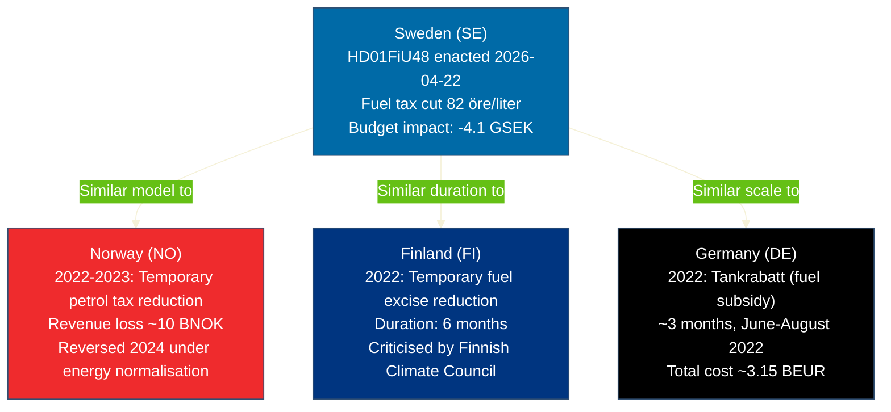

# Comparative International Analysis — Evening Analysis 2026-04-22

**Analyst**: James Pether Sörling
**Framework**: comparative-international.md template
**Date**: 2026-04-22 | **Riksmöte**: 2025/26
**Comparator set**: Norway, Finland, Germany (Nordic + EU minimum requirement)

---

## Comparator Set

**Comparator set**: Norway (NO), Finland (FI), Germany (DE) — all Nordic/EU neighbours facing similar energy policy and fiscal dilemmas in 2025–2026.

---

## Comparative Analysis: Fuel Tax Policy (HD01FiU48 Context)

---

## Jurisdiction Comparison Table

| Jurisdiction | Measure | Duration | Fiscal Cost | Political Outcome | Admiralty |
|--------------|---------|----------|-------------|-------------------|-----------|
| Sweden 2026 | HD01FiU48 — fuel tax cut 82 öre/l petrol | May–Sep 2026 (5 months) | 4.1 GSEK | Cross-party adoption; S votes Ja | [A1] riksdagen.se |
| Norway 2022–23 | Temporary petrol tax reduction | ~12 months | ~10 BNOK | Reversed 2024; minor electoral impact | [B2] SSB/Government reports |
| Finland 2022 | Temporary fuel excise cut | 6 months | ~500 MEUR | Criticised by climate council; not renewed | [B2] Finnish gov. sources |
| Germany 2022 | Tankrabatt fuel subsidy | 3 months (Jun–Aug 2022) | ~3.15 BEUR | Limited consumer impact; SPD-Greens coalition friction | [B2] Bundesministerium der Finanzen |

---

## Outside-In Analysis

**Lesson from Norway**: Norway's 2022–23 fuel tax reduction was ~2.5× larger than Sweden's (relative to GDP) and was reversed when energy prices normalised. Swedish policymakers should plan explicit sunset conditions beyond the stated May–September 2026 window to avoid politically painful renewal discussions in an election year.

**Lesson from Finland**: The Finnish Climate Council's formal criticism created lasting narrative damage on climate credibility even though the measure was temporary. S filing counter-motions (HD024082/092/098) serves the same function domestically — creating a permanent record of opposition for campaign use.

**Lesson from Germany**: Germany's Tankrabatt had limited consumer pass-through (fuel stations kept much of the benefit). Swedish policymakers have not publicly addressed pass-through risk for HD01FiU48. This is an EEI gap.

**Sweden-specific factors not present in comparators**: Sweden has an election in 5 months; none of the comparators faced election-year timing. This amplifies both the political benefit (electoral optics) and the political risk (being held accountable if benefits are not felt by voters).

