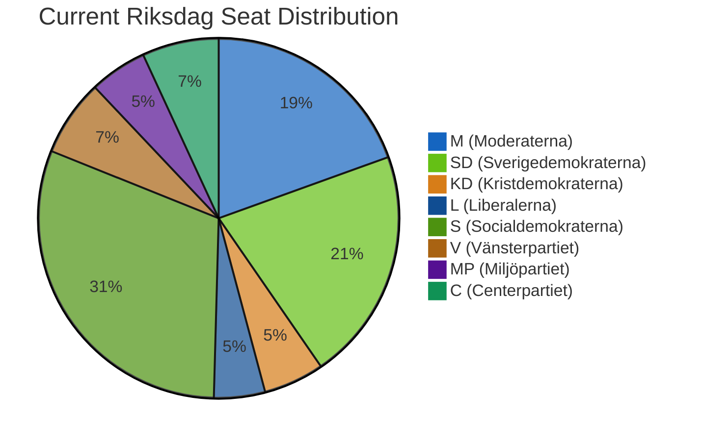

# Election 2026 Analysis — Evening Analysis 2026-04-22

**Analyst**: James Pether Sörling
**Framework**: electoral-domain-methodology.md + Kent Scale WEP
**Date**: 2026-04-22 | **Riksmöte**: 2025/26
**Days until election**: ~144 days (election estimated September 2026)

---

## Seat Projection Context

**Current Riksdag composition** (349 seats):
- Government (Tidökoalitionen): M + SD + KD + L ≈ 176 seats (bare majority)
- Opposition: S + V + MP + C + others ≈ 173 seats

**Majority threshold**: 175 seats

---

## Today's Electoral Impact Analysis

### HD01FiU48 — Fuel Tax Cut (Electoral Dimension)

| Party | Vote | Electoral gain/loss |
|-------|------|---------------------|
| M | Ja | Delivers promise to rural voters; reinforces economic competence narrative |
| SD | Ja | Core voter base (rural, transport-dependent) — HIGH benefit |
| KD | Ja | Consistent with value-conservative + rural profile |
| L | Nej (likely) | Maintains environmental credibility with urban voter base |
| S | Ja | CONTRADICTED by HD024082 counter-motion — dual-track risk |
| V | Nej | Consistent with climate/urban profile |
| MP | Nej | Consistent with climate profile |
| C | Mixed | Split between rural (pro) and liberal (con) wings — no clear read |

**WEP assessment**: It is **Likely** [60–70%] that S's Ja vote will improve their polling numbers among rural and transport-dependent voters in western and northern Sweden in Q3 2026. It is **Roughly even** [45–55%] that the counter-motion HD024082 will be used effectively against S in the election campaign.

---

### HD10442-HD10446 — Interpellation Offensive (Electoral Dimension)

The S accountability offensive targeting Svantesson (Finance), housing minister, and social minister is a classic pre-election positioning move. The eating disorder court documentation in HD10442 demonstrates opposition research capacity.

**WEP assessment**: It is **Very likely** [75–90%] that these interpellations will generate campaign material for S. The court documentation in HD10442 means the issue cannot be dismissed as political theatre.

---

## Coalition Scenario Analysis (Election 2026)

### Scenario A: Government coalition wins (Tidökoalitionen majority)
**Probability**: ~35% (based on current trends)
- Requires SD to maintain ~20% polling
- M to consolidate centre-right vote share
- Key indicator: Fuel tax cut voter credit (→ SD/M benefit)

### Scenario B: S-led government with V+MP support
**Probability**: ~40% (slight S polling advantage)
- S at ~32% in most polls (post-vårproposition period)
- V+MP above 4% threshold both needed
- Key risk: S dual-track strategy may alienate environmental progressive flank

### Scenario C: Hung parliament / Grand coalition pressure
**Probability**: ~20%
- Neither bloc at 175+
- C acting as kingmaker from centre
- Constitutional reform (HD01KU32/KU33) could influence rules for minority government

### Scenario D: Snap election before September
**Probability**: ~5%
- Only if government loses confidence vote on budgetary grounds
- HD01FiU48 passage with cross-party majority actually REDUCES this risk

---

## Election Countdown Indicators (144 days)

| Indicator | Current Status | Expected development |
|-----------|---------------|---------------------|
| S polling position | ~32% | Likely stable if fuel tax cut credit holds |
| SD polling position | ~19-21% | Dependent on migration narrative + fuel cut credit |
| Election date confirmation | Not formally announced | Expected Q1 2026 formal call |
| Grundlag reform impact | Stage 1 (KU32/33) | Too late for 2026 election cycle effect |
| Budget baseline | 4.1 GSEK deterioration | May require austerity framing after election |

