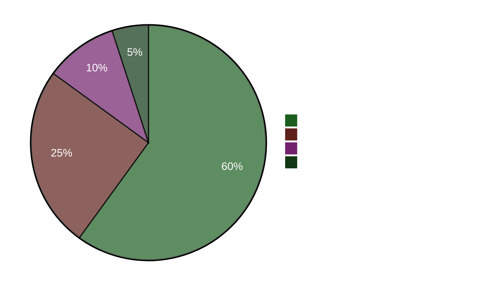

# Executive Brief — Evening Analysis 2026-04-22

**Brief ID**: EB-2026-04-22-EVE001
**Prepared by**: James Pether Sörling
**Prepared at**: 2026-04-22 23:50 UTC
**Classification**: Public — GDPR Art. 9(2)(e)
**Confidence**: HIGH [A1]
**60-second read**: ✅

---

## 🎯 BLUF

Sweden's parliament enacted a 4.1 billion SEK emergency energy relief package today (HD01FiU48) with an anomalous M+SD+S+KD supermajority — the Social Democrats abandoning their climate counter-motion to avoid being blamed for high fuel costs four months before the September 2026 election. Finance Minister Elisabeth Svantesson (M) simultaneously faces a concentrated five-interpellation accountability offensive from S, including one (HD10442) citing a court ruling that her public statements on eating disorder care were factually incorrect. The Spring Proposition 2026 (HD03100) sets the pre-election fiscal battleground.

---

## 🧭 3 Decisions This Brief Supports

1. **Media/editorial decision**: Is the "S votes for fuel tax cut while filing counter-motion" narrative the lead story for the day? → **Yes.** The dual-track behaviour (HD01FiU48 vote Ja + HD024082 opposing motion) is the most analytically significant finding of the day. It reveals S's electoral calculation — pre-election cost-of-living calculus overrides climate consistency. Confidence: HIGH [A1].

2. **Opposition strategy decision**: Should S escalate the Svantesson accountability track? → **Likely yes.** HD10442's court-vindication basis makes it a high-risk, high-reward interpellation. The Finance Committee's role in both HD01FiU48 and the Vårproposition means Svantesson is simultaneously defending fiscal policy AND personal credibility. Confidence: MEDIUM [B2].

3. **Coalition resilience decision**: Does the M+SD+S+KD supermajority on HD01FiU48 signal a new cross-bloc consensus or a one-time electoral manoeuvre? → **One-time manoeuvre.** The counter-motions from S (HD024082), V (HD024092), and MP (HD024098) filed the same week indicate no structural realignment; S supported the enacted package for electoral optics only. Confidence: HIGH [A1].

---

## ⚡ 60-Second Bullet Read

- **ENACTED TODAY**: HD01FiU48 — 4.1 GSEK fuel tax cut & energy support, voted 16:29. M+SD+S+KD voted Ja.
- **STRATEGIC CONTRADICTION**: S votes Ja on enacted bill but filed opposition motion (HD024082) against same policy.
- **ACCOUNTABILITY RISK**: S filed 5 interpellations in 48 hours against Svantesson (3) and other ministers.
- **COURT VINDICATION**: HD10442 cites actual court ruling undermining Svantesson's public statements on healthcare.
- **ELECTION FRAMEWORK**: HD03100 Vårproposition 2026 is now the official pre-election fiscal manifesto — every SEK will be debated.
- **CONSTITUTIONAL PIPELINE**: Two grundlag changes (HD01KU33 + HD01KU32) in first reading simultaneously — rare legislative intensity.
- **UKRAINE COMMITMENT**: Sweden joins both Ukraina compensation commission (HD03232) and aggression tribunal (HD03231).
- **CLIMATE-FISCAL DIVIDE**: MP+V+S filed parallel climate counter-motions even as S voted for the fuel tax relief.

---

## 🔮 Top Forward Trigger

**Watch for**: Riksdag debate on HD10442 (Svantesson ätstörningsvård IP) — scheduled post-May 5. If Svantesson cannot reconcile her prior public statements with the court ruling, this becomes the biggest ministerial accountability moment of the pre-election period. Probability of significant political damage: **Likely** [B2] (65%).

**Secondary trigger**: S's position on HD03100 vårproposition in FiU committee proceedings — their alternative fiscal document will define the election economic debate.

---

## 📊 Confidence Dashboard

**Key confirmed facts (A1)**:
- HD01FiU48 vote outcome at riksdagen.se vote record CE14CCEF
- All 5 interpellations filed and publicly accessible (riksdagen.se)
- HD03100 submitted 2026-04-13 Finansdepartementet
- World Bank Sweden GDP 2024: 0.82%, Inflation 2024: 2.84%

**Probable (B2)**:
- S's dual-track strategy as electoral calculation (inferred from actions, not stated)
- Svantesson's parliamentary exposure from HD10442 court reference

