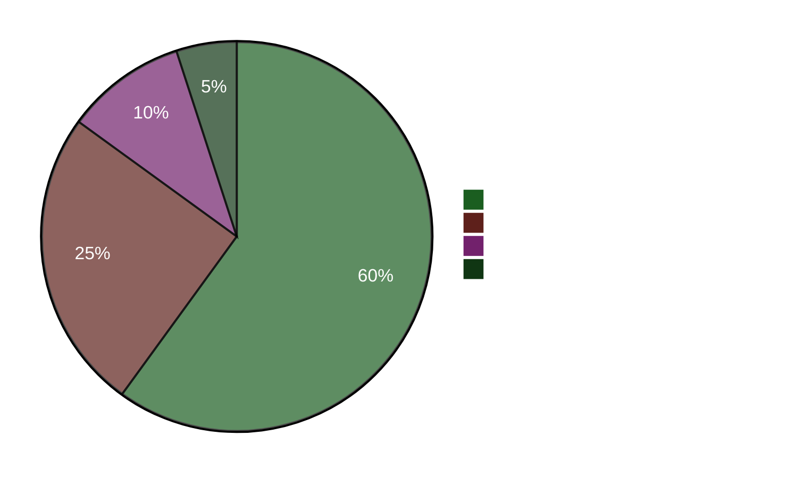

<!-- dir: rtl -->
# موجز تنفيذي — تحليل المساء 2026-04-22

**معرّف الموجز**: EB-2026-04-22-EVE001
**أعدّه**: James Pether Sörling
**تاريخ الإعداد**: 2026-04-22 23:50 UTC
**التصنيف**: عام — GDPR Art. 9(2)(e)
**الموثوقية**: عالية [A1]
**قراءة في 60 ثانية**: ✅

---

## 🎯 الخلاصة التنفيذية

أقرّ البرلمان السويدي اليوم حزمة إغاثة طارئة في مجال الطاقة بقيمة 4.1 مليار كرونة (HD01FiU48) بأغلبية موسّعة غير اعتيادية من M+SD+S+KD — إذ تخلّت الاشتراكية الديمقراطية عن مقترح مضادها المتعلق بالمناخ لتفادي تحمّل المسؤولية عن ارتفاع تكاليف الوقود قبل أربعة أشهر من انتخابات سبتمبر 2026. وفي الوقت ذاته، تواجه وزيرة المالية إليزابيث سفانتسون (M) هجوماً مكثفاً من S يتمثل في خمس استجوابات للمساءلة، من بينها واحد (HD10442) يستشهد بحكم قضائي يُثبت أن تصريحاتها العلنية بشأن رعاية اضطرابات الأكل كانت مغلوطة من الناحية الواقعية. وتُمثّل مقترحات الربيع لعام 2026 (HD03100) الآن البيان المالي الرسمي لما قبل الانتخابات.

---

## 🧭 3 قرارات يدعمها هذا الموجز

1. **قرار الإعلام/التحرير**: هل "تصويت S لصالح خفض ضريبة الوقود مع تقديم مقترح مضاد في آنٍ واحد" هو الرواية المحورية ليوم؟ → **نعم.** إن السلوك المزدوج المسار (التصويت بنعم على HD01FiU48 + المقترح المضاد HD024082) هو الاكتشاف الأكثر أهمية تحليلياً في هذا اليوم. وهو يكشف الحساب الانتخابي لدى S — إذ يطغى حساب تكاليف المعيشة قبيل الانتخابات على الاتساق المناخي. الموثوقية: عالية [A1].

2. **قرار استراتيجية المعارضة**: هل ينبغي لـ S تصعيد مسار المساءلة ضد سفانتسون؟ → **على الأرجح نعم.** الأساس القضائي المُؤكَّد لـ HD10442 يجعله استجواباً عالي المخاطر وعالي العائد. دور لجنة المالية في كلٍّ من HD01FiU48 والمقترح الربيعي يعني أن سفانتسون تدافع في آنٍ واحد عن السياسة المالية وعن مصداقيتها الشخصية. الموثوقية: متوسطة [B2].

3. **قرار مرونة الائتلاف**: هل تُشير الأغلبية الموسّعة لـ M+SD+S+KD على HD01FiU48 إلى توافق جديد عابر للكتل أم إلى مناورة انتخابية استثنائية؟ → **مناورة انتخابية استثنائية.** المقترحات المضادة من S (HD024082) وV (HD024092) وMP (HD024098) المقدَّمة في الأسبوع ذاته تُشير إلى انعدام أي إعادة تموضع هيكلي؛ إذ دعم S الحزمة المُقرَّة لأسباب بصرية انتخابية فحسب. الموثوقية: عالية [A1].

---

## ⚡ قراءة نقطية في 60 ثانية

- **مُقرَّر اليوم**: HD01FiU48 — خفض ضريبة الوقود ودعم الطاقة بقيمة 4.1 مليار SEK، تمت التصويت في الساعة 16:29. صوّت M+SD+S+KD بنعم.
- **تناقض استراتيجي**: S تصوّت بنعم على مشروع القانون المُقرَّر لكنها تقدّم مقترحاً مضاداً (HD024082) ضد السياسة ذاتها.
- **مخاطر المساءلة**: قدّمت S خمسة استجوابات في 48 ساعة ضد سفانتسون (3) ووزراء آخرين.
- **الإثبات القضائي**: HD10442 يستشهد بحكم قضائي فعلي يُقوّض التصريحات العلنية لسفانتسون بشأن الرعاية الصحية.
- **الإطار الانتخابي**: يُمثّل HD03100 مقترحات الربيع 2026 الآن البيان المالي الرسمي لما قبل الانتخابات — كل كرونة ستكون مثار جدل.
- **المسار الدستوري**: تعديلان على القانون الأساسي (HD01KU33 + HD01KU32) في القراءة الأولى في آنٍ واحد — كثافة تشريعية نادرة.
- **الالتزام بأوكرانيا**: تنضم السويد إلى كلٍّ من لجنة التعويضات الأوكرانية (HD03232) ومحكمة العدوان (HD03231).
- **الهوّة بين المناخ والمالية**: قدّمت MP+V+S مقترحات مضادة للمناخ موازية في الوقت الذي صوّتت فيه S لصالح تخفيف ضريبة الوقود.

---

## 🔮 أهم المحفّزات الاستشرافية

**تابع**: مناقشة الريكسداغ حول HD10442 (Svantesson ätstörningsvård IP) — مجدوَلة بعد الخامس من مايو. إن عجزت سفانتسون عن التوفيق بين تصريحاتها العلنية السابقة وحكم المحكمة، فسيكون هذا أكبر لحظات المساءلة الوزارية في مرحلة ما قبل الانتخابات. احتمال الضرر السياسي الجسيم: **مرجّح** [B2] (65 %).

**المحفّز الثانوي**: موقف S من مقترحات الربيع HD03100 في إجراءات لجنة FiU — وثيقتها المالية البديلة ستحدد النقاش الاقتصادي لعام الانتخابات.

---

## 📊 لوحة الموثوقية

**الحقائق الرئيسية المؤكَّدة (A1)**:
- نتيجة تصويت HD01FiU48 على riksdagen.se في سجل التصويت CE14CCEF
- جميع الاستجوابات الخمسة مقدَّمة ومتاحة للعموم (riksdagen.se)
- HD03100 مقدَّم في 2026-04-13 Finansdepartementet
- البنك الدولي الناتج المحلي الإجمالي للسويد 2024: 0.82 %; التضخم 2024: 2.84 %

**مرجّح (B2)**:
- استراتيجية S المزدوجة المسار بوصفها حسابات انتخابية (مستنتَج من الأفعال لا مُصرَّح به)
- التعرّض البرلماني لسفانتسون الناجم عن الاستشهاد القضائي في HD10442

<!-- source-sha: cb87af673fb4a43f297af6c833d737b3ef322067 -->
