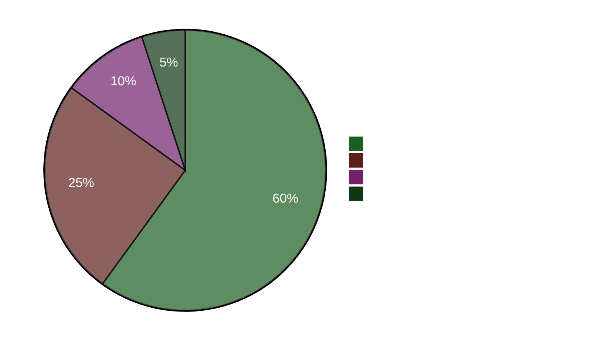

# Ledende resumé — Aftenanalyse 2026-04-22

**Resumé-ID**: EB-2026-04-22-EVE001
**Udarbejdet af**: James Pether Sörling
**Udarbejdet**: 2026-04-22 23:50 UTC
**Klassifikation**: Offentlig — GDPR Art. 9(2)(e)
**Troværdighed**: HØJ [A1]
**60-sekunders læsning**: ✅

---

## 🎯 BLUF

Det svenske parlament vedtog i dag en nødenergihjælpepakke på 4,1 milliarder SEK (HD01FiU48) med et anomalt M+SD+S+KD-superflertalt — socialdemokraterne opgav deres klimamodmotion for at undgå at blive bebrejdet for høje brændstofomkostninger fire måneder før valget i september 2026. Finansminister Elisabeth Svantesson (M) møder samtidig en koncentreret interpellationsansvarighedsoffensiv på fem fronter fra S, herunder én (HD10442), der citerer en domstolsafgørelse om, at hendes offentlige udtalelser om behandling af spiseforstyrrelser var faktuelt ukorrekte. Forårsproposition 2026 (HD03100) er nu det officielle forvalgsmæssige skattepolitiske manifest.

---

## 🧭 3 Beslutninger dette resumé understøtter

1. **Medie/redaktionelt beslutning**: Er "S stemmer for brændstofskattenedsættelse, mens de indgiver modmotion" det ledende narrativ for dagen? → **Ja.** Den to-sporede adfærd (HD01FiU48 Ja-stemme + HD024082 modmotion) er dagens analytisk mest betydningsfulde fund. Det afslører S's valgberegning — forvalgsomkostningerne tilsidesætter klimakonsistens. Troværdighed: HØJ [A1].

2. **Oppositionsstrategibeslutning**: Bør S eskalere ansvarighedssporet mod Svantesson? → **Sandsynligvis ja.** HD10442's domstolsbekræftede grundlag gør det til en høj-risiko/høj-belønning-interpellation. Finansudvalgets rolle i både HD01FiU48 og Forårspropositionen betyder, at Svantesson samtidig forsvarer finanspolitikken OG sin personlige troværdighed. Troværdighed: MEDIUM [B2].

3. **Koalitionsresiliensbeslutet**: Signalerer M+SD+S+KD-superflertalget på HD01FiU48 en ny tværblokskonsensus eller et engangsvalgmanøvre? → **Engangsvalgmanøvre.** Modmotionerne fra S (HD024082), V (HD024092) og MP (HD024098) indgivet samme uge indikerer ingen strukturel omjustering; S støttede den vedtagne pakke af valmæssige optiske årsager. Troværdighed: HØJ [A1].

---

## ⚡ 60-sekunders punktlæsning

- **VEDTAGET I DAG**: HD01FiU48 — 4,1 GSEK brændstofskattenedsættelse og energistøtte, stemt 16:29. M+SD+S+KD stemte Ja.
- **STRATEGISK SELVMODSIGELSE**: S stemmer Ja på vedtaget lovforslag men indgiver modmotion (HD024082) mod samme politik.
- **ANSVARIGHEDSRISIKO**: S indgav 5 interpellationer på 48 timer mod Svantesson (3) og andre ministre.
- **DOMSTOLSBEKRÆFTELSE**: HD10442 citerer faktisk domstolsafgørelse, der underminerer Svantessons offentlige udtalelser om sundhedspleje.
- **VALGRAMME**: HD03100 Forårspropositionen 2026 er nu det officielle forvalgsmæssige finanspolitiske manifest — hver SEK vil blive debatteret.
- **KONSTITUTIONEL PIPELINE**: To grundlovsændringer (HD01KU33 + HD01KU32) i første læsning samtidigt — sjælden lovgivningsmæssig intensitet.
- **UKRAINE-FORPLIGTELSE**: Sverige tilslutter sig både Ukrainakompensationskommissionen (HD03232) og aggresjonstribunalen (HD03231).
- **KLIMA-FINANSKLØFT**: MP+V+S indgav parallelle klimamodmotioner, selv mens S stemte for brændstofskatterelief.

---

## 🔮 Vigtigste fremadrettede trigger

**Hold øje med**: Rigsdagsdebat om HD10442 (Svantesson ätstörningsvård IP) — planlagt efter 5. maj. Hvis Svantesson ikke kan forene sine tidligere offentlige udtalelser med domstolsafgørelsen, bliver dette den største ministerielle ansvarighedsstund i forvalgperioden. Sandsynlighed for betydelig politisk skade: **Sandsynligt** [B2] (65%).

**Sekundær trigger**: S's holdning til HD03100 forårspropositionen i FiU-udvalgets behandling — deres alternative finanspolitiske dokument vil definere valgårets økonomiudebat.

---

## 📊 Troværdigheds-dashboard

**Bekræftede nøglefakta (A1)**:
- HD01FiU48-stemmeresultat på riksdagen.se stemmepost CE14CCEF
- Alle 5 interpellationer indgivet og offentligt tilgængelige (riksdagen.se)
- HD03100 indgivet 2026-04-13 Finansdepartementet
- Verdensbanken Sverige BNP 2024: 0,82 %; Inflation 2024: 2,84 %

**Sandsynligt (B2)**:
- S's to-sporede strategi som valgberegning (udledt af handlinger, ikke erklæret)
- Svantessons parlamentariske eksponering fra HD10442's domstolsreference

<!-- source-sha: cb87af673fb4a43f297af6c833d737b3ef322067 -->
