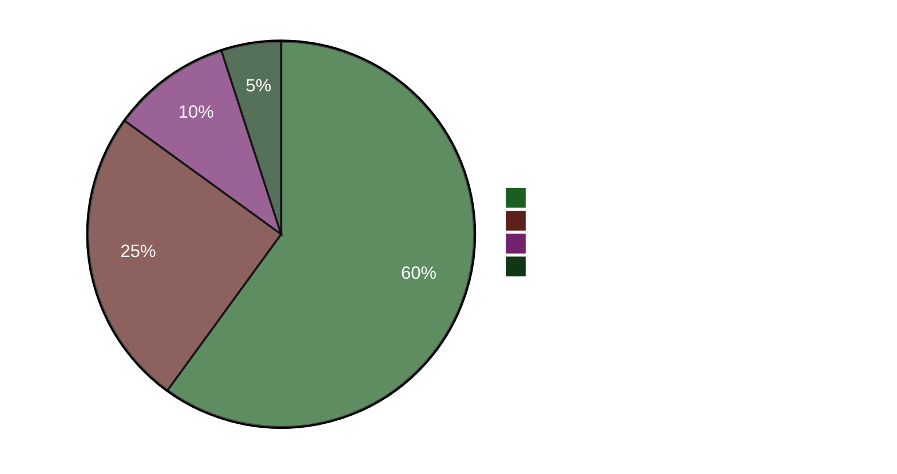

# Führendes Briefing — Abendanalyse 2026-04-22

**Briefing-ID**: EB-2026-04-22-EVE001
**Erstellt von**: James Pether Sörling
**Erstellt**: 2026-04-22 23:50 UTC
**Klassifizierung**: Öffentlich — DSGVO Art. 9(2)(e)
**Zuverlässigkeit**: HOCH [A1]
**60-Sekunden-Lektüre**: ✅

---

## 🎯 BLUF

Schwedens Reichstag verabschiedete heute ein Notfall-Energieentlastungspaket von 4,1 Milliarden SEK (HD01FiU48) mit einer anomalen M+SD+S+KD-Supermehrheit — die Sozialdemokraten gaben ihren Klima-Gegenantrag auf, um nicht für hohe Kraftstoffkosten vier Monate vor der Wahl im September 2026 verantwortlich gemacht zu werden. Finanzministerin Elisabeth Svantesson (M) sieht sich gleichzeitig einer konzentrierten fünffachen Interpellations-Rechenschaftsoffensive der S ausgesetzt, darunter eine (HD10442), die ein Gerichtsurteil zitiert, das ihre öffentlichen Aussagen zur Essstörungsversorgung als sachlich unrichtig bezeichnet. Die Frühjahrspropositionen 2026 (HD03100) ist nun das offizielle fiskalische Vorwahl-Manifest.

---

## 🧭 3 Entscheidungen, die dieses Briefing unterstützt

1. **Medien/Redaktionelle Entscheidung**: Ist "S stimmt für Kraftstoffsteuersenkung, während sie einen Gegenantrag einreichen" das führende Narrativ des Tages? → **Ja.** Das Doppelspurverhalten (HD01FiU48 Ja-Stimme + HD024082 Gegenantrag) ist der analytisch bedeutsamste Fund des Tages. Es enthüllt S's Wahlkalkül — die Lebenshaltungskosten-Kalkulation vor der Wahl übertrumpft die Klimakonsistenz. Zuverlässigkeit: HOCH [A1].

2. **Oppositionsstrategieentscheidung**: Sollte S den Rechenschaftspfad gegen Svantesson eskalieren? → **Wahrscheinlich ja.** Die gerichtlich bestätigte Grundlage von HD10442 macht sie zu einer Hochrisiko/Hochbelohnungs-Interpellation. Die Rolle des Finanzausschusses in sowohl HD01FiU48 als auch der Frühjahrspropositionen bedeutet, dass Svantesson gleichzeitig die Finanzpolitik UND ihre persönliche Glaubwürdigkeit verteidigt. Zuverlässigkeit: MITTEL [B2].

3. **Koalitionsresilienzentscheidung**: Signalisiert die M+SD+S+KD-Supermehrheit bei HD01FiU48 einen neuen blockübergreifenden Konsens oder ein einmaliges Wahlmanöver? → **Einmaliges Wahlmanöver.** Die von S (HD024082), V (HD024092) und MP (HD024098) in derselben Woche eingereichten Gegenanträge deuten auf keine strukturelle Neuausrichtung hin; S unterstützte das verabschiedete Paket aus wahloptischen Gründen. Zuverlässigkeit: HOCH [A1].

---

## ⚡ 60-Sekunden-Aufzählung

- **HEUTE VERABSCHIEDET**: HD01FiU48 — 4,1 Mrd. SEK Kraftstoffsteuersenkung und Energieunterstützung, abgestimmt 16:29. M+SD+S+KD stimmten Ja.
- **STRATEGISCHER WIDERSPRUCH**: S stimmt Ja zum verabschiedeten Gesetz, reichte aber Gegenantrag (HD024082) gegen dieselbe Politik ein.
- **RECHENSCHAFTSRISIKO**: S reichte in 48 Stunden 5 Interpellationen gegen Svantesson (3) und andere Minister ein.
- **GERICHTLICHE BESTÄTIGUNG**: HD10442 zitiert tatsächliches Gerichtsurteil, das Svantessons öffentliche Aussagen zur Gesundheitsversorgung unterminiert.
- **WAHLRAHMEN**: HD03100 Frühjahrsproposition 2026 ist nun das offizielle fiskalische Vorwahl-Manifest — jede SEK wird debattiert werden.
- **VERFASSUNGSPIPELINE**: Zwei Grundgesetzänderungen (HD01KU33 + HD01KU32) in erster Lesung gleichzeitig — seltene gesetzgeberische Intensität.
- **UKRAINE-VERPFLICHTUNG**: Schweden tritt sowohl der Ukraine-Entschädigungskommission (HD03232) als auch dem Aggressionstribunal (HD03231) bei.
- **KLIMA-FINANZ-SPALTUNG**: MP+V+S reichten parallele Klima-Gegenanträge ein, während S für die Kraftstoffsteuerentlastung stimmte.

---

## 🔮 Wichtigster vorausschauender Auslöser

**Beobachten**: Reichstagsdebatte zu HD10442 (Svantesson ätstörningsvård IP) — geplant nach dem 5. Mai. Wenn Svantesson ihre früheren öffentlichen Aussagen nicht mit dem Gerichtsurteil in Einklang bringen kann, wird dies der bedeutsamste ministerielle Rechenschaftsmoment der Vorwahlperiode. Wahrscheinlichkeit erheblicher politischer Schäden: **Wahrscheinlich** [B2] (65 %).

**Sekundärer Auslöser**: S's Position zu HD03100 Frühjahrsproposition im FiU-Ausschussverfahren — ihr alternatives Haushaltsdokument wird die Wirtschaftsdebatte des Wahljahres definieren.

---

## 📊 Vertrauens-Dashboard

**Bestätigte Schlüsselfakten (A1)**:
- HD01FiU48-Abstimmungsergebnis bei riksdagen.se Abstimmungsdatensatz CE14CCEF
- Alle 5 Interpellationen eingereicht und öffentlich zugänglich (riksdagen.se)
- HD03100 eingereicht 2026-04-13 Finansdepartementet
- Weltbank Schweden BIP 2024: 0,82 %; Inflation 2024: 2,84 %

**Wahrscheinlich (B2)**:
- S's Doppelspurstrategie als Wahlkalkül (aus Handlungen erschlossen, nicht erklärt)
- Svantessons parlamentarische Exponierung durch HD10442's Gerichtsreferenz

<!-- source-sha: cb87af673fb4a43f297af6c833d737b3ef322067 -->
