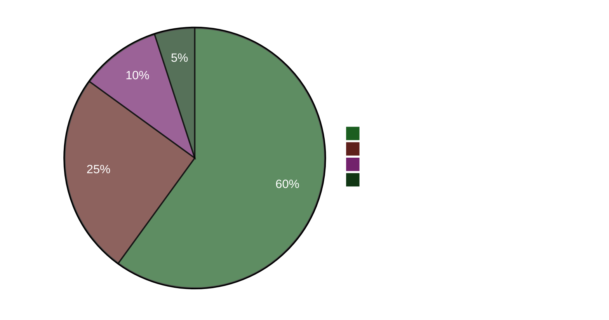

# Resumen ejecutivo — Análisis vespertino 2026-04-22

**ID de resumen**: EB-2026-04-22-EVE001
**Preparado por**: James Pether Sörling
**Preparado el**: 2026-04-22 23:50 UTC
**Clasificación**: Público — RGPD Art. 9(2)(e)
**Fiabilidad**: ALTA [A1]
**Lectura de 60 segundos**: ✅

---

## 🎯 BLUF

El parlamento de Suecia adoptó hoy un paquete de ayuda de emergencia de energía de 4,1 mil millones de SEK (HD01FiU48) con una anomalía de supermayoría M+SD+S+KD — los socialdemócratas abandonaron su contramoción climática para evitar ser culpados por los altos costos de combustible cuatro meses antes de las elecciones de septiembre de 2026. La ministra de Finanzas Elisabeth Svantesson (M) enfrenta simultáneamente una ofensiva concentrada de interpelaciones de rendición de cuentas de S, incluida una (HD10442) que cita una sentencia judicial que indica que sus declaraciones públicas sobre la atención de trastornos alimentarios eran factualmente incorrectas. La Proposición de Primavera 2026 (HD03100) es ahora el manifiesto fiscal oficial preelectoral.

---

## 🧭 3 Decisiones que apoya este briefing

1. **Decisión mediática/editorial**: ¿Es "S vota por la reducción del impuesto al combustible mientras presenta una contramoción" el narrativo principal del día? → **Sí.** El comportamiento de doble vía (voto Sí en HD01FiU48 + contramoción HD024082) es el hallazgo analíticamente más significativo del día. Revela el cálculo electoral de S — el cálculo del costo de vida preelectoral desplaza la consistencia climática. Fiabilidad: ALTA [A1].

2. **Decisión de estrategia de la oposición**: ¿Debería S escalar el camino de rendición de cuentas contra Svantesson? → **Probablemente sí.** La base judicialmente confirmada de HD10442 la convierte en una interpelación de alto riesgo/alta recompensa. El papel de la comisión de finanzas en tanto HD01FiU48 como la Proposición de Primavera significa que Svantesson está defendiendo simultáneamente la política fiscal Y su credibilidad personal. Fiabilidad: MEDIA [B2].

3. **Decisión de resiliencia de la coalición**: ¿La supermayoría M+SD+S+KD en HD01FiU48 señala un nuevo consenso entre bloques o una maniobra electoral única? → **Maniobra electoral única.** Las contramociones de S (HD024082), V (HD024092) y MP (HD024098) presentadas la misma semana indican que no hay realineación estructural; S apoyó el paquete adoptado por razones de óptica electoral. Fiabilidad: ALTA [A1].

---

## ⚡ Lectura de 60 segundos

- **ADOPTADO HOY**: HD01FiU48 — reducción del impuesto al combustible de 4,1 mil millones SEK y ayuda energética, votado 16:29. M+SD+S+KD votaron Sí.
- **CONTRADICCIÓN ESTRATÉGICA**: S vota Sí al proyecto de ley adoptado pero presentó contramoción (HD024082) contra la misma política.
- **RIESGO DE RENDICIÓN DE CUENTAS**: S presentó 5 interpelaciones en 48 horas contra Svantesson (3) y otros ministros.
- **CONFIRMACIÓN JUDICIAL**: HD10442 cita una sentencia judicial real que socava las declaraciones públicas de Svantesson sobre la atención sanitaria.
- **MARCO ELECTORAL**: HD03100 Proposición de Primavera 2026 es ahora el manifiesto fiscal oficial preelectoral — cada SEK será debatida.
- **PIPELINE CONSTITUCIONAL**: Dos cambios constitucionales (HD01KU33 + HD01KU32) en primera lectura simultáneamente — intensidad legislativa poco común.
- **COMPROMISO CON UCRANIA**: Suecia se une tanto a la comisión de compensación de Ucrania (HD03232) como al tribunal de agresión (HD03231).
- **BRECHA CLIMA-FISCAL**: MP+V+S presentaron contramociones climáticas paralelas mientras S votaba por el alivio del impuesto al combustible.

---

## 🔮 Principal disparador prospectivo

**Vigilar**: Debate del Riksdag sobre HD10442 (Svantesson ätstörningsvård IP) — programado después del 5 de mayo. Si Svantesson no puede reconciliar sus anteriores declaraciones públicas con la sentencia judicial, esto se convierte en el mayor momento de rendición de cuentas ministerial del período preelectoral. Probabilidad de daño político significativo: **Probable** [B2] (65 %).

**Disparador secundario**: La posición de S sobre la Proposición de Primavera HD03100 en los procedimientos de la comisión FiU — su documento fiscal alternativo definirá el debate económico del año electoral.

---

## 📊 Panel de confianza

**Hechos clave confirmados (A1)**:
- Resultado de votación HD01FiU48 en riksdagen.se registro de votación CE14CCEF
- Las 5 interpelaciones presentadas y públicamente accesibles (riksdagen.se)
- HD03100 presentada el 2026-04-13 Finansdepartementet
- Banco Mundial PIB Suecia 2024: 0,82 %; Inflación 2024: 2,84 %

**Probable (B2)**:
- La estrategia de doble vía de S como cálculo electoral (inferida de acciones, no declarada)
- La exposición parlamentaria de Svantesson derivada de la referencia judicial de HD10442

<!-- source-sha: cb87af673fb4a43f297af6c833d737b3ef322067 -->
