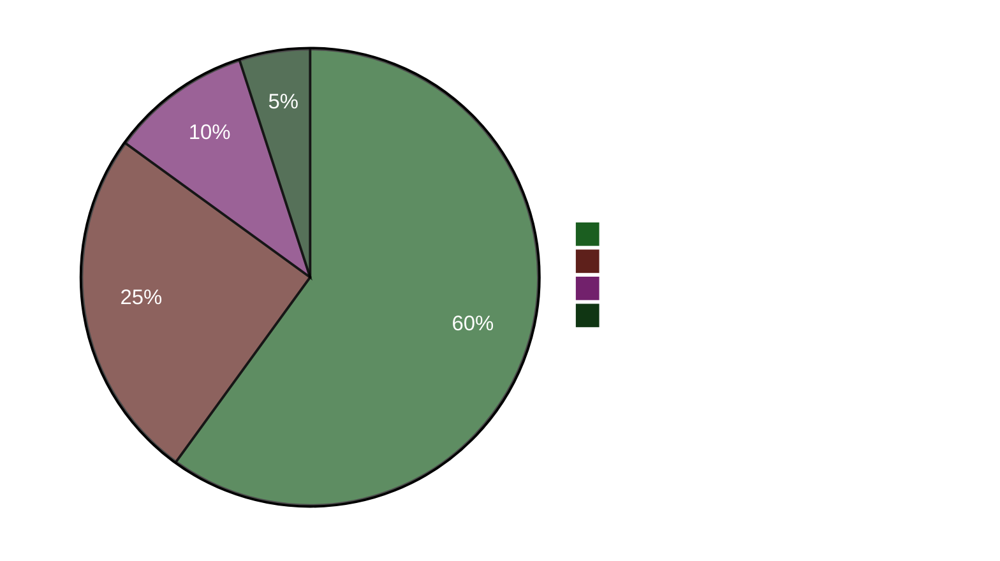

# Johtava yhteenveto — Ilta-analyysi 2026-04-22

**Yhteenveto-tunnus**: EB-2026-04-22-EVE001
**Laatinut**: James Pether Sörling
**Laadittu**: 2026-04-22 23:50 UTC
**Luokittelu**: Julkinen — GDPR Art. 9(2)(e)
**Luotettavuus**: KORKEA [A1]
**60 sekunnin lukeminen**: ✅

---

## 🎯 BLUF

Ruotsin eduskunta hyväksyi tänään 4,1 miljardin kruunun hätäenergiatukipaketin (HD01FiU48) poikkeavalla M+SD+S+KD-supermajoriteetilla — sosiaalidemokraatit hylkäsivät ilmastovastamotionsa välttääkseen syyttelyt korkeista polttoainekustannuksista neljä kuukautta ennen syyskuun 2026 vaaleja. Valtiovarainministeri Elisabeth Svantesson (M) kohtaa samanaikaisesti S:n taholta tiiviin viisinkertaisen interpellaatiovastuuoffensiivin, joka sisältää yhden (HD10442), jossa viitataan tuomioistuinpäätökseen sen suhteen, että hänen julkilausumansa syömishäiriöhoidosta olivat tosiasiallisesti virheellisiä. Keväsbudjetti 2026 (HD03100) on nyt virallinen esivaalikausien talouspolitiikan manifesti.

---

## 🧭 3 Päätöstä, joita tämä yhteenveto tukee

1. **Media/toimituksellinen päätös**: Onko "S äänestää polttoaineveroleikkauksen puolesta samalla kun jättää vastamotionin" päivän johtava kertomus? → **Kyllä.** Kaksoispolkukäyttäytyminen (HD01FiU48 Kyllä-ääni + HD024082 vastamotio) on päivän analyyttisesti merkittävin havainto. Se paljastaa S:n vaalistrategian — esivaalikautisten elinkustannuslaskelmat syrjäyttävät ilmastoyhtenäisyyden. Luotettavuus: KORKEA [A1].

2. **Oppositiostrategiapäätös**: Pitäisikö S eskaleeraa Svantessonia vastaan suunnattua vastuullisuuspolkua? → **Todennäköisesti kyllä.** HD10442:n tuomioistuimen vahvistama perusta tekee siitä korkean riskin/korkean palkkion interpellaation. Valtiovarainvaliokunnan rooli sekä HD01FiU48:ssa että Keväsbudjetissa tarkoittaa, että Svantesson puolustaa samanaikaisesti talouspolitiikkaa JA henkilökohtaista uskottavuuttaan. Luotettavuus: MEDIUM [B2].

3. **Koalition kestävyyspäätös**: Signaloiko M+SD+S+KD-supermajoriteetti HD01FiU48:ssa uutta blokkienvälinen konsensus vai kertavaaliveto? → **Kertavaaliveto.** S:n (HD024082), V:n (HD024092) ja MP:n (HD024098) samalla viikolla jättämät vastamotion osoittavat, ettei rakenteellista uudelleensuuntautumista ole tapahtunut; S tuki hyväksyttyä pakettia vaalioptiikan vuoksi. Luotettavuus: KORKEA [A1].

---

## ⚡ 60 sekunnin pisteluettelo

- **TÄNÄÄN HYVÄKSYTTY**: HD01FiU48 — 4,1 miljardin kruunun polttoaineveroleikkaus ja energiatuki, äänestetty 16:29. M+SD+S+KD äänesti Kyllä.
- **STRATEGINEN RISTIRIITA**: S äänestää Kyllä hyväksyttyä lakiehdotusta mutta jätti vastamotionin (HD024082) samaa politiikkaa vastaan.
- **VASTUURISKI**: S jätti 5 interpellaatiota 48 tunnissa Svantessonia (3) ja muita ministereitä vastaan.
- **TUOMIOISTUIMEN VAHVISTUS**: HD10442 viittaa todelliseen tuomioistuinpäätökseen, joka horjuttaa Svantessonin julkisia lausumia terveydenhuollosta.
- **VAALIRUNKO**: HD03100 Keväsbudjetti 2026 on nyt virallinen esivaalikautinen talouspolitiikan manifesti — jokainen kruunu tulee väittelyn aiheeksi.
- **PERUSTUSLAILLINEN PROSESSI**: Kaksi perustuslain muutosta (HD01KU33 + HD01KU32) ensimmäisessä käsittelyssä samanaikaisesti — harvinainen lainsäädännöllinen intensiteetti.
- **UKRAINA-SITOUMUS**: Ruotsi liittyy sekä Ukrainan korvauskomissioon (HD03232) että aggressiotuomioistuimeen (HD03231).
- **ILMASTO-TALOUSKUILU**: MP+V+S jättivät rinnakkaisia ilmastovastamotioneita samalla kun S äänesti polttoaineverotuken puolesta.

---

## 🔮 Tärkein eteenpäinkatsova laukaisin

**Tarkkaile**: Riksdagin keskustelu HD10442:sta (Svantesson ätstörningsvård IP) — ajateltu toukokuun 5. päivän jälkeen. Jos Svantesson ei pysty sovittamaan aiempia julkisia lausumiaan tuomioistuinpäätöksen kanssa, tästä tulee esivaalikauden merkittävin ministerivastuun hetki. Merkittävän poliittisen vahingon todennäköisyys: **Todennäköinen** [B2] (65 %).

**Toissijainen laukaisin**: S:n kanta HD03100 Keväsbudjetin FiU-valiokuntaprosessissa — heidän vaihtoehtoinen talouspolitiikan dokumenttinsa määrittää vaalikauden talouskeskustelun.

---

## 📊 Luotettavuus-kojelauta

**Vahvistetut avaintiedot (A1)**:
- HD01FiU48-äänestystulos riksdagen.se:n äänestysmerkinnässä CE14CCEF
- Kaikki 5 interpellaatiota jätetty ja julkisesti saatavilla (riksdagen.se)
- HD03100 jätetty 2026-04-13 Finansdepartementet
- Maailmanpankin Ruotsin BKT 2024: 0,82 %; Inflaatio 2024: 2,84 %

**Todennäköinen (B2)**:
- S:n kaksoispolkustrategia vaalistrategiana (pääteltävissä toiminnoista, ei ilmoitettuna)
- Svantessonin parlamentaarinen altistuminen HD10442:n tuomioistuinviittauksesta

<!-- source-sha: cb87af673fb4a43f297af6c833d737b3ef322067 -->
