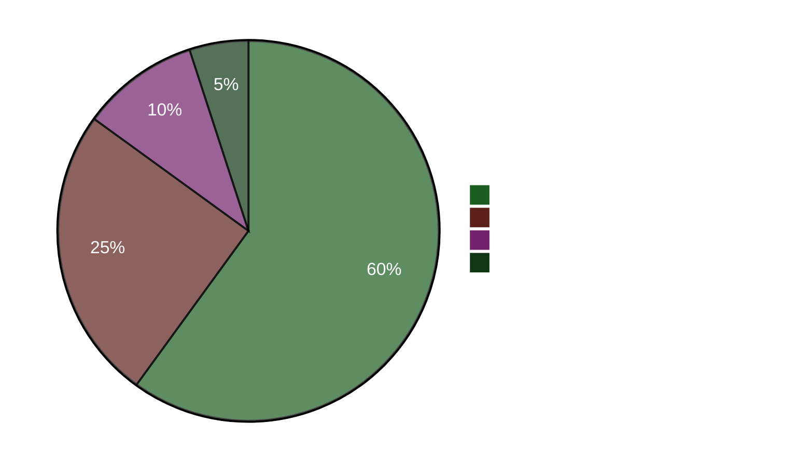

# Briefing de direction — Analyse du soir 2026-04-22

**ID de briefing**: EB-2026-04-22-EVE001
**Préparé par**: James Pether Sörling
**Préparé le**: 2026-04-22 23:50 UTC
**Classification**: Public — RGPD Art. 9(2)(e)
**Fiabilité**: HAUTE [A1]
**Lecture en 60 secondes**: ✅

---

## 🎯 BLUF

Le parlement suédois a adopté aujourd'hui un plan d'urgence de soutien à l'énergie de 4,1 milliards SEK (HD01FiU48) avec une supermajorité anomale M+SD+S+KD — les sociaux-démocrates ont abandonné leur contre-motion climatique pour éviter d'être tenus responsables des coûts élevés des carburants quatre mois avant les élections de septembre 2026. La ministre des Finances Elisabeth Svantesson (M) fait simultanément face à une offensive d'interpellation concentrée à cinq volets de S, dont l'une (HD10442) cite une décision de justice selon laquelle ses déclarations publiques sur la prise en charge des troubles alimentaires étaient factuellement incorrectes. La Proposition de printemps 2026 (HD03100) est désormais le manifeste fiscal officiel de pré-élection.

---

## 🧭 3 Décisions soutenues par ce briefing

1. **Décision médiatique/éditoriale**: Le "S vote pour une réduction de la taxe sur les carburants tout en déposant une contre-motion" est-il le narratif principal de la journée? → **Oui.** Le comportement à double voie (vote Oui sur HD01FiU48 + contre-motion HD024082) est la découverte analytiquement la plus significative de la journée. Il révèle le calcul électoral du S — les calculs du coût de la vie pré-électoral supplantent la cohérence climatique. Fiabilité: HAUTE [A1].

2. **Décision stratégique de l'opposition**: S devrait-il escalader la piste de responsabilisation contre Svantesson? → **Probablement oui.** Le fondement judiciaire confirmé de HD10442 en fait une interpellation à haut risque/haute récompense. Le rôle de la commission des finances dans HD01FiU48 et la Proposition de printemps signifie que Svantesson défend simultanément la politique fiscale ET sa crédibilité personnelle. Fiabilité: MOYEN [B2].

3. **Décision de résilience de coalition**: La supermajorité M+SD+S+KD sur HD01FiU48 signale-t-elle un nouveau consensus inter-bloc ou une manœuvre électorale ponctuelle? → **Manœuvre électorale ponctuelle.** Les contre-motions de S (HD024082), V (HD024092) et MP (HD024098) déposées la même semaine indiquent l'absence de réalignement structurel; S a soutenu le paquet adopté pour des raisons d'optique électorale. Fiabilité: HAUTE [A1].

---

## ⚡ Liste de 60 secondes

- **ADOPTÉ AUJOURD'HUI**: HD01FiU48 — réduction de la taxe sur les carburants et aide à l'énergie de 4,1 milliards SEK, voté 16:29. M+SD+S+KD ont voté Oui.
- **CONTRADICTION STRATÉGIQUE**: S vote Oui sur le projet de loi adopté mais a déposé une contre-motion (HD024082) contre la même politique.
- **RISQUE DE RESPONSABILITÉ**: S a déposé 5 interpellations en 48 heures contre Svantesson (3) et d'autres ministres.
- **CONFIRMATION JUDICIAIRE**: HD10442 cite une véritable décision de justice qui sape les déclarations publiques de Svantesson sur les soins de santé.
- **CADRE ÉLECTORAL**: HD03100 Proposition de printemps 2026 est désormais le manifeste fiscal officiel de pré-élection — chaque SEK sera débattu.
- **PIPELINE CONSTITUTIONNEL**: Deux changements constitutionnels (HD01KU33 + HD01KU32) en première lecture simultanément — intensité législative rare.
- **ENGAGEMENT UKRAINE**: La Suède rejoint à la fois la commission d'indemnisation de l'Ukraine (HD03232) et le tribunal d'agression (HD03231).
- **FOSSÉ CLIMAT-FISCAL**: MP+V+S ont déposé des contre-motions climatiques parallèles tandis que S votait pour l'allègement de la taxe sur les carburants.

---

## 🔮 Principal déclencheur prospectif

**À surveiller**: Débat du Riksdag sur HD10442 (Svantesson ätstörningsvård IP) — prévu après le 5 mai. Si Svantesson ne peut pas concilier ses précédentes déclarations publiques avec la décision de justice, cela deviendra le moment de responsabilité ministérielle le plus important de la période pré-électorale. Probabilité de dommages politiques significatifs: **Probable** [B2] (65 %).

**Déclencheur secondaire**: La position de S sur la Proposition de printemps HD03100 dans les procédures de la commission FiU — leur document fiscal alternatif définira le débat économique de l'année électorale.

---

## 📊 Tableau de bord de confiance

**Faits clés confirmés (A1)**:
- Résultat du vote HD01FiU48 sur riksdagen.se enregistrement de vote CE14CCEF
- Les 5 interpellations déposées et publiquement accessibles (riksdagen.se)
- HD03100 soumis le 2026-04-13 Finansdepartementet
- PIB Suède Banque mondiale 2024: 0,82 %; Inflation 2024: 2,84 %

**Probable (B2)**:
- La stratégie à double voie du S comme calcul électoral (déduite des actions, non déclarée)
- L'exposition parlementaire de Svantesson issue de la référence judiciaire de HD10442

<!-- source-sha: cb87af673fb4a43f297af6c833d737b3ef322067 -->
