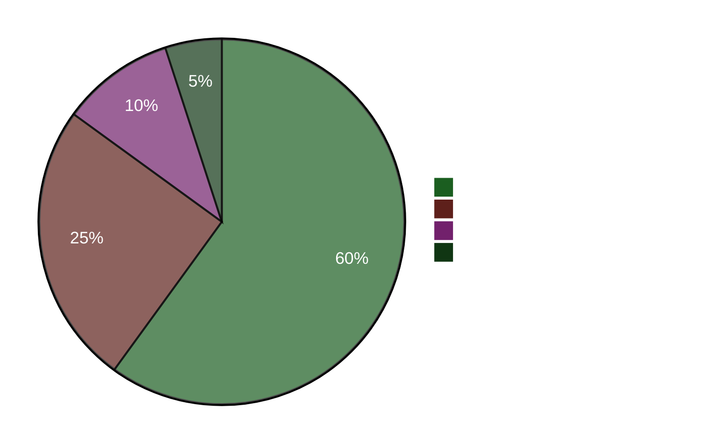

<!-- dir: rtl -->
# תקציר מנהלים — ניתוח ערב 2026-04-22

**מזהה תקציר**: EB-2026-04-22-EVE001
**הוכן על ידי**: James Pether Sörling
**הוכן ב**: 2026-04-22 23:50 UTC
**סיווג**: ציבורי — GDPR Art. 9(2)(e)
**אמינות**: גבוהה [A1]
**קריאה של 60 שניות**: ✅

---

## 🎯 BLUF

הפרלמנט השוודי אישר היום חבילת סיוע חירום לאנרגיה של 4.1 מיליארד כתר (HD01FiU48) עם סופרמג'וריטי חריג של M+SD+S+KD — הסוציאל-דמוקרטים זנחו את הצעת הנגד שלהם בתחום האקלים כדי להימנע מנשיאת האחריות לעלויות דלק גבוהות ארבעה חודשים לפני בחירות ספטמבר 2026. שרת האוצר אליזבת סוונסון (M) עומדת בו-זמנית בפני התקפת אחריות ממוקדת של חמש שאלות פרלמנטריות מצד S, כולל אחת (HD10442) המצטטת פסק דין שקבע שהצהרותיה הפומביות בנוגע לטיפול בהפרעות אכילה לא היו מדויקות מבחינה עובדתית. הצעת האביב 2026 (HD03100) היא כעת המניפסט הפיסקלי הרשמי לפני הבחירות.

---

## 🧭 3 החלטות שתקציר זה תומך בהן

1. **החלטה תקשורתית/עריכתית**: האם "S מצביעה בעד הפחתת מס דלק תוך הגשת הצעת נגד" היא הנרטיב המוביל ליום? → **כן.** התנהגות הנתיב הכפול (הצבעת כן ב-HD01FiU48 + הצעת נגד HD024082) היא הממצא האנליטי המשמעותי ביותר של היום. היא חושפת את החישוב הבחירותי של S — חישובי יוקר המחיה לפני הבחירות גוברים על עקביות האקלים. אמינות: גבוהה [A1].

2. **החלטה אסטרטגית של האופוזיציה**: האם על S לטפס על מסלול האחריות נגד סוונסון? → **כנראה כן.** הבסיס המאושש מבחינה משפטית של HD10442 הופך אותה לשאלה פרלמנטרית בסיכון גבוה/תגמול גבוה. תפקיד ועדת הכספים הן ב-HD01FiU48 והן בהצעת האביב משמעו שסוונסון מגנה בו-זמנית על מדיניות הפיסקלית ועל האמינות האישית שלה. אמינות: בינונית [B2].

3. **החלטת עמידות הקואליציה**: האם הסופרמג'וריטי של M+SD+S+KD ב-HD01FiU48 מסמל קונצנזוס בין-גושי חדש או תמרון בחירותי חד-פעמי? → **תמרון בחירותי חד-פעמי.** הצעות הנגד מ-S (HD024082), V (HD024092) ו-MP (HD024098) שהוגשו באותו שבוע מציינות שאין יישור מחדש מבני; S תמכה בחבילה שאושרה מסיבות אופטיות בחירותיות בלבד. אמינות: גבוהה [A1].

---

## ⚡ קריאה נקודתית של 60 שניות

- **אושר היום**: HD01FiU48 — הפחתת מס דלק של 4.1 מיליארד SEK ותמיכה באנרגיה, הוצבע 16:29. M+SD+S+KD הצביעו כן.
- **סתירה אסטרטגית**: S מצביעה כן על החוק שאושר אך הגישה הצעת נגד (HD024082) נגד אותה מדיניות.
- **סיכון אחריות**: S הגישה 5 שאלות פרלמנטריות ב-48 שעות נגד סוונסון (3) ושרים אחרים.
- **אישור משפטי**: HD10442 מצטט פסק דין אמיתי המחליש את הצהרותיה הפומביות של סוונסון על שירותי בריאות.
- **מסגרת בחירותית**: HD03100 הצעת האביב 2026 היא כעת המניפסט הפיסקלי הרשמי לפני הבחירות — כל כתר יידון.
- **צינור חוקתי**: שני שינויי חוק יסוד (HD01KU33 + HD01KU32) בקריאה ראשונה בו-זמנית — עצימות חקיקתית נדירה.
- **מחויבות אוקראינה**: שוודיה מצטרפת גם לוועדת הפיצויים האוקראינית (HD03232) וגם לבית הדין לתוקפנות (HD03231).
- **פער אקלים-פיסקלי**: MP+V+S הגישו הצעות נגד מקבילות לאקלים גם כאשר S הצביעה לטובת הקלת מס הדלק.

---

## 🔮 הטריגר האסטרטגי המוביל

**עקוב אחר**: דיון הריקסדאג על HD10442 (Svantesson ätstörningsvård IP) — מתוכנן לאחר ה-5 במאי. אם סוונסון לא תוכל לפייס את הצהרותיה הפומביות הקודמות עם פסק הדין, זה יהפוך לרגע האחריות המיניסטריאלית הגדול ביותר של תקופת הקדם-בחירות. הסתברות לנזק פוליטי משמעותי: **סביר** [B2] (65 %).

**טריגר משני**: עמדת S על הצעת האביב HD03100 בהליכי ועדת FiU — מסמך הפיסקלי החלופי שלהם יגדיר את הדיון הכלכלי של שנת הבחירות.

---

## 📊 לוח מחוונים של אמון

**עובדות מפתח מאושרות (A1)**:
- תוצאת הצבעת HD01FiU48 ב-riksdagen.se ברשומת ההצבעה CE14CCEF
- כל 5 השאלות הפרלמנטריות הוגשו ונגישות לציבור (riksdagen.se)
- HD03100 הוגש ב-2026-04-13 Finansdepartementet
- תוצר מקומי גולמי שוודיה לפי הבנק העולמי 2024: 0.82 %; אינפלציה 2024: 2.84 %

**סביר (B2)**:
- אסטרטגיית הנתיב הכפול של S כחישוב בחירותי (מסוקנת מפעולות, לא מוצהרת)
- חשיפתה הפרלמנטרית של סוונסון מהפניה המשפטית של HD10442

<!-- source-sha: cb87af673fb4a43f297af6c833d737b3ef322067 -->
