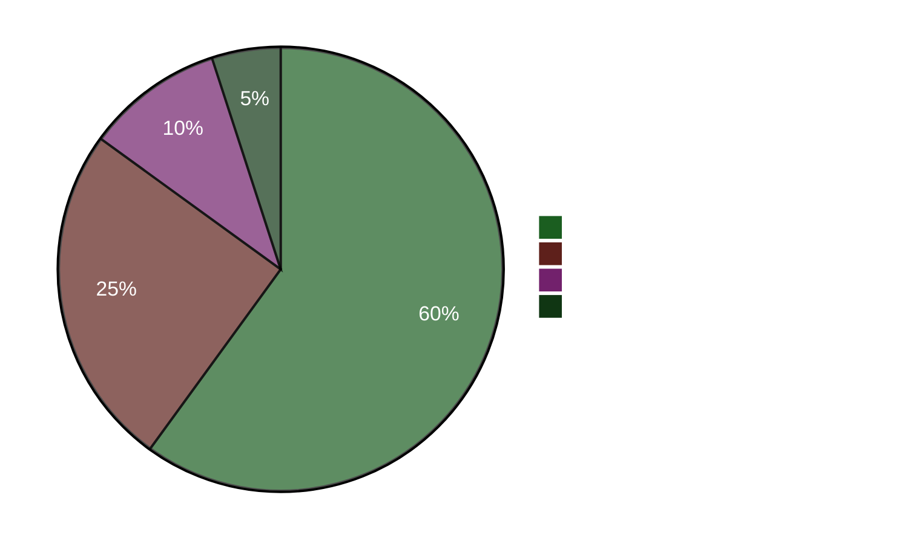

# エグゼクティブ・ブリーフ — 夕刻分析 2026-04-22

**ブリーフID**: EB-2026-04-22-EVE001
**作成者**: James Pether Sörling
**作成日時**: 2026-04-22 23:50 UTC
**分類**: 公開 — GDPR Art. 9(2)(e)
**信頼性**: 高 [A1]
**60秒読み**: ✅

---

## 🎯 BLUF（要旨）

スウェーデン議会は本日、41億クローナの緊急エネルギー支援策（HD01FiU48）を、M+SD+S+KDという異例の超党派過半数で可決した。社会民主党（S）は気候対案を取り下げ、2026年9月選挙まで4ヶ月の時点で燃料費高騰の責任を負うことを回避した。同時に、財務大臣エリサベット・スヴァンテソン（M）は、Sからの5件の質問書による集中的な責任追及を受けており、そのうち1件（HD10442）では、摂食障害ケアに関する彼女の公式発言が事実として誤りであったと判示した裁判所判決が引用されている。2026年春の経済政策声明（HD03100）は現在、公式の選前財政マニフェストとなっている。

---

## 🧭 本ブリーフが支援する3つの意思決定

1. **報道/編集上の判断**: 「SがFiU48に賛成票を投じつつ対案を提出している」は本日の中心的な報道軸か？ → **はい。** 二重経路的行動（HD01FiU48への賛成票 + 対案HD024082）は本日最も分析的に重要な発見です。これはSの選挙計算を露わにしています — 選前の生活費計算が気候上の一貫性に優先しています。信頼性: 高 [A1]。

2. **野党戦略上の判断**: Sはスヴァンテソンへの責任追及路線をエスカレートすべきか？ → **おそらく可。** HD10442の裁判所判決に裏打ちされた根拠は、ハイリスク・ハイリターンな質問書にしています。スヴァンテソンはHD01FiU48と春の政策声明の両方で財政政策と個人的信頼性を同時に守らなければならない状況です。信頼性: 中 [B2]。

3. **連立安定性の判断**: HD01FiU48におけるM+SD+S+KDの超党派過半数は新たなブロック横断的コンセンサスを示すか、それとも一時的な選挙戦術か？ → **一時的な選挙戦術。** 同週に提出されたS（HD024082）・V（HD024092）・MP（HD024098）各党の対案は、構造的な再配置がないことを示しています。Sは選挙的見映えの理由のみで可決された法案を支持したに過ぎません。信頼性: 高 [A1]。

---

## ⚡ 60秒箇条書き

- **本日可決**: HD01FiU48 — 41億SEK燃料税引き下げ・エネルギー支援策、16:29採決。M+SD+S+KDが賛成票。
- **戦略的矛盾**: Sは可決法案に賛成票を投じながら同一政策への対案（HD024082）を提出。
- **責任リスク**: Sは48時間でスヴァンテソン（3件）および他大臣へ5件の質問書を提出。
- **法的裏付け**: HD10442は医療サービスに関するスヴァンテソンの公式発言を否定する実際の裁判所判決を引用。
- **選挙的文脈**: HD03100・2026年春の経済政策声明は今や公式の選前財政マニフェスト — 全クローナが論争対象に。
- **憲法的工程**: 基本法改正2件（HD01KU33 + HD01KU32）が同時に第一読会 — 立法上の稀な高密度状態。
- **ウクライナへのコミットメント**: スウェーデンがウクライナ補償委員会（HD03232）と侵略罪裁判所（HD03231）の双方に加盟。
- **気候・財政間の乖離**: MP+V+Sが燃料税軽減への賛成票と並行して気候関連の対案を提出。

---

## 🔮 最重要先行指標

**追跡対象**: HD10442（Svantesson ätstörningsvård IP）に関する議会討論 — 5月5日以降に予定。スヴァンテソンが裁判所判決との整合性を説明できなければ、選前最大の大臣責任の場面となる。重大な政治的ダメージの確率: **おそらく** [B2]（65%）。

**二次指標**: FiU委員会手続きにおけるHD03100春の政策声明に対するSの立場 — 彼らの代替財政文書が選挙年の経済的議論を規定する。

---

## 📊 信頼性ダッシュボード

**確認済の主要事実 (A1)**:
- HD01FiU48採決結果 riksdagen.se 採決記録CE14CCEF
- 5件の質問書すべて提出済・公開アクセス可（riksdagen.se）
- HD03100は2026-04-13 Finansdepartementet提出
- 世界銀行スウェーデンGDP 2024: 0.82%; インフレ2024: 2.84%

**おそらく (B2)**:
- Sの二重経路戦略を選挙計算として解釈（行動から推論・明示的発言なし）
- HD10442の法的引用によるスヴァンテソンの議会的露出

<!-- source-sha: cb87af673fb4a43f297af6c833d737b3ef322067 -->
