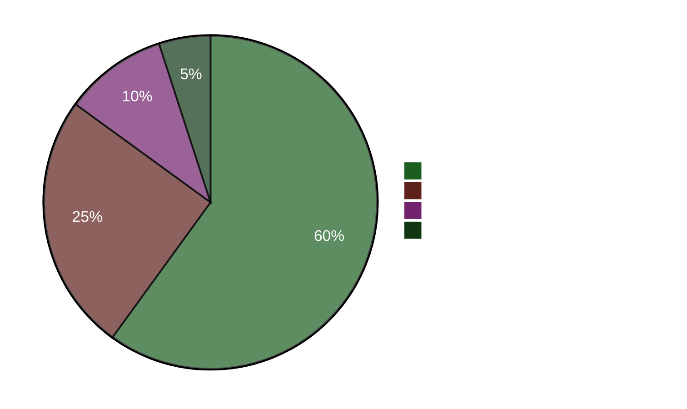

# 임원 브리핑 — 저녁 분석 2026-04-22

**브리핑 ID**: EB-2026-04-22-EVE001
**작성자**: James Pether Sörling
**작성일**: 2026-04-22 23:50 UTC
**분류**: 공개 — GDPR Art. 9(2)(e)
**신뢰도**: 높음 [A1]
**60초 읽기**: ✅

---

## 🎯 핵심 요약 (BLUF)

스웨덴 의회는 오늘 M+SD+S+KD의 이례적인 초당적 과반수로 41억 크로나 규모의 긴급 에너지 지원 패키지(HD01FiU48)를 통과시켰다. 사민당(S)은 2026년 9월 선거를 4개월 앞두고 연료비 급등에 대한 책임을 피하기 위해 기후 관련 대안을 철회했다. 동시에 재무장관 엘리사벳 스반테손(M)은 S의 집중적인 책임 추궁을 받고 있으며, 그 중 한 건(HD10442)은 섭식장애 치료에 관한 그녀의 공개 발언이 사실과 다르다고 판결한 법원 판결을 인용하고 있다. 2026년 봄 경제정책 성명(HD03100)은 이제 공식적인 선거 전 재정 선언문이 되었다.

---

## 🧭 이 브리핑이 지원하는 3가지 의사결정

1. **언론/편집 결정**: "S가 연료세 감면에 찬성하면서 대안을 제출했다"가 오늘의 핵심 보도 방향인가? → **예.** 이중 경로 행동(HD01FiU48 찬성표 + 대안 HD024082)은 오늘의 가장 중요한 분석적 발견입니다. 이는 S의 선거적 계산을 드러냅니다 — 선거 전 생계비 계산이 기후 일관성보다 우선합니다. 신뢰도: 높음 [A1].

2. **야당 전략 결정**: S는 스반테손에 대한 책임 추궁 경로를 강화해야 하는가? → **아마 그렇다.** HD10442의 법원 판결로 뒷받침된 근거는 이를 고위험·고수익 질의로 만듭니다. 스반테손은 HD01FiU48과 봄 정책 성명 양쪽에서 재정 정책과 개인 신뢰도를 동시에 방어해야 합니다. 신뢰도: 중간 [B2].

3. **연립 안정성 결정**: HD01FiU48에서의 M+SD+S+KD 초당적 과반수는 새로운 블록 횡단 합의를 나타내는가, 아니면 일회성 선거 전술인가? → **일회성 선거 전술.** 같은 주에 제출된 S(HD024082), V(HD024092), MP(HD024098)의 대안들은 구조적 재편성이 없음을 나타냅니다. S는 순전히 선거적 시각적 이유로 통과된 패키지를 지지했습니다. 신뢰도: 높음 [A1].

---

## ⚡ 60초 요점 정리

- **오늘 통과**: HD01FiU48 — 41억 SEK 연료세 감면·에너지 지원, 16:29 표결. M+SD+S+KD 찬성.
- **전략적 모순**: S는 통과된 법안에 찬성표를 던지면서 동일한 정책에 대한 대안(HD024082)을 제출.
- **책임 위험**: S는 48시간 내에 스반테손(3건)과 다른 장관들에게 5건의 질의서 제출.
- **법적 뒷받침**: HD10442는 스반테손의 의료 서비스 공개 발언을 부정하는 실제 법원 판결 인용.
- **선거 맥락**: HD03100 2026년 봄 경제정책 성명은 이제 공식 선거 전 재정 선언문 — 모든 크로나가 논쟁 대상.
- **헌법적 일정**: 기본법 개정 2건(HD01KU33 + HD01KU32)이 동시에 1독회 — 드문 입법 집중도.
- **우크라이나 공약**: 스웨덴이 우크라이나 배상위원회(HD03232)와 침략죄 재판소(HD03231) 양측에 가입.
- **기후·재정 간 격차**: MP+V+S가 연료세 완화에 찬성하면서 동시에 기후 관련 대안 제출.

---

## 🔮 핵심 선행 지표

**추적 대상**: HD10442(Svantesson ätstörningsvård IP)에 관한 의회 토론 — 5월 5일 이후 예정. 스반테손이 법원 판결과의 일치를 설명하지 못하면, 이것이 선거 전 최대의 장관 책임 순간이 된다. 심각한 정치적 피해 가능성: **아마도** [B2] (65%).

**보조 지표**: FiU 위원회 절차에서 HD03100 봄 정책 성명에 대한 S의 입장 — 그들의 대안적 재정 문서가 선거 해의 경제 논의를 규정할 것이다.

---

## 📊 신뢰도 대시보드

**확인된 주요 사실 (A1)**:
- HD01FiU48 표결 결과 riksdagen.se 표결 기록 CE14CCEF
- 5건의 질의서 모두 제출 및 공개 접근 가능 (riksdagen.se)
- HD03100은 2026-04-13 Finansdepartementet 제출
- 세계은행 스웨덴 GDP 2024: 0.82%; 인플레이션 2024: 2.84%

**아마도 (B2)**:
- S의 이중 경로 전략을 선거적 계산으로 해석 (행동에서 추론, 명시적 발언 없음)
- HD10442 법적 인용으로 인한 스반테손의 의회적 노출

<!-- source-sha: cb87af673fb4a43f297af6c833d737b3ef322067 -->
