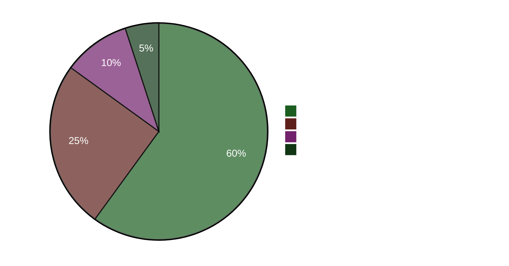

# Uitvoerend briefing — Avondanalyse 2026-04-22

**Briefing-ID**: EB-2026-04-22-EVE001
**Opgesteld door**: James Pether Sörling
**Opgesteld op**: 2026-04-22 23:50 UTC
**Classificatie**: Openbaar — AVG Art. 9(2)(e)
**Betrouwbaarheid**: HOOG [A1]
**60 seconden lezen**: ✅

---

## 🎯 BLUF

Het Zweedse parlement keurde vandaag een noodenergiepakket van 4,1 miljard SEK goed (HD01FiU48) met een anomale M+SD+S+KD-supermeerderheid — de sociaaldemocraten lieten hun klimaattegenvoorstel varen om te voorkomen dat ze de schuld krijgen van hoge brandstofkosten vier maanden voor de verkiezingen van september 2026. Minister van Financiën Elisabeth Svantesson (M) staat tegelijk voor een geconcentreerde vijfvoudige interpellatie-verantwoordingsoffensief van S, waaronder één (HD10442) die een rechterlijke uitspraak aanhaalt dat haar openbare verklaringen over de zorg voor eetstoornissen feitelijk onjuist waren. De Voorjaarspropositie 2026 (HD03100) is nu het officiële fiscale pre-verkiezingsmanifest.

---

## 🧭 3 Beslissingen die dit briefing ondersteunt

1. **Media/redactionele beslissing**: Is "S stemt voor brandstofbelastingverlaging terwijl ze een tegenvoorstel indienen" het leidende narratief van de dag? → **Ja.** Het dubbele spoorgedrag (Ja-stem op HD01FiU48 + tegenvoorstel HD024082) is de analytisch meest significante bevinding van de dag. Het onthult de electorale berekening van S — de kosten van levensonderhoud-berekening voor de verkiezingen overstijgt de klimaatconsistentie. Betrouwbaarheid: HOOG [A1].

2. **Opposiestrategie-beslissing**: Moet S het verantwoordingsspoor tegen Svantesson escaleren? → **Waarschijnlijk ja.** De rechterlijk bevestigde basis van HD10442 maakt het een interpellatie met hoog risico/hoge beloning. De rol van de financiële commissie in zowel HD01FiU48 als de Voorjaarspropositie betekent dat Svantesson tegelijk de begrotingspolitiek EN haar persoonlijke geloofwaardigheid verdedigt. Betrouwbaarheid: GEMIDDELD [B2].

3. **Coalitieresilientiebeslissing**: Signaleert de M+SD+S+KD-supermeerderheid bij HD01FiU48 een nieuw blokoverkoepelend consensus of een eenmalig verkiezingsmanoeuvre? → **Eenmalig verkiezingsmanoeuvre.** De tegenvoorstellen van S (HD024082), V (HD024092) en MP (HD024098) ingediend in dezelfde week duiden op geen structurele heroriëntatie; S steunde het aangenomen pakket om electorale optische redenen. Betrouwbaarheid: HOOG [A1].

---

## ⚡ 60 seconden opsomming

- **VANDAAG AANGENOMEN**: HD01FiU48 — 4,1 miljard SEK brandstofbelastingverlaging en energiesteun, gestemd 16:29. M+SD+S+KD stemden Ja.
- **STRATEGISCHE TEGENSTRIJDIGHEID**: S stemt Ja op aangenomen wetsvoorstel maar diende tegenvoorstel in (HD024082) tegen dezelfde politiek.
- **VERANTWOORDINGSRISICO**: S diende in 48 uur 5 interpellaties in tegen Svantesson (3) en andere ministers.
- **RECHTERLIJKE BEVESTIGING**: HD10442 citeert een werkelijke rechterlijke uitspraak die Svantessons openbare verklaringen over gezondheidszorg ondermijnt.
- **VERKIEZINGSKADER**: HD03100 Voorjaarspropositie 2026 is nu het officiële fiscale pre-verkiezingsmanifest — elke SEK zal worden gedebatteerd.
- **CONSTITUTIONELE PIPELINE**: Twee grondwetswijzigingen (HD01KU33 + HD01KU32) in eerste lezing tegelijk — zeldzame wetgevingsintensiteit.
- **OEKRAÏNE-VERBINTENIS**: Zweden sluit zich aan bij zowel de Oekraïne-vergoedingscommissie (HD03232) als het agressietribunaal (HD03231).
- **KLIMAAT-FISCALE KLOOF**: MP+V+S dienden parallelle klimaattegenvoorsstellen in terwijl S stemde voor de brandstofbelastingverlichting.

---

## 🔮 Belangrijkste vooruitkijkende trigger

**Let op**: Rijksdag-debat over HD10442 (Svantesson ätstörningsvård IP) — gepland na 5 mei. Als Svantesson haar eerdere openbare verklaringen niet kan verzoenen met de rechterlijke uitspraak, wordt dit het grootste ministeriële verantwoordingsmoment van de pre-verkiezingsperiode. Kans op significante politieke schade: **Waarschijnlijk** [B2] (65 %).

**Secundaire trigger**: S's positie over HD03100 Voorjaarspropositie in de FiU-commissieprocedures — hun alternatieve begrotingsdocument zal het economische debat van het verkiezingsjaar bepalen.

---

## 📊 Vertrouwensdashboard

**Bevestigde sleutelfeiten (A1)**:
- HD01FiU48-stemresultaat op riksdagen.se stemregistratie CE14CCEF
- Alle 5 interpellaties ingediend en publiek toegankelijk (riksdagen.se)
- HD03100 ingediend op 2026-04-13 Finansdepartementet
- Wereldbank Zweden BBP 2024: 0,82 %; Inflatie 2024: 2,84 %

**Waarschijnlijk (B2)**:
- S's dubbele spoorstrategie als electorale berekening (afgeleid uit acties, niet verklaard)
- Svantessons parlementaire blootstelling door HD10442's rechterlijke referentie

<!-- source-sha: cb87af673fb4a43f297af6c833d737b3ef322067 -->
