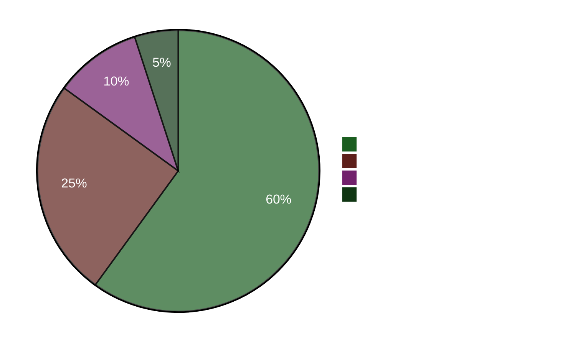

# Ledersammendrag — Kveldsanalyse 2026-04-22

**Sammendrag-ID**: EB-2026-04-22-EVE001
**Utarbeidet av**: James Pether Sörling
**Utarbeidet**: 2026-04-22 23:50 UTC
**Klassifisering**: Offentlig — GDPR Art. 9(2)(e)
**Troverdighet**: HØY [A1]
**60-sekunders lesing**: ✅

---

## 🎯 BLUF

Sverigets storting vedtok i dag en nødenergistøttepakke på 4,1 milliarder SEK (HD01FiU48) med et anomalt M+SD+S+KD-superflertall — sosialdemokratene forlot sin klimamotmotmot for å unngå å bli beskyldt for høye drivstoffkostnader fire måneder før valget i september 2026. Finansminister Elisabeth Svantesson (M) møter samtidig en konsentrert femdobbelt interpellasjonsansvarighetsoffensiv fra S, inkludert én (HD10442) som siterer en domstolsavgjørelse om at hennes offentlige uttalelser om behandling av spiseforstyrrelse var faktisk ukorrekte. Vårproposisjon 2026 (HD03100) er nå det offisielle forvalgsbudsjettpolitiske manifestet.

---

## 🧭 3 Beslutninger dette sammendraget støtter

1. **Medie/redaksjonell beslutning**: Er "S stemmer for drivstoffskattekutt mens de leverer motmotmot" det ledende narrativet for dagen? → **Ja.** Den tosporede atferden (HD01FiU48 Ja-stemme + HD024082 motmotmot) er dagens analytisk mest betydningsfulle funn. Det avslører S's valgkalkyle — forvalgskostnadene overstyrer klimakonsistens. Troverdighet: HØY [A1].

2. **Opposisjonsstrategibeslutning**: Bør S eskalere ansvarlighetssporet mot Svantesson? → **Sannsynligvis ja.** HD10442's domstolsbekreftet grunnlag gjør det til en høy-risiko/høy-belønning-interpellasjon. Finanskomiteens rolle i både HD01FiU48 og Vårproposisjonen betyr at Svantesson samtidig forsvarer finanspolitikken OG sin personlige troverdighet. Troverdighet: MEDIUM [B2].

3. **Koalisjonsresiliensbeslutet**: Signaliserer M+SD+S+KD-superflertalget på HD01FiU48 en ny tverrblokkskonsensus eller et engangsvalgmanøver? → **Engangsvalgmanøver.** Motmotionene fra S (HD024082), V (HD024092) og MP (HD024098) levert samme uke indikerer ingen strukturell omjustering; S støttet den vedtatte pakken av valgmessige optiske årsaker. Troverdighet: HØY [A1].

---

## ⚡ 60-sekunders punktlesing

- **VEDTATT I DAG**: HD01FiU48 — 4,1 GSEK drivstoffskattekutt og energistøtte, stemt 16:29. M+SD+S+KD stemte Ja.
- **STRATEGISK SELVMOTSIGELSE**: S stemmer Ja på vedtatt lovforslag men leverte motmotmot (HD024082) mot samme politikk.
- **ANSVARIGHETSRISIKO**: S leverte 5 interpellasjoner på 48 timer mot Svantesson (3) og andre ministre.
- **DOMSTOLSBEKREFTELSE**: HD10442 siterer faktisk domstolsavgjørelse som underminerer Svantessons offentlige uttalelser om helsevern.
- **VALGRAMME**: HD03100 Vårproposisjon 2026 er nå det offisielle forvalgsmessige finanspolitiske manifest — hver SEK vil bli debattert.
- **KONSTITUSJONELL PIPELINE**: To grunnlovsendringer (HD01KU33 + HD01KU32) i første lesning samtidig — sjelden lovgivningsintensitet.
- **UKRAINA-FORPLIKTELSE**: Sverige slutter seg til både Ukraina-kompensasjonskommisjonen (HD03232) og aggresjonstribunalen (HD03231).
- **KLIMA-FINANSKLØFT**: MP+V+S leverte parallelle klimamotmotioner selv da S stemte for drivstoffskattestøtte.

---

## 🔮 Viktigste fremadrettede trigger

**Hold øye med**: Stortingsdebatt om HD10442 (Svantesson ätstörningsvård IP) — planlagt etter 5. mai. Hvis Svantesson ikke kan forene sine tidligere offentlige uttalelser med domstolsavgjørelsen, blir dette den største ministerielle ansvarighetsøyeblikket i forvalgsperioden. Sannsynlighet for betydelig politisk skade: **Sannsynlig** [B2] (65 %).

**Sekundær trigger**: S's holdning til HD03100 Vårproposisjonen i FiU-komiteens behandling — deres alternative finanspolitiske dokument vil definere valgårets økonomiudebat.

---

## 📊 Troverdighets-dashboard

**Bekreftede nøkkelfakta (A1)**:
- HD01FiU48-stemmeresultat på riksdagen.se stemmepost CE14CCEF
- Alle 5 interpellasjoner levert og offentlig tilgjengelige (riksdagen.se)
- HD03100 levert 2026-04-13 Finansdepartementet
- Verdensbankens Sverige BNP 2024: 0,82 %; Inflasjon 2024: 2,84 %

**Sannsynlig (B2)**:
- S's tosporede strategi som valgkalkyle (utledet av handlinger, ikke erklært)
- Svantessons parlamentariske eksponering fra HD10442's domstolsreferanse

<!-- source-sha: cb87af673fb4a43f297af6c833d737b3ef322067 -->
