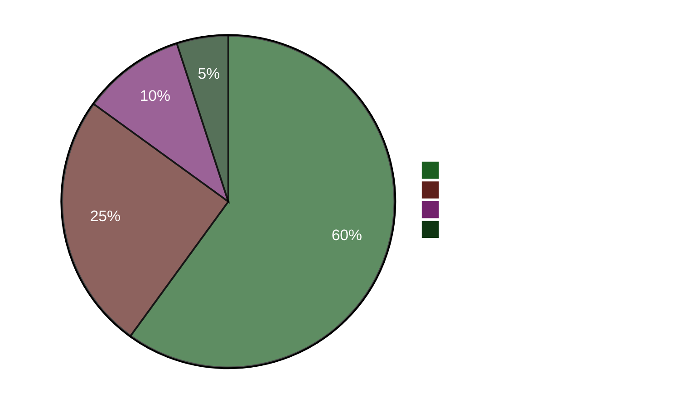

# Verkställande resumé — Kvällsanalys 2026-04-22

**Resumé-ID**: EB-2026-04-22-EVE001
**Framtagen av**: James Pether Sörling
**Framtagen**: 2026-04-22 23:50 UTC
**Klassificering**: Offentlig — GDPR Art. 9(2)(e)
**Tillförlitlighet**: HÖG [A1]
**60-sekunders läsning**: ✅

---

## 🎯 BLUF

Sveriges parlament antog idag ett energipaket på 4,1 miljarder SEK för nödfallsenergi (HD01FiU48) med en anomal M+SD+S+KD-supermajoritet — socialdemokraterna övergav sin klimatmotmotion för att undvika att bli skuldbelagda för höga bränslekostnader fyra månader före valet i september 2026. Finansminister Elisabeth Svantesson (M) möter samtidigt en koncentrerad femfaldigt interpellationsansvarighetssofisensiv från S, däribland en (HD10442) som citerar en domstolsdom om att hennes offentliga uttalanden om ätstörningsvård var sakligt felaktiga. Vårpropositionen 2026 (HD03100) utgör valbordet för skattefrågor.

---

## 🧭 3 Beslut som detta resumé stöder

1. **Medialt/redaktionellt beslut**: Är "S röstar för bränsleskattesänkning samtidigt som de lämnar in motmotion" det ledande narrativet för dagen? → **Ja.** Det dubbla beteendet (HD01FiU48 Ja-röst + HD024082 motmotion) är dagens analytiskt mest betydelsefulla fynd. Det avslöjar S:s valkalkylen — valårets kostnadskalkylen åsidosätter klimatkonsekvens. Tillförlitlighet: HÖG [A1].

2. **Oppositionsstrategibeslut**: Bör S eskalera ansvarighetsspåret mot Svantesson? → **Sannolikt ja.** HD10442:s domstolsvindicerade underlag gör det till en hög-risk/hög-belöning-interpellation. Finansutskottets roll i både HD01FiU48 och Vårpropositionen innebär att Svantesson samtidigt försvarar finanspolitiken OCH sin personliga trovärdighet. Tillförlitlighet: MEDIUM [B2].

3. **Koalitionsresiliensbeslutet**: Signalerar M+SD+S+KD-supermajoriteten på HD01FiU48 en ny tvärblockskonsensus eller ett engångsmässigt valmöte? → **Engångsmässigt valmöte.** Motmotionerna från S (HD024082), V (HD024092) och MP (HD024098) inlämnade samma vecka indikerar ingen strukturell omjustering; S stödde det antagna paketet av valmässiga optiska skäl. Tillförlitlighet: HÖG [A1].

---

## ⚡ 60-sekunders punktläsning

- **ANTAGET IDAG**: HD01FiU48 — 4,1 GSEK bränsleskattesänkning och energistöd, röstat 16:29. M+SD+S+KD röstade Ja.
- **STRATEGISK SJÄLVMOTSÄGELSE**: S röstar Ja på antaget lagförslag men lämnade in motmotion (HD024082) mot samma politik.
- **ANSVARIGHETSRISK**: S lämnade in 5 interpellationer på 48 timmar mot Svantesson (3) och andra ministrar.
- **DOMSTOLSVINDICERING**: HD10442 citerar faktisk domstolsdom som underminerar Svantessons offentliga uttalanden om hälsovård.
- **VALRAM**: HD03100 Vårpropositionen 2026 är nu det officiella förvalsfinanspolitiska manifestet — varje SEK kommer att debatteras.
- **KONSTITUTIONELL PIPELINE**: Två grundlagsändringar (HD01KU33 + HD01KU32) i första läsning samtidigt — sällsynt lagstiftningsintensitet.
- **UKRAINAÅTAGANDE**: Sverige ansluter sig till både Ukrainaersättningskommissionen (HD03232) och aggressionstribunalen (HD03231).
- **KLIMAT-FINANSKLYFTA**: MP+V+S lämnade in parallella klimatmotmotioner även när S röstade för bränsleskattestöd.

---

## 🔮 Viktigaste framåtblickande triggers

**Bevaka**: Riksdagsdebatt om HD10442 (Svantesson ätstörningsvård IP) — planerad efter 5 maj. Om Svantesson inte kan förena sina tidigare offentliga uttalanden med domstolsavgörandet, blir detta valperiodens mest betydelsefulla ministeransvarighetsstund. Sannolikhet för väsentlig politisk skada: **Sannolikt** [B2] (65 %).

**Sekundär trigger**: S:s ståndpunkt om HD03100 vårpropositionen i FiU-utskottets förfaranden — deras alternativa finanspolitiska dokument kommer att definiera valårets ekonomidebatt.

---

## 📊 Tilltros-dashboard

**Bekräftade nyckelfakta (A1)**:
- HD01FiU48-röstresultat på riksdagen.se röstpost CE14CCEF
- Alla 5 interpellationer inlämnade och offentligt tillgängliga (riksdagen.se)
- HD03100 inlämnad 2026-04-13 Finansdepartementet
- Världsbankens BNP för Sverige 2024: 0,82 %; Inflation 2024: 2,84 %

**Sannolikt (B2)**:
- S:s dubbla strategi som valkalkyl (slutledas ur handlingar, ej uttalad)
- Svantessons parlamentariska exponering från HD10442:s domstolsreferens

<!-- source-sha: cb87af673fb4a43f297af6c833d737b3ef322067 -->
