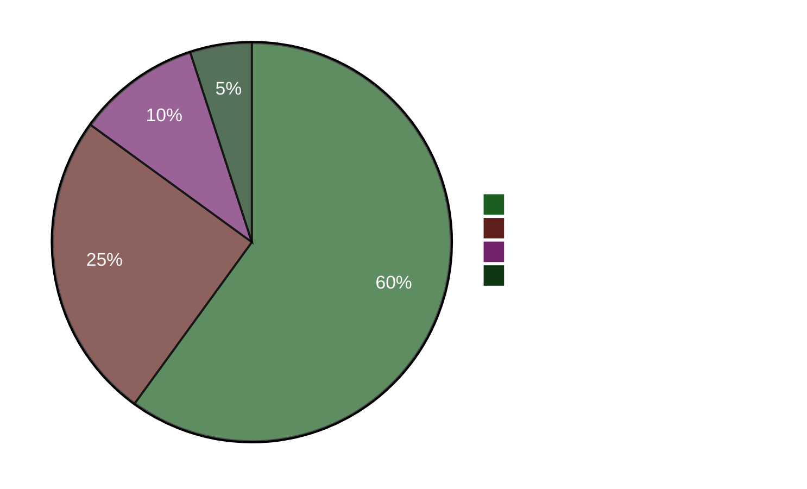

# 执行简报 — 晚间分析 2026-04-22

**简报ID**: EB-2026-04-22-EVE001
**编制**: James Pether Sörling
**编制日期**: 2026-04-22 23:50 UTC
**分类**: 公开 — GDPR Art. 9(2)(e)
**可靠性**: 高 [A1]
**60秒阅读**: ✅

---

## 🎯 核心摘要（BLUF）

瑞典议会今日以M+SD+S+KD罕见超级多数通过了410亿克朗紧急能源支持方案（HD01FiU48）。社会民主党（S）放弃了其气候替代方案，以避免在2026年9月大选前4个月承担燃料成本上涨的责任。与此同时，财政大臣伊丽莎白·斯万特松（M）正面临S发起的密集问责攻势——5份质询函中包括一份（HD10442）引用了法院判决，认定她关于饮食失调护理的公开声明在事实上有误。2026年春季经济政策声明（HD03100）现已成为正式的选前财政宣言。

---

## 🧭 本简报支持的3项决策

1. **媒体/编辑决策**："S在支持燃料税减免的同时提交替代方案"是否为当日核心叙事？ → **是。** 双轨行为（HD01FiU48赞成票 + 替代方案HD024082）是当日最重要的分析发现。这揭示了S的选举计算——选前生活成本计算优先于气候一致性。可靠性：高 [A1]。

2. **反对党战略决策**：S是否应升级对斯万特松的问责路线？ → **可能是。** HD10442经法院判决支撑的依据使其成为高风险高回报的质询函。斯万特松在HD01FiU48和春季政策声明两方面同时为财政政策和个人信誉进行辩护。可靠性：中 [B2]。

3. **联合政府稳定性决策**：HD01FiU48上M+SD+S+KD的超级多数是否预示新的跨党派共识，还是一次性选举策略？ → **一次性选举策略。** 同周提交的S（HD024082）、V（HD024092）、MP（HD024098）各党替代方案表明不存在结构性重新定位；S支持该方案纯粹出于选举形象考虑。可靠性：高 [A1]。

---

## ⚡ 60秒要点

- **今日通过**：HD01FiU48 — 410亿SEK燃料税减免·能源支持，16:29表决。M+SD+S+KD投赞成票。
- **战略矛盾**：S对通过的法案投赞成票，同时提交针对同一政策的替代方案（HD024082）。
- **问责风险**：S在48小时内对斯万特松（3份）及其他部长提交5份质询函。
- **司法背书**：HD10442引用真实法院判决，否定斯万特松关于医疗服务的公开声明。
- **选举语境**：HD03100 2026年春季经济政策声明现已成为正式选前财政宣言——每一分克朗都将受到争议。
- **宪法日程**：两项基本法修正（HD01KU33 + HD01KU32）同时进行第一读会——罕见的立法密集。
- **乌克兰承诺**：瑞典同时加入乌克兰赔偿委员会（HD03232）和侵略罪法庭（HD03231）。
- **气候与财政的鸿沟**：MP+V+S在支持燃料税减免的同时提交平行气候替代方案。

---

## 🔮 核心前瞻触发指标

**跟踪对象**：关于HD10442（Svantesson ätstörningsvård IP）的议会辩论——计划于5月5日后进行。若斯万特松无法调和其公开声明与法院判决，这将成为选前最重大的部长问责时刻。严重政治损害概率：**可能** [B2]（65%）。

**次要触发指标**：S在FiU委员会程序中对HD03100春季政策声明的立场——其替代财政文件将界定选举年的经济讨论。

---

## 📊 可信度仪表板

**已确认关键事实 (A1)**:
- HD01FiU48表决结果 riksdagen.se 表决记录CE14CCEF
- 全部5份质询函已提交并可公开查阅（riksdagen.se）
- HD03100于2026-04-13由Finansdepartementet提交
- 世界银行瑞典GDP 2024: 0.82%；通胀2024: 2.84%

**可能 (B2)**:
- 将S的双轨战略解读为选举计算（从行动推断，非明确表态）
- HD10442法律引用对斯万特松议会曝光的影响

<!-- source-sha: cb87af673fb4a43f297af6c833d737b3ef322067 -->
