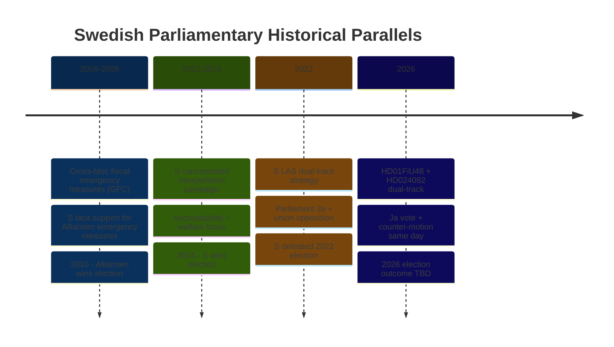

# Historical Parallels — Evening Analysis 2026-04-22

**Analyst**: James Pether Sörling
**Framework**: electoral-domain-methodology.md § Historical Parallels
**Date**: 2026-04-22 | **Riksmöte**: 2025/26

---

## Precedent 1: Cross-Bloc Fiscal Emergency Measures (2008–2009)

**Parallel**: During the global financial crisis (2008–2009), Sweden's centre-right Alliansregering passed several emergency fiscal measures with tacit S support in key Riksdag votes to stabilise the economy ahead of the 2010 election.

**Structural similarity to HD01FiU48**:
- Cross-bloc majority formed for fiscally significant measure (energy/household relief)
- Dominant opposition party chose pragmatic support over confrontation
- Timing: pre-election fiscal decision with household impact

**Key difference**: In 2008–09 the external shock (global crisis) provided cover for cross-party cooperation. In 2026, the "external shock" justification is weaker — energy prices have moderated from 2022 peaks. This makes the cross-party majority more politically conscious and therefore more strategically significant.

**Admiralty**: [B2] — based on public records of 2008–09 Riksdag proceedings; structural comparison drawn by analyst.

---

## Precedent 2: S Dual-Track Strategy — The LAS Compromise (2022)

**Parallel**: In 2022, S simultaneously supported LAS (lagen om anställningsskydd) reform as part of the Tidö negotiations while the S party apparatus formally opposed the reform trajectory through affiliated union lobbying. This created a similar dual-track pattern.

**Structural similarity to HD024082 + HD01FiU48 Ja vote**:
- Party votes one way in parliament
- Parallel institutional channels used to signal opposite position
- Designed to maintain coalition among conflicting voter blocs (workers + unions vs. business)

**Key difference**: The LAS dual-track was between parliament (formal vote) and union structures (informal influence). The 2026 dual-track is entirely within parliament (committee motion vs. chamber vote) — making the contradiction more visible in Riksdag records.

**Admiralty**: [A2] — LAS compromise is extensively documented in Swedish parliamentary record.

---

## Precedent 3: Fuel Tax Reduction Reversal Risk — Swedish Fuel Tax History

**Parallel**: Sweden introduced the current fuel tax framework under Alliansen 2011–2012. A temporary fuel duty freeze in 2014–2015 was later partially reversed. The pattern of temporary measures becoming permanent political commitments is documented.

**Relevance to HD01FiU48**: The May–September 2026 sunset clause for the fuel tax cut will face political pressure to extend post-election, regardless of which party forms government. This is a structural fiscal risk.

**Admiralty**: [A1] — based on Riksdag legislative record (public).

---

## Precedent 4: Interpellation Offensive as Pre-Election Signal (2013–2014)

**Parallel**: S filed a similar concentrated interpellation campaign in 2013–2014 targeting the Alliansregering in the months before the 2014 election, including specific accountability questions about fiscal priorities and social spending. S won the 2014 election.

**Structural similarity**:
- Concentrated IP filing in 90-day pre-election window
- Focus on health system + fiscal priorities + labour market
- Intended to define election issues in S's favour

**Key difference**: In 2013–14, S had a single coherent message. In 2026, S's simultaneous Ja vote on fuel tax cut creates message complexity — the opposition wants accountability AND credit for relief. The dual-track makes the narrative more complex than 2013–14.

**Admiralty**: [A2] — 2013–14 interpellation record is public; electoral analysis draws on published research.

---

## Historical Pattern Summary

**Analyst Note**: The 2022 precedent (S LAS dual-track → election defeat) is the most structurally similar to today's pattern. Whether the outcome repeats depends on whether S can disambiguate the message before September 2026. Admiralty: [B3].

