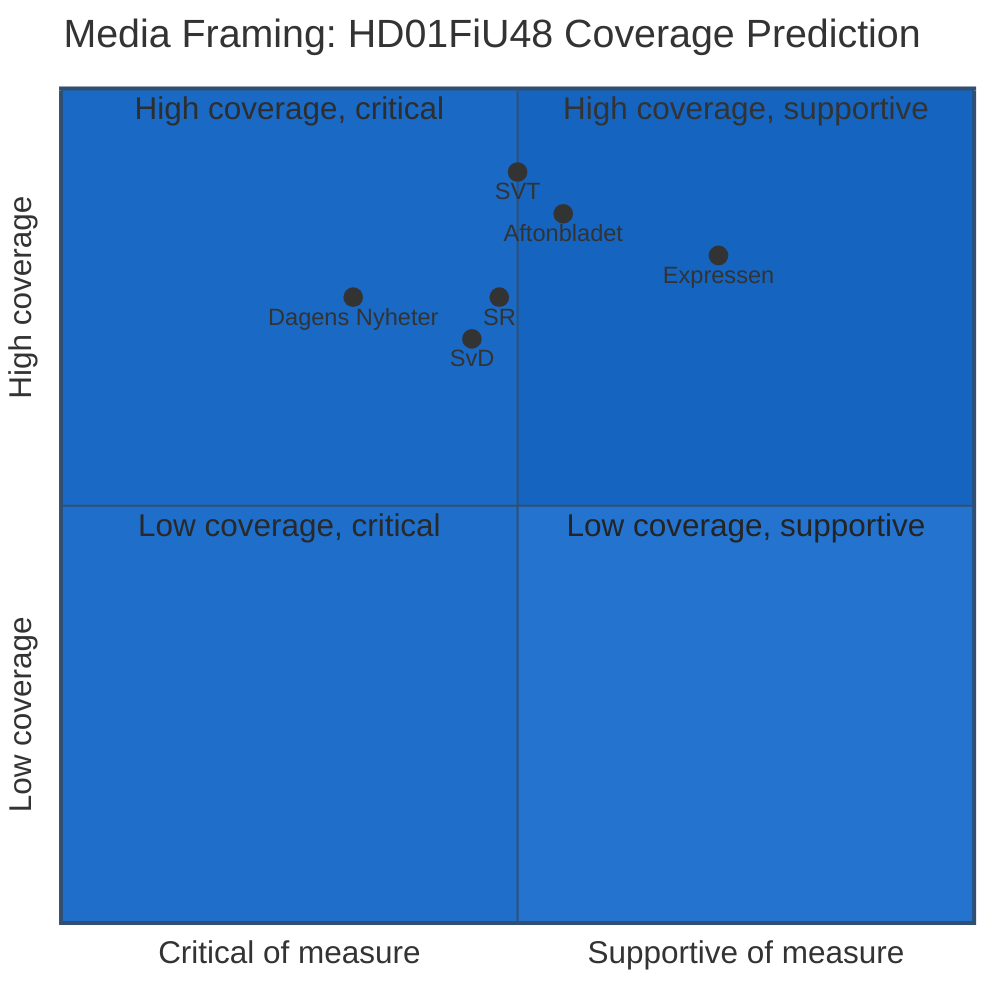

# Media Framing Analysis — Evening Analysis 2026-04-22

**Analyst**: James Pether Sörling
**Framework**: electoral-domain-methodology.md § Media Framing
**Date**: 2026-04-22 | **Riksmöte**: 2025/26

---

## Per-Party Framing Predictions

| Party | Expected framing of HD01FiU48 | Expected framing of S interpellations |
|-------|------------------------------|--------------------------------------|
| M | "Responsible relief for Swedish households" | Dismissal: "political theatre" |
| SD | "We delivered for ordinary Swedes" | Attack: "Why did S wait until now?" |
| KD | "Family economic relief" | Neutral — own issues dominate |
| L | "We refused to increase fossil dependency" | Neutral — differentiation |
| S | "Relief for families + we hold government accountable" | "Concrete accountability on every front" |
| V | "Wrong tool — climate regression" | Supportive of IP accountability |
| MP | "Pre-election populism at climate cost" | Mixed — supports welfare IPs |
| C | Split: rural C supports, urban C opposes | — |

---

## Media Quadrant Analysis

---

## Key Framing Battles

### Battle 1: "Relief" vs. "Fossil Subsidy"

- **Government + S framing**: This is household cost relief for families facing high fuel bills
- **V+MP+L framing**: This is a retrograde fossil fuel subsidy at exactly the wrong moment
- **Prediction**: Relief framing will dominate Swedish tabloid media (Expressen, Aftonbladet) in the short term; fossil subsidy framing will dominate opinion/editorial pages (DN, SvD environmental desks)

### Battle 2: S Credibility — "Consistent Opposition" vs. "Opportunist"

- **S framing**: We support families AND hold the government accountable
- **Government parties framing**: S voted Ja for the measure they filed a motion against — they cannot be trusted
- **Prediction**: Government parties will use the dual-track contradiction in campaign ads. S will rely on voters not tracking committee motions.

### Battle 3: "Accountability" vs. "Obstruction"

- **S framing (interpellations)**: We ask hard questions with court documentation
- **Government framing**: Opposition filibustering pre-election with procedural tools
- **Prediction**: HD10442 eating disorder court documentation makes this difficult to dismiss as obstruction — media will cover the specific case

---

## Narrative Radar

**Dominant expected narrative for 2026-04-22 evening news**:
> "Riksdag enacts fuel tax relief with broad cross-party support, while Socialdemokraterna simultaneously signals opposition through committee motions — and files five accountability interpellations targeting Finance Minister Svantesson."

**This narrative is**: Complex (two S positions simultaneously), high-stakes (144 days to election), and rich in specifics (the court documentation elevates HD10442 above typical political theatre).

**Admiralty**: [B3] — media framing prediction based on structural analysis of party positions and historical press coverage patterns; not verified against actual press coverage.

