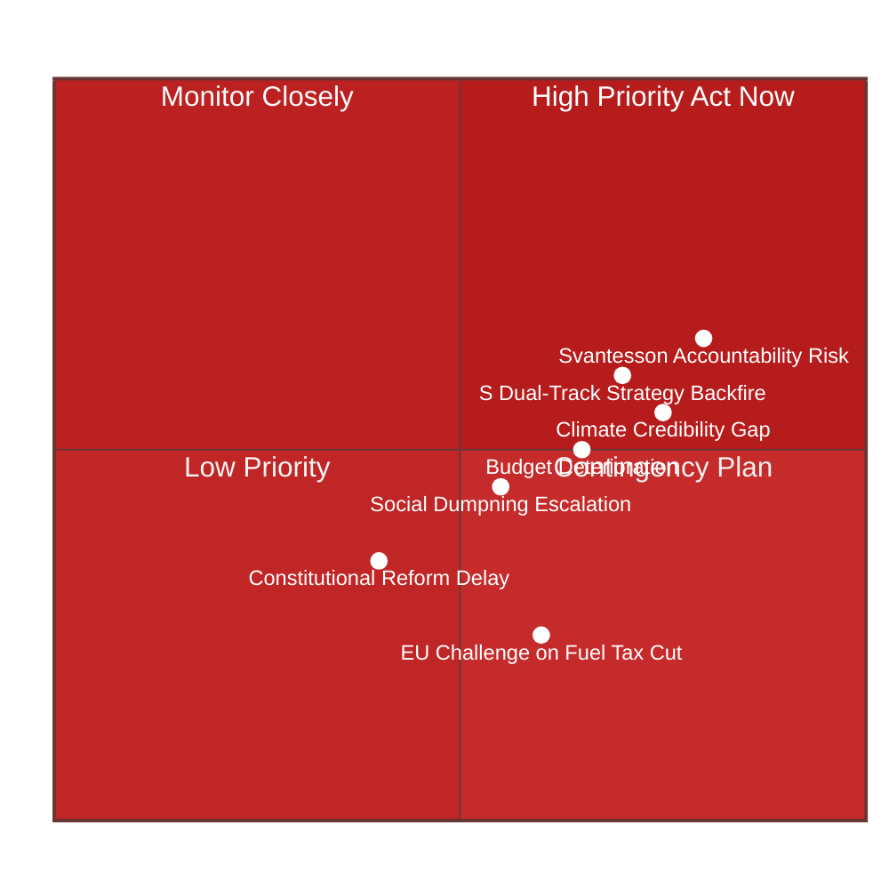
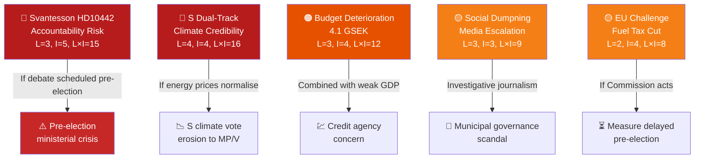

# Risk Assessment — Evening Analysis 2026-04-22

**Analyst**: James Pether Sörling
**Methodology**: political-risk-methodology.md (5-dimension register, L×I scoring)
**Date**: 2026-04-22 | **Riksmöte**: 2025/26

---

## Risk Overview

---

## 5-Dimension Risk Register

| Risk | L (1–5) | I (1–5) | L×I | Priority | Source | Admiralty |
|------|---------|---------|-----|----------|--------|-----------|
| Svantesson ministerial accountability crisis (HD10442 court ruling) | 3 | 5 | 15 | HIGH | HD10442 (riksdagen.se, 2026-04-21) | [A1] |
| S dual-track strategy (Ja vote + opposition motion) alienates climate voters | 4 | 4 | 16 | HIGH | HD01FiU48 vote + HD024082 (riksdagen.se) | [A1] |
| Climate-fiscal credibility gap widening pre-election | 4 | 4 | 16 | HIGH | HD024082/092/098 + HD01FiU48 enacted | [A1] |
| Budget deterioration (4.1 GSEK) affects fiscal credibility | 3 | 4 | 12 | MEDIUM | HD01FiU48 fiscal note; World Bank GDP 0.82% | [A1] |
| Social dumpning becomes media escalation before election | 3 | 3 | 9 | MEDIUM | HD10443 + HD10423 scheduled 2026-05-05 | [A1] |
| EU Commission challenge to fuel tax cut compatibility | 2 | 4 | 8 | MEDIUM | EU state aid rules; HD03236 fuel measure | [B3] |
| Constitutional reform (KU33 vilande) delayed in second reading | 2 | 3 | 6 | LOW | HD01KU33 first reading only | [B2] |
| Coalition fracture on vårproposition HD03100 | 1 | 5 | 5 | CONTINGENCY | HD03100 — full coalition backing assumed | [C3] |

---

## Risk Cascading Chains

---

## Posterior Probabilities

| Risk | Base Rate | Updated P | Trigger |
|------|-----------|-----------|---------|
| Svantesson faces significant parliamentary pressure from HD10442 | 45% | **65%** | Court documentation attached to IP — unusually strong evidentiary basis |
| S loses climate voters due to HD01FiU48 Ja vote | 35% | **55%** | MP+V already signalling in motions; S base increasingly climate-conscious |
| Budget balance deteriorates further before June budget | 40% | **60%** | Weak GDP growth trajectory + pre-election spending pressure |
| HD10443 social dumpning triggers media investigation | 25% | **45%** | Pattern of multiple S interpellations on same theme is investigative journalism signal |

